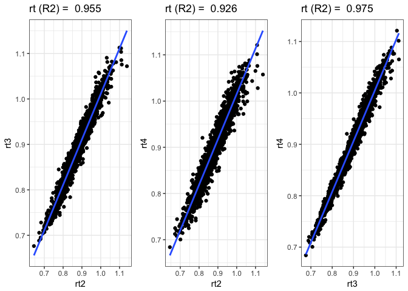
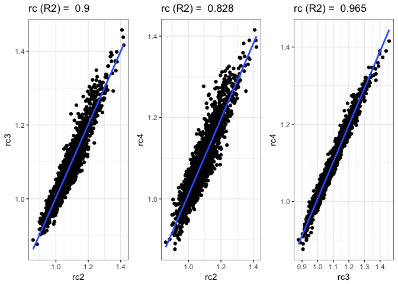
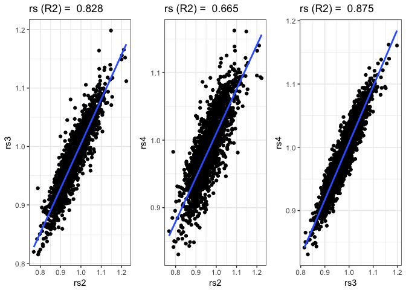
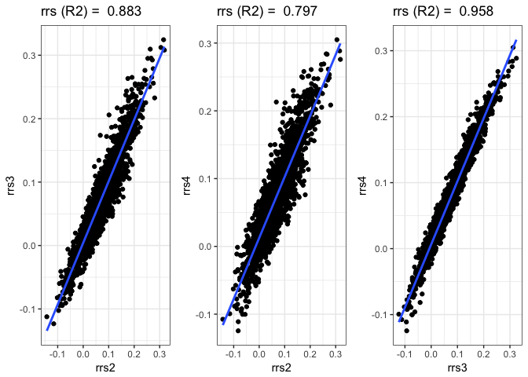

``` r
library('tidyverse')
library('stringr')
library('grid')
library('gridExtra')
library('pander')
source(paste0(di, '/script/R/eviResilience.R'))
```

``` r
# Read data
iv <- read.csv(file=paste(di, "/data/evi_mean.csv", sep=""), header = TRUE, sep = ',')

# Prepare data
# NOTE remove pop 9 
evi <- iv %>% filter(pop != 9) %>% 
  dplyr::select(-n_composites, -long, -lat, -pop)
```

Compute resilience metrics
--------------------------

-   Para los disturbance events de 2005 y 2012, vamos a computar las métricas de resiliencia. Lo hacemos aplicando diferentes ventanas temporales (2, 3 y 4).

-   Luego analizamos la correlación para cada indicador (rs, rc, rt y rrs) entre las diferentes ventanas. Si están muy correlacionados podemos decir que el resultado no varía mucho entre ellos.

``` r
dyears <- c(2005, 2012)

# Compute resilience for 2, 3 and 4 years 
res2 <- eviResilience(evi, event_years = dyears, window = 2)
res3 <- eviResilience(evi, event_years = dyears, window = 3)
res4 <- eviResilience(evi, event_years = dyears, window = 4)
```

``` r
# Vector with objects name
obj <- c('res2', 'res3', 'res4')

correla_ws <- c()

for (i in obj){ 
  x <- get(i)
  xres <- x$resilience
  out <- xres %>% 
    mutate(ws = paste0('ws_', as.character(str_extract(i, "([0-9])")))) %>% 
    select(-disturb_year, -iv_malla_modi_id)
  
  correla_ws <- bind_rows(correla_ws, out)
}

# Split by window size 
correla <- correla_ws %>% split(.$ws) 

# Change names 
names(correla[["ws_2"]])[1:4] <- paste0(names(correla[["ws_2"]])[1:4], '2')
names(correla[["ws_3"]])[1:4] <- paste0(names(correla[["ws_3"]])[1:4], '3')
names(correla[["ws_4"]])[1:4] <- paste0(names(correla[["ws_4"]])[1:4], '4')

cor2 <- correla[["ws_2"]] %>% select(-ws) %>% mutate(ind = row_number())
cor3 <- correla[["ws_3"]] %>% select(-ws) %>% mutate(ind = row_number())
cor4 <- correla[["ws_4"]] %>% select(-ws) %>% mutate(ind = row_number())


correlations <- inner_join(cor2, cor3, by='ind') %>% inner_join(cor4, by='ind')
```

### Correlations window size

#### Resistance

``` r
# Resistance
aux_coefs <- c()

model <- lm(rt2~rt3, data=correlations)
p_rt23 <- correlations %>% ggplot(aes(rt2, rt3)) + 
  geom_point() + theme_bw() + geom_smooth(method = 'lm', se=FALSE) + 
  ggtitle(paste('rt (R2) = ', round(summary(model)$r.squared, 3))) + 
  theme(legend.position = c(.2, .75))
aux <- as.data.frame(cbind('rt','2-3', as.numeric(summary(model)$r.squared)))
aux_coefs <- rbind(aux_coefs, aux)

model <- lm(rt2~rt4, data=correlations)
p_rt24 <- correlations %>% ggplot(aes(rt2, rt4)) + 
  geom_point() + theme_bw() + geom_smooth(method = 'lm', se=FALSE) + 
  ggtitle(paste('rt (R2) = ', round(summary(model)$r.squared, 3))) +
  theme(legend.position = 'none')
aux <- as.data.frame(cbind('rt','2-4', as.numeric(summary(model)$r.squared)))
aux_coefs <- rbind(aux_coefs, aux)

model <- lm(rt3~rt4, data=correlations)
p_rt34 <- correlations %>% ggplot(aes(rt3, rt4)) + 
  geom_point() + theme_bw() + geom_smooth(method = 'lm', se=FALSE) + 
  ggtitle(paste('rt (R2) = ', round(summary(model)$r.squared, 3))) +
  theme(legend.position = 'none')
aux <- as.data.frame(cbind('rt','3-4', as.numeric(summary(model)$r.squared)))
aux_coefs <- rbind(aux_coefs, aux)

grid.arrange(p_rt23, p_rt24, p_rt34,ncol=3) 
```



#### Recovery

``` r
# Recovery 
model <- lm(rc2~rc3, data=correlations)
p_rc23 <- correlations %>% ggplot(aes(rc2, rc3)) + 
  geom_point() + theme_bw() + geom_smooth(method = 'lm', se=FALSE) + 
  ggtitle(paste('rc (R2) = ', round(summary(model)$r.squared, 3))) + 
  theme(legend.position = c(.2, .75))
aux <- as.data.frame(cbind('rc','2-3', as.numeric(summary(model)$r.squared)))
aux_coefs <- rbind(aux_coefs, aux)


model <- lm(rc2~rc4, data=correlations)
p_rc24 <- correlations %>% ggplot(aes(rc2, rc4)) + 
  geom_point() + theme_bw() + geom_smooth(method = 'lm', se=FALSE) + 
  ggtitle(paste('rc (R2) = ', round(summary(model)$r.squared, 3))) +
  theme(legend.position = 'none')
aux <- as.data.frame(cbind('rc','2-4', as.numeric(summary(model)$r.squared)))
aux_coefs <- rbind(aux_coefs, aux)


model <- lm(rc3~rc4, data=correlations)
p_rc34 <- correlations %>% ggplot(aes(rc3, rc4)) + 
  geom_point() + theme_bw() + geom_smooth(method = 'lm', se=FALSE) + 
  ggtitle(paste('rc (R2) = ', round(summary(model)$r.squared, 3))) +
  theme(legend.position = 'none')
aux <- as.data.frame(cbind('rc','3-4', as.numeric(summary(model)$r.squared)))
aux_coefs <- rbind(aux_coefs, aux)


grid.arrange(p_rc23, p_rc24, p_rc34,ncol=3) 
```



#### Resilience

``` r
# Resilience
model <- lm(rs2~rs3, data=correlations)
p_rs23 <- correlations %>% ggplot(aes(rs2, rs3)) + 
  geom_point() + theme_bw() + geom_smooth(method = 'lm', se=FALSE) + 
  ggtitle(paste('rs (R2) = ', round(summary(model)$r.squared, 3))) + 
  theme(legend.position = c(.2, .75))
aux <- as.data.frame(cbind('rs','2-3', as.numeric(summary(model)$r.squared)))
aux_coefs <- rbind(aux_coefs, aux)

model <- lm(rs2~rs4, data=correlations)
p_rs24 <- correlations %>% ggplot(aes(rs2, rs4)) + 
  geom_point() + theme_bw() + geom_smooth(method = 'lm', se=FALSE) + 
  ggtitle(paste('rs (R2) = ', round(summary(model)$r.squared, 3))) +
  theme(legend.position = 'none')
aux <- as.data.frame(cbind('rs','2-4', as.numeric(summary(model)$r.squared)))
aux_coefs <- rbind(aux_coefs, aux)

model <- lm(rs3~rs4, data=correlations)
p_rs34 <- correlations %>% ggplot(aes(rs3, rs4)) + 
  geom_point() + theme_bw() + geom_smooth(method = 'lm', se=FALSE) + 
  ggtitle(paste('rs (R2) = ', round(summary(model)$r.squared, 3))) +
  theme(legend.position = 'none')
aux <- as.data.frame(cbind('rs','3-4', as.numeric(summary(model)$r.squared)))
aux_coefs <- rbind(aux_coefs, aux)

grid.arrange(p_rs23, p_rs24, p_rs34,ncol=3) 
```



#### Relative Resilience

``` r
# Relative Resilience
model <- lm(rrs2~rrs3, data=correlations)
p_rrs23 <- correlations %>% ggplot(aes(rrs2, rrs3)) + 
  geom_point() + theme_bw() + geom_smooth(method = 'lm', se=FALSE) + 
  ggtitle(paste('rrs (R2) = ', round(summary(model)$r.squared, 3))) + 
  theme(legend.position = c(.2, .75))
aux <- as.data.frame(cbind('rrs','2-3', as.numeric(summary(model)$r.squared)))
aux_coefs <- rbind(aux_coefs, aux)

model <- lm(rrs2~rrs4, data=correlations)
p_rrs24 <- correlations %>% ggplot(aes(rrs2, rrs4)) + 
  geom_point() + theme_bw() + geom_smooth(method = 'lm', se=FALSE) + 
  ggtitle(paste('rrs (R2) = ', round(summary(model)$r.squared, 3))) +
  theme(legend.position = 'none')
aux <- as.data.frame(cbind('rrs','2-4', as.numeric(summary(model)$r.squared)))
aux_coefs <- rbind(aux_coefs, aux)

model <- lm(rrs3~rrs4, data=correlations)
p_rrs34 <- correlations %>% ggplot(aes(rrs3, rrs4)) + 
  geom_point() + theme_bw() + geom_smooth(method = 'lm', se=FALSE) + 
  ggtitle(paste('rrs (R2) = ', round(summary(model)$r.squared, 3))) +
  theme(legend.position = 'none')
aux <- as.data.frame(cbind('rrs','3-4', as.numeric(summary(model)$r.squared)))
aux_coefs <- rbind(aux_coefs, aux)

grid.arrange(p_rrs23, p_rrs24, p_rrs34,ncol=3) 
```



``` r
names(aux_coefs) <- c('var', 'window_size', 'r2')

write.csv(aux_coefs, file=paste0(di, '/out/correla_resilience/correla_window_size.csv'), row.names = F)
```

``` r
aux_coefs %>% pander()
```

<table style="width:54%;">
<colgroup>
<col width="8%" />
<col width="19%" />
<col width="26%" />
</colgroup>
<thead>
<tr class="header">
<th align="center">var</th>
<th align="center">window_size</th>
<th align="center">r2</th>
</tr>
</thead>
<tbody>
<tr class="odd">
<td align="center">rt</td>
<td align="center">2-3</td>
<td align="center">0.955450926921608</td>
</tr>
<tr class="even">
<td align="center">rt</td>
<td align="center">2-4</td>
<td align="center">0.92620704211355</td>
</tr>
<tr class="odd">
<td align="center">rt</td>
<td align="center">3-4</td>
<td align="center">0.974850886801899</td>
</tr>
<tr class="even">
<td align="center">rc</td>
<td align="center">2-3</td>
<td align="center">0.899941896683591</td>
</tr>
<tr class="odd">
<td align="center">rc</td>
<td align="center">2-4</td>
<td align="center">0.828482285426833</td>
</tr>
<tr class="even">
<td align="center">rc</td>
<td align="center">3-4</td>
<td align="center">0.965180230447147</td>
</tr>
<tr class="odd">
<td align="center">rs</td>
<td align="center">2-3</td>
<td align="center">0.827515756641927</td>
</tr>
<tr class="even">
<td align="center">rs</td>
<td align="center">2-4</td>
<td align="center">0.665045903961248</td>
</tr>
<tr class="odd">
<td align="center">rs</td>
<td align="center">3-4</td>
<td align="center">0.875479466269448</td>
</tr>
<tr class="even">
<td align="center">rrs</td>
<td align="center">2-3</td>
<td align="center">0.883383651631435</td>
</tr>
<tr class="odd">
<td align="center">rrs</td>
<td align="center">2-4</td>
<td align="center">0.796729859540512</td>
</tr>
<tr class="even">
<td align="center">rrs</td>
<td align="center">3-4</td>
<td align="center">0.957632365854058</td>
</tr>
</tbody>
</table>
