``` r
library("rgdal")
library("sp")
library("raster")
library("rasterVis")
source(paste0(di,"/script/R/exportpdf.R")) # function to export raster levelplots maps as pdf
library("dplyr")
library("ggplot2")
library("reshape2")
library("purrr")
# library("pander")
library("knitr")
library("effects")
library("pander")
library("broom")
```

Read data and Prepare Data
--------------------------

-   Crear variable factorial para agrupar a las poblaciones
-   No incluiremos la poblacion 9

``` r
# Read data 
anomalias_evimean <- read.csv(file=paste(di, "/data/anomalies/anomalias_evimean.csv", sep=""), header = TRUE, sep = ',')
# anomalias_composite <- read.csv(file=paste(di, "/data/anomalies/anomalias_composite.csv", sep=""), header = TRUE, sep = ',')

anomalias_evimean <- anomalias_evimean %>% 
  mutate(
    clu_pop = as.factor(case_when(
      pop == 1 ~ "Camarate",
      pop %in% c(2,3,4,5) ~ 'Northern slope',
      pop %in% c(6,7,8) ~ 'Southern slope',
      pop == 9 ~ 'out')),
    clu_pop2 = as.factor(case_when(
      pop %in% c(1,2,3,4,5) ~ 'Northern slope',
      pop %in% c(6,7,8) ~ 'Southern slope',
      pop == 9 ~ 'out'))) %>% 
  filter(clu_pop != 'out')
```

Anomalies by cluster populations
--------------------------------

-   Datos medios de las anomalias (*a*), anomalias normalizadas (*nora*) y de las anomalias estandarizadas(*sa*) por cluster

-   Consideramos al Camarate (pop 1, dentro del Northern Slopes)

``` r
# Anomalies 
avg_a_clu <- anomalias_evimean %>% 
  group_by(clu_pop2, y) %>% 
  summarise(mean=mean(a, na.rm=T),
            sd = sd(a, na.rm=T),
            se = sd/sqrt(length(a))) %>% 
 mutate(signo = ifelse(mean >= 0, 'pos', 'neg')) 

# Normalized Anomalies 
avg_nora_clu <- anomalias_evimean %>% 
  group_by(clu_pop2, y) %>% 
  summarise(mean=mean(nora, na.rm=T),
            sd = sd(nora, na.rm=T),
            se = sd/sqrt(length(nora))) %>% 
 mutate(signo = ifelse(mean >= 0, 'pos', 'neg'))

# Standardized Anomalies 
avg_sa_clu <- anomalias_evimean %>% 
  group_by(clu_pop2, y) %>% 
  summarise(mean=mean(sa, na.rm=T),
            sd = sd(sa, na.rm=T),
            se = sd/sqrt(length(sa))) %>% 
 mutate(signo = ifelse(mean >= 0, 'pos', 'neg'))
```

### EVI Anomaly by cluster pop

``` r
myylab <- 'EVI Anomaly'

plot_a_clu <- avg_a_clu %>%  
  ggplot(aes(x=y, y=mean, fill=signo)) + 
  geom_bar(stat = "identity") + 
  geom_errorbar(aes(ymin = mean - se, ymax = mean + se, colour=signo), width=.5) +
  facet_wrap(~clu_pop2, nrow = 2) + 
  scale_fill_manual(values = c("pos" = color_pos, "neg" =  color_neg)) +
  scale_color_manual(values = c("pos" = color_pos, "neg" =  color_neg)) +
  ylab(myylab) + xlab('') +
  theme_bw() +
  theme(text = element_text(size=16),
        legend.position = "none",
        panel.grid.major.x = element_blank(),
        panel.grid.minor = element_blank(),
        strip.background = element_rect(fill = "white"))

pdf(file=paste0(di, "/images/plot_anoma_EVI_clu_a.pdf"), height = 7, width = 7)
plot_a_clu
dev.off()
```

    ## quartz_off_screen 
    ##                 2

### EVI Normalized Anomaly by cluster pop

``` r
myylab <- 'EVI Normalized Anomaly'

plot_nora_clu <- avg_nora_clu %>%  
  ggplot(aes(x=y, y=mean, fill=signo)) + 
  geom_bar(stat = "identity") + 
  geom_errorbar(aes(ymin = mean - se, ymax = mean + se, colour=signo), width=.5) +
  facet_wrap(~clu_pop2, nrow = 2) + 
  scale_fill_manual(values = c("pos" = color_pos, "neg" =  color_neg)) +
  scale_color_manual(values = c("pos" = color_pos, "neg" =  color_neg)) +
  ylab(myylab) + xlab('') +
  theme_bw() +
  theme(text = element_text(size=16),
        legend.position = "none",
        panel.grid.major.x = element_blank(),
        panel.grid.minor = element_blank(),
        strip.background = element_rect(fill = "white"))

pdf(file=paste0(di, "/images/plot_anoma_EVI_clu_nora.pdf"), height = 7, width = 7)
plot_nora_clu 
dev.off()
```

    ## quartz_off_screen 
    ##                 2

### EVI Standardized Anomaly by cluster pop

``` r
myylab <- 'EVI Standardized Anomaly'

plot_sa_clu  <- avg_sa_clu %>%  
  ggplot(aes(x=y, y=mean, fill=signo)) + 
  geom_bar(stat = "identity") + 
  geom_errorbar(aes(ymin = mean - se, ymax = mean + se, colour=signo), width=.5) +
  facet_wrap(~clu_pop2, nrow = 2) + 
  scale_fill_manual(values = c("pos" = color_pos, "neg" =  color_neg)) +
  scale_color_manual(values = c("pos" = color_pos, "neg" =  color_neg)) +
  ylab(myylab) + xlab('') +
  theme_bw() +
  theme(text = element_text(size=16),
        legend.position = "none",
        panel.grid.major.x = element_blank(),
        panel.grid.minor = element_blank(),
        strip.background = element_rect(fill = "white"))

pdf(file=paste0(di, "/images/plot_anoma_EVI_clu_sa.pdf"), height = 7, width = 7)
plot_sa_clu
dev.off()
```

    ## quartz_off_screen 
    ##                 2

Anomalies by populations
------------------------

-   Datos medios de las anomalias (*a*), anomalias normalizadas (*nora*) y de las anomalias estandarizadas(*sa*) por poblaciones

``` r
# Anomalies 
avg_a_pop <- anomalias_evimean %>% 
  group_by(pop, y) %>% 
  summarise(mean=mean(a, na.rm=T),
            sd = sd(a, na.rm=T),
            se = sd/sqrt(length(a))) %>% 
 mutate(signo = ifelse(mean >= 0, 'pos', 'neg')) 

# Normalized Anomalies 
avg_nora_pop <- anomalias_evimean %>% 
  group_by(pop, y) %>% 
  summarise(mean=mean(nora, na.rm=T),
            sd = sd(nora, na.rm=T),
            se = sd/sqrt(length(nora))) %>% 
 mutate(signo = ifelse(mean >= 0, 'pos', 'neg'))

# Standardized Anomalies 
avg_sa_pop <- anomalias_evimean %>% 
  group_by(pop, y) %>% 
  summarise(mean=mean(sa, na.rm=T),
            sd = sd(sa, na.rm=T),
            se = sd/sqrt(length(sa))) %>% 
 mutate(signo = ifelse(mean >= 0, 'pos', 'neg'))
```

``` r
label_pop <- c('1' = 'Lugros', '2' = 'Guejar-Sierra', '3' = 'Monachil',
                      '4' = 'Dilar', '5' = 'Durcal', '6' = 'Caniar', 
                      '7' = 'Poqueira', '8' = 'Trevelez', '9' = 'Cadiar')
```

### EVI Anomaly by pop

``` r
myylab <- 'EVI Anomaly'

plot_a_pop <- avg_a_pop %>%  
  ggplot(aes(x=y, y=mean, fill=signo)) + 
  geom_bar(stat = "identity") + 
  geom_errorbar(aes(ymin = mean - se, ymax = mean + se, colour=signo), width=.5) +
  facet_wrap(~pop, nrow = 3, labeller = as_labeller(label_pop)) + 
  scale_fill_manual(values = c("pos" = color_pos, "neg" =  color_neg)) +
  scale_color_manual(values = c("pos" = color_pos, "neg" =  color_neg)) +
  ylab(myylab) + xlab('') +
  theme_bw() +
  theme(text = element_text(size=16), legend.position = "none",
        panel.grid.major.x = element_blank(),
        panel.grid.minor = element_blank(),
        strip.background = element_rect(fill = "white"))

pdf(file=paste0(di, "/images/plot_anoma_EVI_pop_a.pdf"), height = 14, width = 14)
plot_a_pop
dev.off()
```

    ## quartz_off_screen 
    ##                 2

### EVI Normalized Anomaly by pop

``` r
myylab <- 'EVI Normalized Anomaly'

plot_nora_pop <- avg_nora_pop %>%  
  ggplot(aes(x=y, y=mean, fill=signo)) + 
  geom_bar(stat = "identity") + 
  geom_errorbar(aes(ymin = mean - se, ymax = mean + se, colour=signo), width=.5) +
  facet_wrap(~pop, nrow = 3, labeller = as_labeller(label_pop)) +
  scale_fill_manual(values = c("pos" = color_pos, "neg" =  color_neg)) +
  scale_color_manual(values = c("pos" = color_pos, "neg" =  color_neg)) +
  ylab(myylab) + xlab('') +
  theme_bw() +
  theme(text = element_text(size=16),
        legend.position = "none",
        panel.grid.major.x = element_blank(),
        panel.grid.minor = element_blank(),
        strip.background = element_rect(fill = "white"))

pdf(file=paste0(di, "/images/plot_anoma_EVI_pop_nora.pdf"), height = 14, width = 14)
plot_nora_pop 
dev.off()
```

    ## quartz_off_screen 
    ##                 2

### EVI Standardized Anomaly by pop

``` r
myylab <- 'EVI Standardized Anomaly'

plot_sa_pop  <- avg_sa_pop %>%  
  ggplot(aes(x=y, y=mean, fill=signo)) + 
  geom_bar(stat = "identity") + 
  geom_errorbar(aes(ymin = mean - se, ymax = mean + se, colour=signo), width=.5) +
  facet_wrap(~pop, nrow = 3, labeller = as_labeller(label_pop)) + 
  scale_fill_manual(values = c("pos" = color_pos, "neg" =  color_neg)) +
  scale_color_manual(values = c("pos" = color_pos, "neg" =  color_neg)) +
  ylab(myylab) + xlab('') +
  theme_bw() +
  theme(text = element_text(size=16),
        legend.position = "none",
        panel.grid.major.x = element_blank(),
        panel.grid.minor = element_blank(),
        strip.background = element_rect(fill = "white"))

pdf(file=paste0(di, "/images/plot_anoma_EVI_pop_sa.pdf"), height = 14, width = 14)
plot_sa_pop
dev.off()
```

    ## quartz_off_screen 
    ##                 2

Maps
====

-   Create raster maps (two projections: `epsg:4326` and `epsg:23030`)

``` r
# Create stack of raster 
stack_anomalias <- stack(r_anomalia_a2005, r_anomalia_a2012, r_anomalia_nora2005, r_anomalia_nora2012, r_anomalia_sa2005, r_anomalia_sa2012)

stack_anomalias_re <- stack(r_anomalia_a2005_re, r_anomalia_a2012_re, r_anomalia_nora2005_re, r_anomalia_nora2012_re, r_anomalia_sa2005_re, r_anomalia_sa2012_re)


# Export stack 
temp <- getwd()
setwd(paste(di, "/data/raster/", sep=""))
writeRaster(stack_anomalias, filename = 'r_all_nomalias_stack', overwrite =TRUE) 
writeRaster(stack_anomalias_re, filename = 'r_all_anomalias_re_stack', overwrite =TRUE) 
setwd(temp)
```

Spatial exploration of the anomaly
----------------------------------

### Anomaly

``` r
# Select a palette http://colorbrewer2.org/
mypal <- brewer.pal(11, "RdYlGn")
# Specify the color palette
myTheme=rasterTheme(region=mypal)

lp <- levelplot(stack_anomalias, 
          margin=FALSE,
          layer=c('a_2005', 'a_2012'),
          #par.settings=myTheme, 
          par.settings=RdBuTheme, 
          names.attr=c("2005", "2012"),
          pretty=TRUE,
          layout=c(2,1),
          main='EVI Anomaly', xlab=NULL, ylab=NULL) 

print(lp)
```

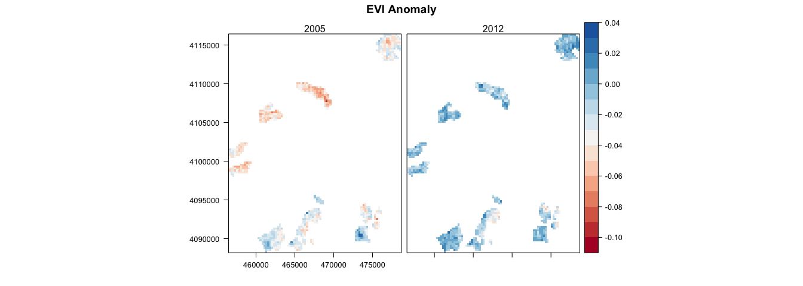

``` r
tiff(filename=paste0(di, '/images/raster_maps/anomaly_2005_2012_a.tiff'), 
     height = 1600, width = 2500, res=150, pointsize = 20, bg='transparent')
print(lp)
dev.off()
```

    ## quartz_off_screen 
    ##                 2

``` r
exportpdf(mypdf=paste0(di, '/images/raster_maps/anomaly_2005_2012_a.pdf'), lp) 
```

    ## quartz_off_screen 
    ##                 2

### Normalized Anomaly

``` r
# Select a palette http://colorbrewer2.org/
mypal <- brewer.pal(11, "RdYlGn")
# Specify the color palette
myTheme=rasterTheme(region=mypal)

lp <- levelplot(stack_anomalias, 
          margin=FALSE,
          layer=c('nora_2005', 'nora_2012'),
          #par.settings=myTheme, 
          par.settings=RdBuTheme, 
          names.attr=c("2005", "2012"),
          pretty=TRUE,
          layout=c(2,1),
          main='EVI Normalized Anomaly', xlab=NULL, ylab=NULL) 

print(lp)
```

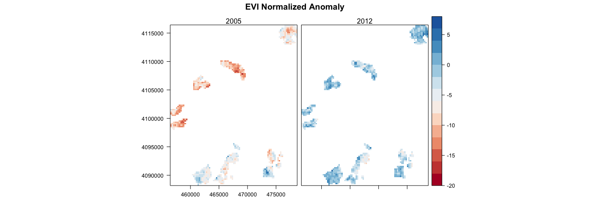

``` r
tiff(filename=paste0(di, '/images/raster_maps/anomaly_2005_2012_nora.tiff'), 
     height = 1600, width = 2500, res=150, pointsize = 20, bg='transparent')
print(lp)
dev.off()
```

    ## quartz_off_screen 
    ##                 2

``` r
exportpdf(mypdf=paste0(di, '/images/raster_maps/anomaly_2005_2012_nora.pdf'), lp) 
```

    ## quartz_off_screen 
    ##                 2

### Standardized Anomaly

``` r
# Select a palette http://colorbrewer2.org/
mypal <- brewer.pal(11, "RdYlGn")
# Specify the color palette
myTheme=rasterTheme(region=mypal)

lp <- levelplot(stack_anomalias, 
          margin=FALSE,
          layer=c('sa_2005', 'sa_2012'),
          #par.settings=myTheme, 
          par.settings=RdBuTheme, 
          names.attr=c("2005", "2012"),
          pretty=TRUE,
          layout=c(2,1),
          main='EVI Standardized Anomaly', xlab=NULL, ylab=NULL) 

print(lp)
```

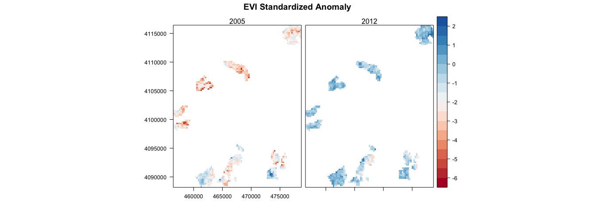

``` r
tiff(filename=paste0(di, '/images/raster_maps/anomaly_2005_2012_sa.tiff'), 
     height = 1600, width = 2500, res=150, pointsize = 20, bg='transparent')
print(lp)
dev.off()
```

    ## quartz_off_screen 
    ##                 2

``` r
exportpdf(mypdf=paste0(di, '/images/raster_maps/anomaly_2005_2012_sa.pdf'), lp) 
```

    ## quartz_off_screen 
    ##                 2

### Analisis de diferencias year y clu para las anomalias

-   Preparo un dataframe. Solamente selecciono los años 2005 y 2012 (distrub year)

``` r
compara_anoma <- anomalias_evimean %>% 
  filter(y %in% c(2005,2012)) %>% 
  mutate(y = as.factor(y)) %>% 
  rename(disturb_year = y, 
         site = clu_pop2)
```

-   Incluyo dos funciones customizadas para analizar las anovas y posthoc comparison

``` r
# Custom Function to compute ANOVAS
aovas <- function(df, vars, resp_var){ 
  require('dplyr')
  require('broom')
  
  # Create subset 
  dfsel <- df %>% dplyr::select_(.dots=c(vars, resp_var)) 
    
  # Model 
  myformula <- as.formula(paste0(resp_var,  " ~ ",
                                 paste(vars, collapse = '*')))
  
  mymodel <- aov(myformula, data=dfsel)
  
  # Output model Summary http://my.ilstu.edu/~wjschne/444/ANOVA.html#(1)
  model_coeff <- broom::tidy(mymodel)
  model_summary <- broom::glance(mymodel)
  
  out <- c() 
  out$model_coeff <- model_coeff
  out$model_summary <- model_summary
  out$mymodel <- mymodel
  
  return(out)
}


# Post-Hoc comparison
phc <- function(mymodel, resp_var){
  require(lsmeans)

  # Disturb Event 
  ph_event <- lsmeans(mymodel, pairwise ~ disturb_year, adjust = "tukey")
  
  # differences letters 
  cld_event <- cld(ph_event, alpha   = 0.01, 
                   Letters = letters, 
                   adjust  = "tukey")
  
  # Site  
  ph_site <- lsmeans(mymodel, pairwise ~ site, adjust = "tukey")
  cld_site <- cld(ph_site, alpha   = 0.01, 
                 Letters = letters, 
                 adjust  = "tukey")

  # interaction 
  ph_i <- lsmeans(mymodel, pairwise ~ disturb_year:site, adjust = "tukey")
  cld_i <- cld(ph_i, alpha   = 0.01, 
                 Letters = letters, 
                 adjust  = "tukey")
  
  # Objets for plot
  aux_ph_site <- as.data.frame(summary(ph_site$lsmeans)) 
  aux_ph_site <- aux_ph_site %>% mutate(var = resp_var)
  aux_ph_event <- as.data.frame(summary(ph_event$lsmeans)) 
  aux_ph_event <- aux_ph_event %>% mutate(var = resp_var)
  aux_ph_i <- as.data.frame(summary(ph_i$lsmeans)) 
  aux_ph_i <- aux_ph_i %>% mutate(var = resp_var)
  
  # Return objects
  cat('\n### Event ###\n')
  print(ph_event)
  print(cld_event)
  cat('\n### Clu pop ###\n')
  print(ph_site)
  print(cld_site)
  cat('\n### Event:Clu pop ###\n')
  print(ph_i)
  return(list(aux_ph_site, aux_ph_event, aux_ph_i, cld_site, cld_event, cld_i))
}
```

####  Compara Anomaly (a)

``` r
resp_var <- 'a'
vars <- c('disturb_year','site')

# AOV
aov_a <- aovas(compara_anoma, vars=vars, resp_var = resp_var)

mc <- aov_a$model_coeff

pander(mc, round=5,
       caption = paste0("ANOVA table: ", resp_var), missing = '', 
       emphasize.strong.cells = 
         which(mc < 0.1 & mc == mc$p.value, arr.ind = T))
```

<table style="width:85%;">
<caption>ANOVA table: a</caption>
<colgroup>
<col width="25%" />
<col width="6%" />
<col width="11%" />
<col width="12%" />
<col width="16%" />
<col width="12%" />
</colgroup>
<thead>
<tr class="header">
<th align="center">term</th>
<th align="center">df</th>
<th align="center">sumsq</th>
<th align="center">meansq</th>
<th align="center">statistic</th>
<th align="center">p.value</th>
</tr>
</thead>
<tbody>
<tr class="odd">
<td align="center">disturb_year</td>
<td align="center">1</td>
<td align="center">0.3476</td>
<td align="center">0.3476</td>
<td align="center">1938</td>
<td align="center"><strong>0</strong></td>
</tr>
<tr class="even">
<td align="center">site</td>
<td align="center">1</td>
<td align="center">0.01468</td>
<td align="center">0.01468</td>
<td align="center">81.89</td>
<td align="center"><strong>0</strong></td>
</tr>
<tr class="odd">
<td align="center">disturb_year:site</td>
<td align="center">1</td>
<td align="center">0.06197</td>
<td align="center">0.06197</td>
<td align="center">345.6</td>
<td align="center"><strong>0</strong></td>
</tr>
<tr class="even">
<td align="center">Residuals</td>
<td align="center">1820</td>
<td align="center">0.3264</td>
<td align="center">0.00018</td>
<td align="center"></td>
<td align="center"></td>
</tr>
</tbody>
</table>

``` r
gm <- aov_a$model_summary

gm <- apply(gm, 1, formatC, digits = 2, format = "f") %>% t()
colnames(gm) <- paste0("$",c("R^2","\\mathrm{adj}R^2","\\sigma_e","F","p","df_m","\\mathrm{logLik}","AIC","BIC","\\mathrm{dev}","df_e"),"$")
rownames(gm) <- "Statistic"
pander(t(gm)) 
```

<table style="width:49%;">
<colgroup>
<col width="33%" />
<col width="15%" />
</colgroup>
<thead>
<tr class="header">
<th align="center"> </th>
<th align="center">Statistic</th>
</tr>
</thead>
<tbody>
<tr class="odd">
<td align="center"><strong><span class="math inline"><em>R</em><sup>2</sup></span></strong></td>
<td align="center">0.57</td>
</tr>
<tr class="even">
<td align="center"><strong><span class="math inline"><em>a</em><em>d</em><em>j</em><em>R</em><sup>2</sup></span></strong></td>
<td align="center">0.56</td>
</tr>
<tr class="odd">
<td align="center"><strong><span class="math inline"><em>σ</em><sub><em>e</em></sub></span></strong></td>
<td align="center">0.01</td>
</tr>
<tr class="even">
<td align="center"><strong><span class="math inline"><em>F</em></span></strong></td>
<td align="center">788.57</td>
</tr>
<tr class="odd">
<td align="center"><strong><span class="math inline"><em>p</em></span></strong></td>
<td align="center">0.00</td>
</tr>
<tr class="even">
<td align="center"><strong><span class="math inline"><em>d</em><em>f</em><sub><em>m</em></sub></span></strong></td>
<td align="center">4.00</td>
</tr>
<tr class="odd">
<td align="center"><strong><span class="math inline"><em>l</em><em>o</em><em>g</em><em>L</em><em>i</em><em>k</em></span></strong></td>
<td align="center">5281.08</td>
</tr>
<tr class="even">
<td align="center"><strong><span class="math inline"><em>A</em><em>I</em><em>C</em></span></strong></td>
<td align="center">-10552.17</td>
</tr>
<tr class="odd">
<td align="center"><strong><span class="math inline"><em>B</em><em>I</em><em>C</em></span></strong></td>
<td align="center">-10524.62</td>
</tr>
<tr class="even">
<td align="center"><strong><span class="math inline"><em>d</em><em>e</em><em>v</em></span></strong></td>
<td align="center">0.33</td>
</tr>
<tr class="odd">
<td align="center"><strong><span class="math inline"><em>d</em><em>f</em><sub><em>e</em></sub></span></strong></td>
<td align="center">1820.00</td>
</tr>
</tbody>
</table>

``` r
# Post hoc Define model
mymodel <- aov_a$mymodel
postH_a <- phc(mymodel = mymodel, resp_var = resp_var)
```

    ## 
    ## ### Event ###
    ## $lsmeans
    ##  disturb_year       lsmean           SE   df     lower.CL     upper.CL
    ##  2005         -0.034580800 0.0004436606 1820 -0.035450938 -0.033710663
    ##  2012         -0.007356516 0.0004436606 1820 -0.008226654 -0.006486378
    ## 
    ## Results are averaged over the levels of: site 
    ## Confidence level used: 0.95 
    ## 
    ## $contrasts
    ##  contrast       estimate           SE   df t.ratio p.value
    ##  2005 - 2012 -0.02722428 0.0006274309 1820  -43.39  <.0001
    ## 
    ## Results are averaged over the levels of: site 
    ## 
    ##  disturb_year       lsmean           SE   df     lower.CL     upper.CL
    ##  2005         -0.034580800 0.0004436606 1820 -0.035573855 -0.033587745
    ##  2012         -0.007356516 0.0004436606 1820 -0.008349571 -0.006363461
    ##  .group
    ##   a    
    ##    b   
    ## 
    ## Results are averaged over the levels of: site 
    ## Confidence level used: 0.95 
    ## Conf-level adjustment: sidak method for 2 estimates 
    ## significance level used: alpha = 0.01 
    ## 
    ## ### Clu pop ###
    ## $lsmeans
    ##  site                lsmean           SE   df    lower.CL    upper.CL
    ##  Northern slope -0.02380758 0.0004363026 1820 -0.02466329 -0.02295187
    ##  Southern slope -0.01812974 0.0004508986 1820 -0.01901407 -0.01724540
    ## 
    ## Results are averaged over the levels of: disturb_year 
    ## Confidence level used: 0.95 
    ## 
    ## $contrasts
    ##  contrast                            estimate           SE   df t.ratio
    ##  Northern slope - Southern slope -0.005677843 0.0006274309 1820  -9.049
    ##  p.value
    ##   <.0001
    ## 
    ## Results are averaged over the levels of: disturb_year 
    ## 
    ##  site                lsmean           SE   df    lower.CL    upper.CL
    ##  Northern slope -0.02380758 0.0004363026 1820 -0.02478416 -0.02283099
    ##  Southern slope -0.01812974 0.0004508986 1820 -0.01913899 -0.01712048
    ##  .group
    ##   a    
    ##    b   
    ## 
    ## Results are averaged over the levels of: disturb_year 
    ## Confidence level used: 0.95 
    ## Conf-level adjustment: sidak method for 2 estimates 
    ## significance level used: alpha = 0.01 
    ## 
    ## ### Event:Clu pop ###
    ## $lsmeans
    ##  disturb_year site                 lsmean          SE   df     lower.CL
    ##  2005         Northern slope -0.043251544 0.000617025 1820 -0.044461696
    ##  2012         Northern slope -0.004363615 0.000617025 1820 -0.005573766
    ##  2005         Southern slope -0.025910056 0.000637667 1820 -0.027160692
    ##  2012         Southern slope -0.010349417 0.000637667 1820 -0.011600053
    ##      upper.CL
    ##  -0.042041393
    ##  -0.003153463
    ##  -0.024659420
    ##  -0.009098781
    ## 
    ## Confidence level used: 0.95 
    ## 
    ## $contrasts
    ##  contrast                                      estimate           SE   df
    ##  2005,Northern slope - 2012,Northern slope -0.038887930 0.0008726051 1820
    ##  2005,Northern slope - 2005,Southern slope -0.017341488 0.0008873213 1820
    ##  2005,Northern slope - 2012,Southern slope -0.032902127 0.0008873213 1820
    ##  2012,Northern slope - 2005,Southern slope  0.021546441 0.0008873213 1820
    ##  2012,Northern slope - 2012,Southern slope  0.005985803 0.0008873213 1820
    ##  2005,Southern slope - 2012,Southern slope -0.015560639 0.0009017973 1820
    ##  t.ratio p.value
    ##  -44.565  <.0001
    ##  -19.544  <.0001
    ##  -37.080  <.0001
    ##   24.283  <.0001
    ##    6.746  <.0001
    ##  -17.255  <.0001
    ## 
    ## P value adjustment: tukey method for comparing a family of 4 estimates

``` r
#### ~ Site
ps <- plot(effect("site",mymodel))
#### ~ Disturb Year
pd <- plot(effect('disturb_year', mymodel))
#### Disturb Year:Site
picollapse <- plot(effect("disturb_year:site",mymodel), multiline = TRUE, ci.style = 'bars')
pi <- plot(effect("disturb_year:site",mymodel), layout=c(3,1))
```

``` r
ps
```

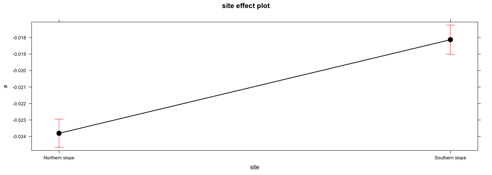

``` r
pd
```

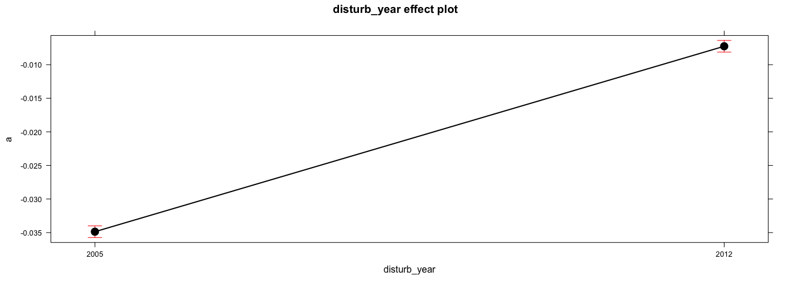

``` r
picollapse
```

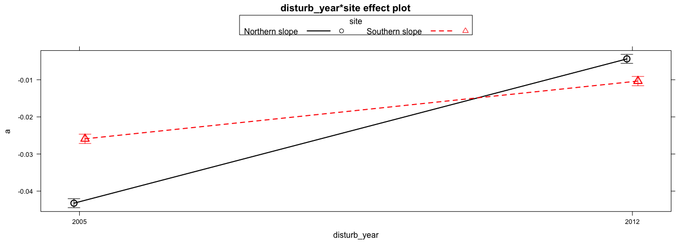

``` r
pi
```

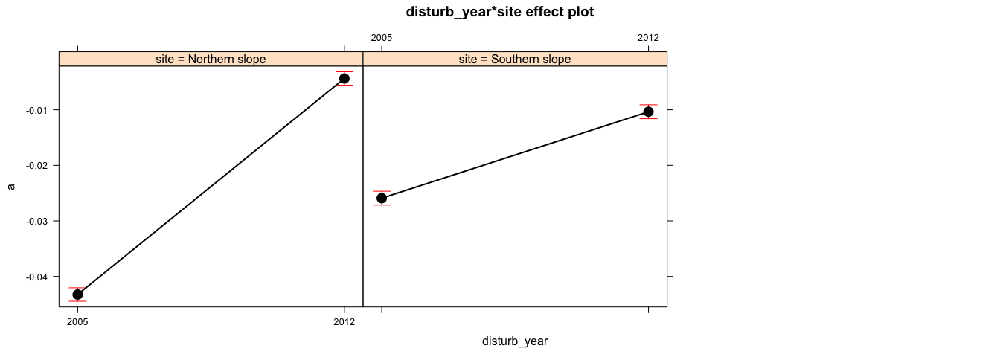

####  Compara Normalized Anomaly (nora)

``` r
resp_var <- 'nora'
vars <- c('disturb_year','site')

# AOV
aov_nora <- aovas(compara_anoma, vars=vars, resp_var = resp_var)

mc <- aov_nora$model_coeff

pander(mc, round=5,
       caption = paste0("ANOVA table: ", resp_var), missing = '', 
       emphasize.strong.cells = 
         which(mc < 0.1 & mc == mc$p.value, arr.ind = T))
```

<table style="width:85%;">
<caption>ANOVA table: nora</caption>
<colgroup>
<col width="25%" />
<col width="6%" />
<col width="11%" />
<col width="12%" />
<col width="16%" />
<col width="12%" />
</colgroup>
<thead>
<tr class="header">
<th align="center">term</th>
<th align="center">df</th>
<th align="center">sumsq</th>
<th align="center">meansq</th>
<th align="center">statistic</th>
<th align="center">p.value</th>
</tr>
</thead>
<tbody>
<tr class="odd">
<td align="center">disturb_year</td>
<td align="center">1</td>
<td align="center">15760</td>
<td align="center">15760</td>
<td align="center">2322</td>
<td align="center"><strong>0</strong></td>
</tr>
<tr class="even">
<td align="center">site</td>
<td align="center">1</td>
<td align="center">1256</td>
<td align="center">1256</td>
<td align="center">185</td>
<td align="center"><strong>0</strong></td>
</tr>
<tr class="odd">
<td align="center">disturb_year:site</td>
<td align="center">1</td>
<td align="center">3082</td>
<td align="center">3082</td>
<td align="center">454</td>
<td align="center"><strong>0</strong></td>
</tr>
<tr class="even">
<td align="center">Residuals</td>
<td align="center">1820</td>
<td align="center">12353</td>
<td align="center">6.787</td>
<td align="center"></td>
<td align="center"></td>
</tr>
</tbody>
</table>

``` r
gm <- aov_nora$model_summary

gm <- apply(gm, 1, formatC, digits = 2, format = "f") %>% t()
colnames(gm) <- paste0("$",c("R^2","\\mathrm{adj}R^2","\\sigma_e","F","p","df_m","\\mathrm{logLik}","AIC","BIC","\\mathrm{dev}","df_e"),"$")
rownames(gm) <- "Statistic"
pander(t(gm)) 
```

<table style="width:49%;">
<colgroup>
<col width="33%" />
<col width="15%" />
</colgroup>
<thead>
<tr class="header">
<th align="center"> </th>
<th align="center">Statistic</th>
</tr>
</thead>
<tbody>
<tr class="odd">
<td align="center"><strong><span class="math inline"><em>R</em><sup>2</sup></span></strong></td>
<td align="center">0.62</td>
</tr>
<tr class="even">
<td align="center"><strong><span class="math inline"><em>a</em><em>d</em><em>j</em><em>R</em><sup>2</sup></span></strong></td>
<td align="center">0.62</td>
</tr>
<tr class="odd">
<td align="center"><strong><span class="math inline"><em>σ</em><sub><em>e</em></sub></span></strong></td>
<td align="center">2.61</td>
</tr>
<tr class="even">
<td align="center"><strong><span class="math inline"><em>F</em></span></strong></td>
<td align="center">987.01</td>
</tr>
<tr class="odd">
<td align="center"><strong><span class="math inline"><em>p</em></span></strong></td>
<td align="center">0.00</td>
</tr>
<tr class="even">
<td align="center"><strong><span class="math inline"><em>d</em><em>f</em><sub><em>m</em></sub></span></strong></td>
<td align="center">4.00</td>
</tr>
<tr class="odd">
<td align="center"><strong><span class="math inline"><em>l</em><em>o</em><em>g</em><em>L</em><em>i</em><em>k</em></span></strong></td>
<td align="center">-4332.65</td>
</tr>
<tr class="even">
<td align="center"><strong><span class="math inline"><em>A</em><em>I</em><em>C</em></span></strong></td>
<td align="center">8675.31</td>
</tr>
<tr class="odd">
<td align="center"><strong><span class="math inline"><em>B</em><em>I</em><em>C</em></span></strong></td>
<td align="center">8702.85</td>
</tr>
<tr class="even">
<td align="center"><strong><span class="math inline"><em>d</em><em>e</em><em>v</em></span></strong></td>
<td align="center">12352.65</td>
</tr>
<tr class="odd">
<td align="center"><strong><span class="math inline"><em>d</em><em>f</em><sub><em>e</em></sub></span></strong></td>
<td align="center">1820.00</td>
</tr>
</tbody>
</table>

``` r
# Post hoc Define model
mymodel <- aov_nora$mymodel
postH_nora <- phc(mymodel = mymodel, resp_var = resp_var)
```

    ## 
    ## ### Event ###
    ## $lsmeans
    ##  disturb_year    lsmean         SE   df  lower.CL  upper.CL
    ##  2005         -7.154722 0.08631418 1820 -7.324007 -6.985437
    ##  2012         -1.361416 0.08631418 1820 -1.530701 -1.192131
    ## 
    ## Results are averaged over the levels of: site 
    ## Confidence level used: 0.95 
    ## 
    ## $contrasts
    ##  contrast     estimate        SE   df t.ratio p.value
    ##  2005 - 2012 -5.793306 0.1220667 1820  -47.46  <.0001
    ## 
    ## Results are averaged over the levels of: site 
    ## 
    ##  disturb_year    lsmean         SE   df  lower.CL  upper.CL .group
    ##  2005         -7.154722 0.08631418 1820 -7.347921 -6.961523  a    
    ##  2012         -1.361416 0.08631418 1820 -1.554615 -1.168217   b   
    ## 
    ## Results are averaged over the levels of: site 
    ## Confidence level used: 0.95 
    ## Conf-level adjustment: sidak method for 2 estimates 
    ## significance level used: alpha = 0.01 
    ## 
    ## ### Clu pop ###
    ## $lsmeans
    ##  site              lsmean         SE   df  lower.CL  upper.CL
    ##  Northern slope -5.088210 0.08488266 1820 -5.254688 -4.921733
    ##  Southern slope -3.427928 0.08772233 1820 -3.599975 -3.255881
    ## 
    ## Results are averaged over the levels of: disturb_year 
    ## Confidence level used: 0.95 
    ## 
    ## $contrasts
    ##  contrast                         estimate        SE   df t.ratio p.value
    ##  Northern slope - Southern slope -1.660283 0.1220667 1820 -13.601  <.0001
    ## 
    ## Results are averaged over the levels of: disturb_year 
    ## 
    ##  site              lsmean         SE   df  lower.CL  upper.CL .group
    ##  Northern slope -5.088210 0.08488266 1820 -5.278205 -4.898216  a    
    ##  Southern slope -3.427928 0.08772233 1820 -3.624278 -3.231577   b   
    ## 
    ## Results are averaged over the levels of: disturb_year 
    ## Confidence level used: 0.95 
    ## Conf-level adjustment: sidak method for 2 estimates 
    ## significance level used: alpha = 0.01 
    ## 
    ## ### Event:Clu pop ###
    ## $lsmeans
    ##  disturb_year site               lsmean        SE   df  lower.CL
    ##  2005         Northern slope -9.2853605 0.1200422 1820 -9.520796
    ##  2012         Northern slope -0.8910601 0.1200422 1820 -1.126495
    ##  2005         Southern slope -5.0240830 0.1240581 1820 -5.267394
    ##  2012         Southern slope -1.8317723 0.1240581 1820 -2.075084
    ##    upper.CL
    ##  -9.0499255
    ##  -0.6556252
    ##  -4.7807718
    ##  -1.5884611
    ## 
    ## Confidence level used: 0.95 
    ## 
    ## $contrasts
    ##  contrast                                    estimate        SE   df
    ##  2005,Northern slope - 2012,Northern slope -8.3943004 0.1697653 1820
    ##  2005,Northern slope - 2005,Southern slope -4.2612775 0.1726284 1820
    ##  2005,Northern slope - 2012,Southern slope -7.4535882 0.1726284 1820
    ##  2012,Northern slope - 2005,Southern slope  4.1330229 0.1726284 1820
    ##  2012,Northern slope - 2012,Southern slope  0.9407122 0.1726284 1820
    ##  2005,Southern slope - 2012,Southern slope -3.1923108 0.1754447 1820
    ##  t.ratio p.value
    ##  -49.446  <.0001
    ##  -24.685  <.0001
    ##  -43.177  <.0001
    ##   23.942  <.0001
    ##    5.449  <.0001
    ##  -18.196  <.0001
    ## 
    ## P value adjustment: tukey method for comparing a family of 4 estimates

``` r
#### ~ Site
ps <- plot(effect("site",mymodel))
#### ~ Disturb Year
pd <- plot(effect('disturb_year', mymodel))
#### Disturb Year:Site
picollapse <- plot(effect("disturb_year:site",mymodel), multiline = TRUE, ci.style = 'bars')
pi <- plot(effect("disturb_year:site",mymodel), layout=c(3,1))
```

``` r
ps
```

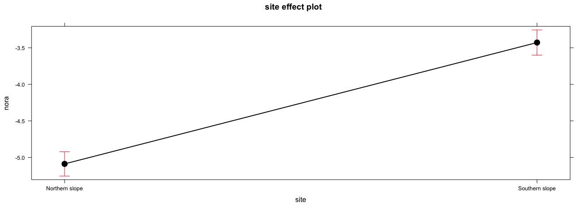

``` r
pd
```

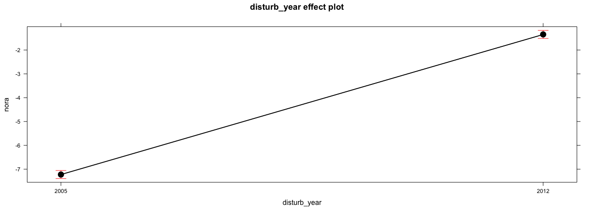

``` r
picollapse
```

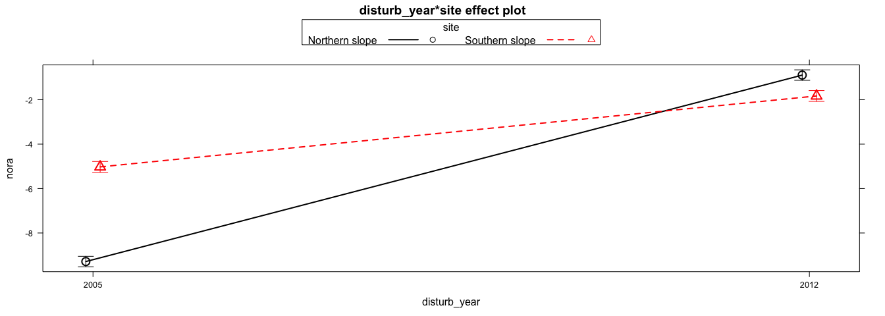

``` r
pi
```

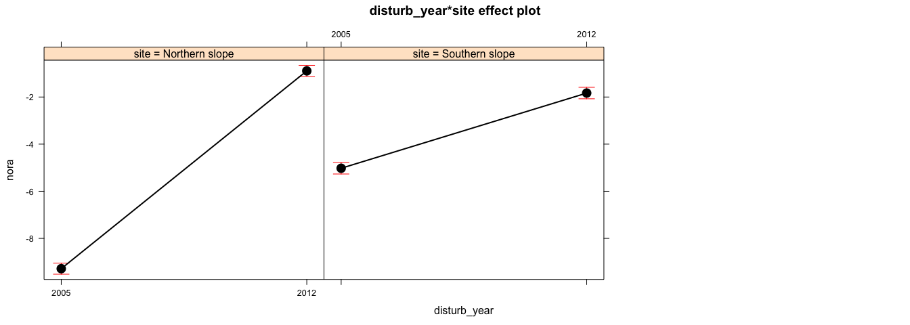

####  Compara Standardized Anomaly (sa)

``` r
resp_var <- 'sa'
vars <- c('disturb_year','site')

# AOV
aov_sa <- aovas(compara_anoma, vars=vars, resp_var = resp_var)

mc <- aov_sa$model_coeff

pander(mc, round=5,
       caption = paste0("ANOVA table: ", resp_var), missing = '', 
       emphasize.strong.cells = 
         which(mc < 0.1 & mc == mc$p.value, arr.ind = T))
```

<table style="width:85%;">
<caption>ANOVA table: sa</caption>
<colgroup>
<col width="25%" />
<col width="6%" />
<col width="11%" />
<col width="12%" />
<col width="16%" />
<col width="12%" />
</colgroup>
<thead>
<tr class="header">
<th align="center">term</th>
<th align="center">df</th>
<th align="center">sumsq</th>
<th align="center">meansq</th>
<th align="center">statistic</th>
<th align="center">p.value</th>
</tr>
</thead>
<tbody>
<tr class="odd">
<td align="center">disturb_year</td>
<td align="center">1</td>
<td align="center">1629</td>
<td align="center">1629</td>
<td align="center">2113</td>
<td align="center"><strong>0</strong></td>
</tr>
<tr class="even">
<td align="center">site</td>
<td align="center">1</td>
<td align="center">38.4</td>
<td align="center">38.4</td>
<td align="center">49.79</td>
<td align="center"><strong>0</strong></td>
</tr>
<tr class="odd">
<td align="center">disturb_year:site</td>
<td align="center">1</td>
<td align="center">242.3</td>
<td align="center">242.3</td>
<td align="center">314.1</td>
<td align="center"><strong>0</strong></td>
</tr>
<tr class="even">
<td align="center">Residuals</td>
<td align="center">1820</td>
<td align="center">1404</td>
<td align="center">0.7712</td>
<td align="center"></td>
<td align="center"></td>
</tr>
</tbody>
</table>

``` r
gm <- aov_sa$model_summary

gm <- apply(gm, 1, formatC, digits = 2, format = "f") %>% t()
colnames(gm) <- paste0("$",c("R^2","\\mathrm{adj}R^2","\\sigma_e","F","p","df_m","\\mathrm{logLik}","AIC","BIC","\\mathrm{dev}","df_e"),"$")
rownames(gm) <- "Statistic"
pander(t(gm)) 
```

<table style="width:49%;">
<colgroup>
<col width="33%" />
<col width="15%" />
</colgroup>
<thead>
<tr class="header">
<th align="center"> </th>
<th align="center">Statistic</th>
</tr>
</thead>
<tbody>
<tr class="odd">
<td align="center"><strong><span class="math inline"><em>R</em><sup>2</sup></span></strong></td>
<td align="center">0.58</td>
</tr>
<tr class="even">
<td align="center"><strong><span class="math inline"><em>a</em><em>d</em><em>j</em><em>R</em><sup>2</sup></span></strong></td>
<td align="center">0.58</td>
</tr>
<tr class="odd">
<td align="center"><strong><span class="math inline"><em>σ</em><sub><em>e</em></sub></span></strong></td>
<td align="center">0.88</td>
</tr>
<tr class="even">
<td align="center"><strong><span class="math inline"><em>F</em></span></strong></td>
<td align="center">825.60</td>
</tr>
<tr class="odd">
<td align="center"><strong><span class="math inline"><em>p</em></span></strong></td>
<td align="center">0.00</td>
</tr>
<tr class="even">
<td align="center"><strong><span class="math inline"><em>d</em><em>f</em><sub><em>m</em></sub></span></strong></td>
<td align="center">4.00</td>
</tr>
<tr class="odd">
<td align="center"><strong><span class="math inline"><em>l</em><em>o</em><em>g</em><em>L</em><em>i</em><em>k</em></span></strong></td>
<td align="center">-2349.21</td>
</tr>
<tr class="even">
<td align="center"><strong><span class="math inline"><em>A</em><em>I</em><em>C</em></span></strong></td>
<td align="center">4708.43</td>
</tr>
<tr class="odd">
<td align="center"><strong><span class="math inline"><em>B</em><em>I</em><em>C</em></span></strong></td>
<td align="center">4735.97</td>
</tr>
<tr class="even">
<td align="center"><strong><span class="math inline"><em>d</em><em>e</em><em>v</em></span></strong></td>
<td align="center">1403.61</td>
</tr>
<tr class="odd">
<td align="center"><strong><span class="math inline"><em>d</em><em>f</em><sub><em>e</em></sub></span></strong></td>
<td align="center">1820.00</td>
</tr>
</tbody>
</table>

``` r
# Post hoc Define model
mymodel <- aov_sa$mymodel
postH_sa <- phc(mymodel = mymodel, resp_var = resp_var)
```

    ## 
    ## ### Event ###
    ## $lsmeans
    ##  disturb_year     lsmean         SE   df   lower.CL   upper.CL
    ##  2005         -2.2845241 0.02909544 1820 -2.3415881 -2.2274602
    ##  2012         -0.4181652 0.02909544 1820 -0.4752291 -0.3611012
    ## 
    ## Results are averaged over the levels of: site 
    ## Confidence level used: 0.95 
    ## 
    ## $contrasts
    ##  contrast     estimate         SE   df t.ratio p.value
    ##  2005 - 2012 -1.866359 0.04114716 1820 -45.358  <.0001
    ## 
    ## Results are averaged over the levels of: site 
    ## 
    ##  disturb_year     lsmean         SE   df   lower.CL   upper.CL .group
    ##  2005         -2.2845241 0.02909544 1820 -2.3496491 -2.2193992  a    
    ##  2012         -0.4181652 0.02909544 1820 -0.4832901 -0.3530402   b   
    ## 
    ## Results are averaged over the levels of: site 
    ## Confidence level used: 0.95 
    ## Conf-level adjustment: sidak method for 2 estimates 
    ## significance level used: alpha = 0.01 
    ## 
    ## ### Clu pop ###
    ## $lsmeans
    ##  site              lsmean         SE   df  lower.CL  upper.CL
    ##  Northern slope -1.496513 0.02861289 1820 -1.552630 -1.440395
    ##  Southern slope -1.206176 0.02957011 1820 -1.264171 -1.148182
    ## 
    ## Results are averaged over the levels of: disturb_year 
    ## Confidence level used: 0.95 
    ## 
    ## $contrasts
    ##  contrast                          estimate         SE   df t.ratio
    ##  Northern slope - Southern slope -0.2903365 0.04114716 1820  -7.056
    ##  p.value
    ##   <.0001
    ## 
    ## Results are averaged over the levels of: disturb_year 
    ## 
    ##  site              lsmean         SE   df  lower.CL  upper.CL .group
    ##  Northern slope -1.496513 0.02861289 1820 -1.560558 -1.432468  a    
    ##  Southern slope -1.206176 0.02957011 1820 -1.272364 -1.139989   b   
    ## 
    ## Results are averaged over the levels of: disturb_year 
    ## Confidence level used: 0.95 
    ## Conf-level adjustment: sidak method for 2 estimates 
    ## significance level used: alpha = 0.01 
    ## 
    ## ### Event:Clu pop ###
    ## $lsmeans
    ##  disturb_year site               lsmean         SE   df   lower.CL
    ##  2005         Northern slope -2.7943291 0.04046474 1820 -2.8736913
    ##  2012         Northern slope -0.1986967 0.04046474 1820 -0.2780589
    ##  2005         Southern slope -1.7747192 0.04181845 1820 -1.8567364
    ##  2012         Southern slope -0.6376337 0.04181845 1820 -0.7196509
    ##    upper.CL
    ##  -2.7149669
    ##  -0.1193345
    ##  -1.6927020
    ##  -0.5556165
    ## 
    ## Confidence level used: 0.95 
    ## 
    ## $contrasts
    ##  contrast                                    estimate         SE   df
    ##  2005,Northern slope - 2012,Northern slope -2.5956323 0.05722578 1820
    ##  2005,Northern slope - 2005,Southern slope -1.0196099 0.05819087 1820
    ##  2005,Northern slope - 2012,Southern slope -2.1566954 0.05819087 1820
    ##  2012,Northern slope - 2005,Southern slope  1.5760225 0.05819087 1820
    ##  2012,Northern slope - 2012,Southern slope  0.4389369 0.05819087 1820
    ##  2005,Southern slope - 2012,Southern slope -1.1370856 0.05914022 1820
    ##  t.ratio p.value
    ##  -45.358  <.0001
    ##  -17.522  <.0001
    ##  -37.062  <.0001
    ##   27.084  <.0001
    ##    7.543  <.0001
    ##  -19.227  <.0001
    ## 
    ## P value adjustment: tukey method for comparing a family of 4 estimates

``` r
#### ~ Site
ps <- plot(effect("site",mymodel))
#### ~ Disturb Year
pd <- plot(effect('disturb_year', mymodel))
#### Disturb Year:Site
picollapse <- plot(effect("disturb_year:site",mymodel), multiline = TRUE, ci.style = 'bars')
pi <- plot(effect("disturb_year:site",mymodel), layout=c(3,1))
```

``` r
ps
```

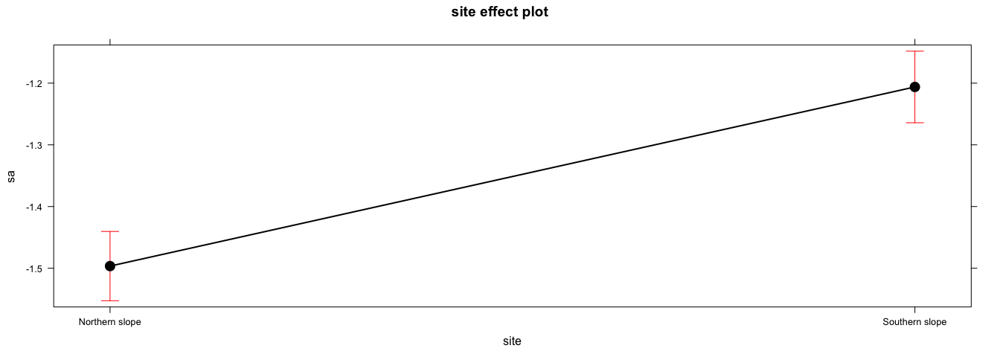

``` r
pd
```

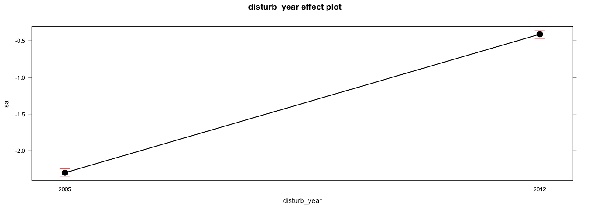

``` r
picollapse
```

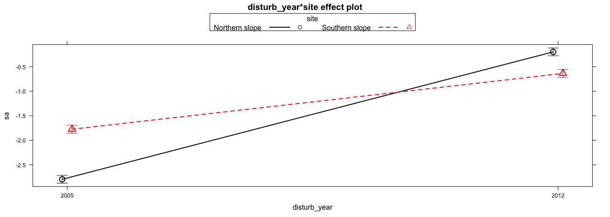

``` r
pi
```

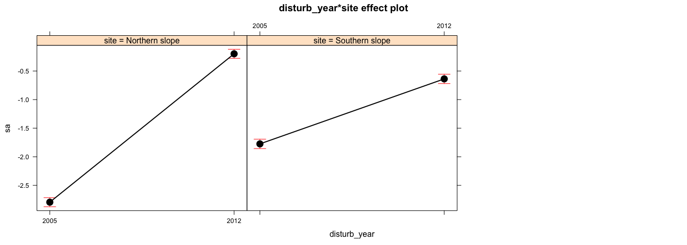

#### Plot de trayectoria de las anomalías

-   Idea de plot de la media y la varianza (Trayectoria). Relacionado con las métricas de estabilidad (com. personal. Paula Escribano).

-   Referencias intersantes para las trayectorias:

    -   Zimmermann, N. E., R. A. Washington-Allen, R. D. Ramsey, M. E. Schaepman, L. Mathys, B. Koetz, M. Kneubuehler, and T. C. Edwards. 2007. Modern remote sensing for environmental monitoring of landscape states and trajectories. Pages 65-91 in F. Kienast, O. Wildi, and S. Ghosh, editors. A changing world: challenges for landscape research. Springer, Dordrecht, The Netherlands.
    -   Washington-Allen, R. A., R. D. Ramsey, N. E. West, and B. E. Norton. 2008. Quantification of the ecological resilience of drylands using digital remote sensing. Ecology and Society 13(1): 33. <http://www.ecologyandsociety.org/vol13/iss1/art33/>

``` r
traj <- anomalias_evimean %>% group_by(pop, y) %>% 
  summarise(mean = mean(a),
            sd = sd(a))

traj_mean <- traj %>% 
  group_by(y) %>% 
  summarise(meanOfmean = mean(mean), 
            sdOfmean = sd(mean),
            seOfmean = sdOfmean/sqrt(length(mean)),
            meanOfsd = mean(sd),
            sdOfsd = sd(sd),
            seOfsd = sdOfsd /sqrt(length(sd))) %>% 
  as.data.frame()


traj_plot <- traj_mean%>% 
  ggplot(aes(x=meanOfmean, y=meanOfsd, label=y)) +
  geom_errorbar(aes(ymin=meanOfsd - seOfsd, ymax=meanOfsd + seOfsd)) + 
  geom_errorbarh(aes(xmin=meanOfmean - seOfmean, xmax=meanOfmean + seOfmean)) + 
  geom_path(colour='gray') +
  geom_point(size=3, shape=21, fill='white') + 
  geom_text(hjust = 0.001, nudge_x = 0.001) + 
  geom_vline(aes(xintercept = mean(meanOfmean)), colour='red') +
  geom_hline(aes(yintercept = mean(meanOfsd)), colour ='red')+
  theme_bw() + xlab('mean') + ylab('variance') + 
  theme(strip.background = element_rect(fill = "white"), 
        legend.position="none") 

traj_plot
```

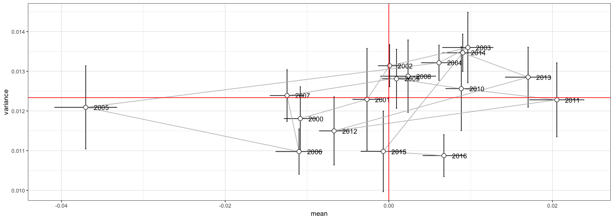

``` r
pdf(file=paste0(di, "/images/plot_trajectories_anomalies.pdf"), height = 6, width =6)
traj_plot
dev.off()
```

    ## quartz_off_screen 
    ##                 2

``` r
traj_mean_pop <- traj %>% 
  mutate(clu_pop = as.factor(ifelse(pop %in% c(1,2,3,4,5), 'N', 'S'))) %>% 
  group_by(clu_pop,y) %>% 
  summarise(meanOfmean = mean(mean), 
            sdOfmean = sd(mean),
            seOfmean = sdOfmean/sqrt(length(mean)),
            meanOfsd = mean(sd),
            sdOfsd = sd(sd),
            seOfsd = sdOfsd /sqrt(length(sd))) %>%
  as.data.frame() 

line_traj_mean_pop <- traj_mean_pop %>% 
  group_by(clu_pop) %>% 
  summarise(
    meanOfmean = mean(meanOfmean), 
    meanOfsd = mean(meanOfsd)
  )


  
traj_plot_pop <- ggplot(traj_mean_pop,
  aes(x=meanOfmean, y=meanOfsd, label=y)) +
  geom_errorbar(aes(ymin=meanOfsd - seOfsd, ymax=meanOfsd + seOfsd)) + 
  geom_errorbarh(aes(xmin=meanOfmean - seOfmean, xmax=meanOfmean + seOfmean)) + 
  geom_path(colour='gray') +
  geom_point(size=3, shape=21, fill='white') +
  geom_text(hjust = 0.001, nudge_x = 0.001) + 
  facet_wrap(~clu_pop) +
  theme_bw() + xlab('mean') + ylab('variance') + 
  theme(strip.background = element_rect(fill = "white"), 
        legend.position="none") 

traj_plot_pop <- 
  traj_plot_pop + 
  geom_vline(aes(xintercept = meanOfmean), line_traj_mean_pop,  colour='red') +
  geom_hline(aes(yintercept = meanOfsd), line_traj_mean_pop, colour ='red') 

traj_plot_pop
```

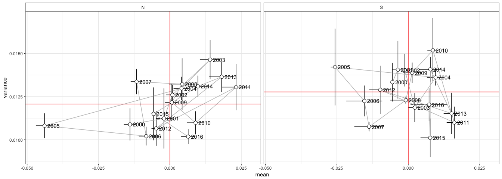

``` r
pdf(file=paste0(di, "/images/plot_trajectories_anomalies_clu.pdf"), height = 6, width =10)
traj_plot_pop
dev.off()
```

    ## quartz_off_screen 
    ##                 2

Notas que podemos obtener de explorar las anomalías
===================================================

Del análisis del plot de trayectorias
-------------------------------------

-   2005 supuso una disminución del greenness (el promedio de las anomalías es muy bajo respecto a los otros años), y esta disminución es bastante homogénea para todos los pixeles.

-   Aunque 2012 presentó anomalías negativas (disminuición del greenness), su magnitud promedio (es decir el promedio para todos los pixeles) fue inferior al promedio observado para los años 2006, 2007 y 2000. Nótese que los años 2006 y 2007 son los posteriores a la gran sequía de 2005.

-   Un análisis detallado entre las poblaciones del N y del S, refleja un patron simliar respecto a 2005, esto es, es el año en el que el promedio de las anomalías fue el mas bajo. Con 2012 ocurre algo similar. Llama la atención, que para 2005 sin embargo el patron fue mas heterogéno en las poblaciones del sur, esto es, mucha varibilidad en las anomalías de las poblaciones situadas en el sur.

Explorando las anomalías
------------------------

-   Cuando exploramos las anomalías (brutas, estandarizadas y normalizadas) observamos valores muy negativos para el año 2005. Sin embargo
