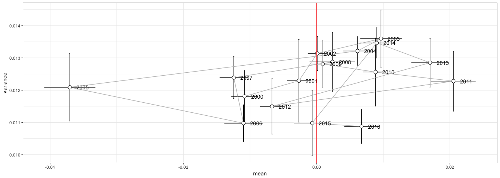
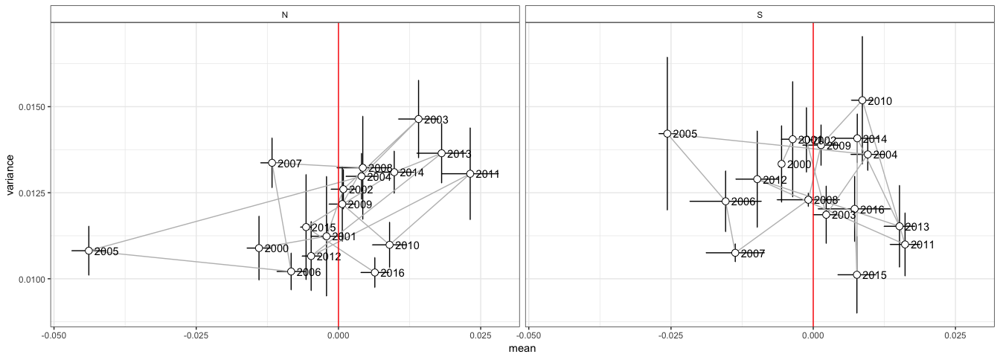

``` r
library("rgdal")
library("sp")
library("raster")
library("rasterVis")
source(paste0(di,"/script/R/exportpdf.R")) # function to export raster levelplots maps as pdf
library("dplyr")
library("ggplot2")
library("reshape2")
library("purrr")
# library("pander")
library("knitr")
```

Read data and Prepare Data
--------------------------

-   Crear variable factorial para agrupar a las poblaciones
-   No incluiremos la poblacion 9

``` r
# Read data 
anomalias_evimean <- read.csv(file=paste(di, "/data/anomalies/anomalias_evimean.csv", sep=""), header = TRUE, sep = ',')
# anomalias_composite <- read.csv(file=paste(di, "/data/anomalies/anomalias_composite.csv", sep=""), header = TRUE, sep = ',')

anomalias_evimean <- anomalias_evimean %>% 
  mutate(
    clu_pop = as.factor(case_when(
      pop == 1 ~ "Camarate",
      pop %in% c(2,3,4,5) ~ 'Northern slope',
      pop %in% c(6,7,8) ~ 'Southern slope',
      pop == 9 ~ 'out')),
    clu_pop2 = as.factor(case_when(
      pop %in% c(1,2,3,4,5) ~ 'Northern slope',
      pop %in% c(6,7,8) ~ 'Southern slope',
      pop == 9 ~ 'out'))) %>% 
  filter(clu_pop != 'out')
```

Anomalies by cluster populations
--------------------------------

-   Datos medios de las anomalias (*a*), anomalias normalizadas (*nora*) y de las anomalias estandarizadas(*sa*) por cluster

-   Consideramos al Camarate (pop 1, dentro del Northern Slopes)

``` r
# Anomalies 
avg_a_clu <- anomalias_evimean %>% 
  group_by(clu_pop2, y) %>% 
  summarise(mean=mean(a, na.rm=T),
            sd = sd(a, na.rm=T),
            se = sd/sqrt(length(a))) %>% 
 mutate(signo = ifelse(mean >= 0, 'pos', 'neg')) 

# Normalized Anomalies 
avg_nora_clu <- anomalias_evimean %>% 
  group_by(clu_pop2, y) %>% 
  summarise(mean=mean(nora, na.rm=T),
            sd = sd(nora, na.rm=T),
            se = sd/sqrt(length(nora))) %>% 
 mutate(signo = ifelse(mean >= 0, 'pos', 'neg'))

# Standardized Anomalies 
avg_sa_clu <- anomalias_evimean %>% 
  group_by(clu_pop2, y) %>% 
  summarise(mean=mean(sa, na.rm=T),
            sd = sd(sa, na.rm=T),
            se = sd/sqrt(length(sa))) %>% 
 mutate(signo = ifelse(mean >= 0, 'pos', 'neg'))
```

### EVI Anomaly by cluster pop

``` r
myylab <- 'EVI Anomaly'

plot_a_clu <- avg_a_clu %>%  
  ggplot(aes(x=y, y=mean, fill=signo)) + 
  geom_bar(stat = "identity") + 
  geom_errorbar(aes(ymin = mean - se, ymax = mean + se, colour=signo), width=.5) +
  facet_wrap(~clu_pop2, nrow = 2) + 
  scale_fill_manual(values = c("pos" = color_pos, "neg" =  color_neg)) +
  scale_color_manual(values = c("pos" = color_pos, "neg" =  color_neg)) +
  ylab(myylab) + xlab('') +
  theme_bw() +
  theme(text = element_text(size=16),
        legend.position = "none",
        panel.grid.major.x = element_blank(),
        panel.grid.minor = element_blank(),
        strip.background = element_rect(fill = "white"))

pdf(file=paste0(di, "/images/plot_anoma_EVI_clu_a.pdf"), height = 7, width = 7)
plot_a_clu
dev.off()
```

    ## quartz_off_screen 
    ##                 2

### EVI Normalized Anomaly by cluster pop

``` r
myylab <- 'EVI Normalized Anomaly'

plot_nora_clu <- avg_nora_clu %>%  
  ggplot(aes(x=y, y=mean, fill=signo)) + 
  geom_bar(stat = "identity") + 
  geom_errorbar(aes(ymin = mean - se, ymax = mean + se, colour=signo), width=.5) +
  facet_wrap(~clu_pop2, nrow = 2) + 
  scale_fill_manual(values = c("pos" = color_pos, "neg" =  color_neg)) +
  scale_color_manual(values = c("pos" = color_pos, "neg" =  color_neg)) +
  ylab(myylab) + xlab('') +
  theme_bw() +
  theme(text = element_text(size=16),
        legend.position = "none",
        panel.grid.major.x = element_blank(),
        panel.grid.minor = element_blank(),
        strip.background = element_rect(fill = "white"))

pdf(file=paste0(di, "/images/plot_anoma_EVI_clu_nora.pdf"), height = 7, width = 7)
plot_nora_clu 
dev.off()
```

    ## quartz_off_screen 
    ##                 2

### EVI Standardized Anomaly by cluster pop

``` r
myylab <- 'EVI Standardized Anomaly'

plot_sa_clu  <- avg_sa_clu %>%  
  ggplot(aes(x=y, y=mean, fill=signo)) + 
  geom_bar(stat = "identity") + 
  geom_errorbar(aes(ymin = mean - se, ymax = mean + se, colour=signo), width=.5) +
  facet_wrap(~clu_pop2, nrow = 2) + 
  scale_fill_manual(values = c("pos" = color_pos, "neg" =  color_neg)) +
  scale_color_manual(values = c("pos" = color_pos, "neg" =  color_neg)) +
  ylab(myylab) + xlab('') +
  theme_bw() +
  theme(text = element_text(size=16),
        legend.position = "none",
        panel.grid.major.x = element_blank(),
        panel.grid.minor = element_blank(),
        strip.background = element_rect(fill = "white"))

pdf(file=paste0(di, "/images/plot_anoma_EVI_clu_sa.pdf"), height = 7, width = 7)
plot_sa_clu
dev.off()
```

    ## quartz_off_screen 
    ##                 2

Anomalies by populations
------------------------

-   Datos medios de las anomalias (*a*), anomalias normalizadas (*nora*) y de las anomalias estandarizadas(*sa*) por poblaciones

``` r
# Anomalies 
avg_a_pop <- anomalias_evimean %>% 
  group_by(pop, y) %>% 
  summarise(mean=mean(a, na.rm=T),
            sd = sd(a, na.rm=T),
            se = sd/sqrt(length(a))) %>% 
 mutate(signo = ifelse(mean >= 0, 'pos', 'neg')) 

# Normalized Anomalies 
avg_nora_pop <- anomalias_evimean %>% 
  group_by(pop, y) %>% 
  summarise(mean=mean(nora, na.rm=T),
            sd = sd(nora, na.rm=T),
            se = sd/sqrt(length(nora))) %>% 
 mutate(signo = ifelse(mean >= 0, 'pos', 'neg'))

# Standardized Anomalies 
avg_sa_pop <- anomalias_evimean %>% 
  group_by(pop, y) %>% 
  summarise(mean=mean(sa, na.rm=T),
            sd = sd(sa, na.rm=T),
            se = sd/sqrt(length(sa))) %>% 
 mutate(signo = ifelse(mean >= 0, 'pos', 'neg'))
```

``` r
label_pop <- c('1' = 'Lugros', '2' = 'Guejar-Sierra', '3' = 'Monachil',
                      '4' = 'Dilar', '5' = 'Durcal', '6' = 'Caniar', 
                      '7' = 'Poqueira', '8' = 'Trevelez', '9' = 'Cadiar')
```

### EVI Anomaly by pop

``` r
myylab <- 'EVI Anomaly'

plot_a_pop <- avg_a_pop %>%  
  ggplot(aes(x=y, y=mean, fill=signo)) + 
  geom_bar(stat = "identity") + 
  geom_errorbar(aes(ymin = mean - se, ymax = mean + se, colour=signo), width=.5) +
  facet_wrap(~pop, nrow = 3, labeller = as_labeller(label_pop)) + 
  scale_fill_manual(values = c("pos" = color_pos, "neg" =  color_neg)) +
  scale_color_manual(values = c("pos" = color_pos, "neg" =  color_neg)) +
  ylab(myylab) + xlab('') +
  theme_bw() +
  theme(text = element_text(size=16), legend.position = "none",
        panel.grid.major.x = element_blank(),
        panel.grid.minor = element_blank(),
        strip.background = element_rect(fill = "white"))

pdf(file=paste0(di, "/images/plot_anoma_EVI_pop_a.pdf"), height = 14, width = 14)
plot_a_pop
dev.off()
```

    ## quartz_off_screen 
    ##                 2

### EVI Normalized Anomaly by pop

``` r
myylab <- 'EVI Normalized Anomaly'

plot_nora_pop <- avg_nora_pop %>%  
  ggplot(aes(x=y, y=mean, fill=signo)) + 
  geom_bar(stat = "identity") + 
  geom_errorbar(aes(ymin = mean - se, ymax = mean + se, colour=signo), width=.5) +
  facet_wrap(~pop, nrow = 3, labeller = as_labeller(label_pop)) +
  scale_fill_manual(values = c("pos" = color_pos, "neg" =  color_neg)) +
  scale_color_manual(values = c("pos" = color_pos, "neg" =  color_neg)) +
  ylab(myylab) + xlab('') +
  theme_bw() +
  theme(text = element_text(size=16),
        legend.position = "none",
        panel.grid.major.x = element_blank(),
        panel.grid.minor = element_blank(),
        strip.background = element_rect(fill = "white"))

pdf(file=paste0(di, "/images/plot_anoma_EVI_pop_nora.pdf"), height = 14, width = 14)
plot_nora_pop 
dev.off()
```

    ## quartz_off_screen 
    ##                 2

### EVI Standardized Anomaly by pop

``` r
myylab <- 'EVI Standardized Anomaly'

plot_sa_pop  <- avg_sa_pop %>%  
  ggplot(aes(x=y, y=mean, fill=signo)) + 
  geom_bar(stat = "identity") + 
  geom_errorbar(aes(ymin = mean - se, ymax = mean + se, colour=signo), width=.5) +
  facet_wrap(~pop, nrow = 3, labeller = as_labeller(label_pop)) + 
  scale_fill_manual(values = c("pos" = color_pos, "neg" =  color_neg)) +
  scale_color_manual(values = c("pos" = color_pos, "neg" =  color_neg)) +
  ylab(myylab) + xlab('') +
  theme_bw() +
  theme(text = element_text(size=16),
        legend.position = "none",
        panel.grid.major.x = element_blank(),
        panel.grid.minor = element_blank(),
        strip.background = element_rect(fill = "white"))

pdf(file=paste0(di, "/images/plot_anoma_EVI_pop_sa.pdf"), height = 14, width = 14)
plot_sa_pop
dev.off()
```

    ## quartz_off_screen 
    ##                 2

Maps
====

-   Create raster maps (two projections: `epsg:4326` and `epsg:23030`)

``` r
# Create stack of raster 
stack_anomalias <- stack(r_anomalia_a2005, r_anomalia_a2012, r_anomalia_nora2005, r_anomalia_nora2012, r_anomalia_sa2005, r_anomalia_sa2012)

stack_anomalias_re <- stack(r_anomalia_a2005_re, r_anomalia_a2012_re, r_anomalia_nora2005_re, r_anomalia_nora2012_re, r_anomalia_sa2005_re, r_anomalia_sa2012_re)


# Export stack 
temp <- getwd()
setwd(paste(di, "/data/raster/", sep=""))
writeRaster(stack_anomalias, filename = 'r_all_nomalias_stack', overwrite =TRUE) 
writeRaster(stack_anomalias_re, filename = 'r_all_anomalias_re_stack', overwrite =TRUE) 
setwd(temp)
```

Spatial exploration of the anomaly
----------------------------------

### Anomaly

``` r
# Select a palette http://colorbrewer2.org/
mypal <- brewer.pal(11, "RdYlGn")
# Specify the color palette
myTheme=rasterTheme(region=mypal)

lp <- levelplot(stack_anomalias, 
          margin=FALSE,
          layer=c('a_2005', 'a_2012'),
          #par.settings=myTheme, 
          par.settings=RdBuTheme, 
          names.attr=c("2005", "2012"),
          pretty=TRUE,
          layout=c(2,1),
          main='EVI Anomaly', xlab=NULL, ylab=NULL) 

print(lp)
```


``` r
tiff(filename=paste0(di, '/images/raster_maps/anomaly_2005_2012_a.tiff'), 
     height = 1600, width = 2500, res=150, pointsize = 20, bg='transparent')
print(lp)
dev.off()
```

    ## quartz_off_screen 
    ##                 2

``` r
exportpdf(mypdf=paste0(di, '/images/raster_maps/anomaly_2005_2012_a.pdf'), lp) 
```

    ## quartz_off_screen 
    ##                 2

### Normalized Anomaly

``` r
# Select a palette http://colorbrewer2.org/
mypal <- brewer.pal(11, "RdYlGn")
# Specify the color palette
myTheme=rasterTheme(region=mypal)

lp <- levelplot(stack_anomalias, 
          margin=FALSE,
          layer=c('nora_2005', 'nora_2012'),
          #par.settings=myTheme, 
          par.settings=RdBuTheme, 
          names.attr=c("2005", "2012"),
          pretty=TRUE,
          layout=c(2,1),
          main='EVI Normalized Anomaly', xlab=NULL, ylab=NULL) 

print(lp)
```


``` r
tiff(filename=paste0(di, '/images/raster_maps/anomaly_2005_2012_nora.tiff'), 
     height = 1600, width = 2500, res=150, pointsize = 20, bg='transparent')
print(lp)
dev.off()
```

    ## quartz_off_screen 
    ##                 2

``` r
exportpdf(mypdf=paste0(di, '/images/raster_maps/anomaly_2005_2012_nora.pdf'), lp) 
```

    ## quartz_off_screen 
    ##                 2

### Standardized Anomaly

``` r
# Select a palette http://colorbrewer2.org/
mypal <- brewer.pal(11, "RdYlGn")
# Specify the color palette
myTheme=rasterTheme(region=mypal)

lp <- levelplot(stack_anomalias, 
          margin=FALSE,
          layer=c('sa_2005', 'sa_2012'),
          #par.settings=myTheme, 
          par.settings=RdBuTheme, 
          names.attr=c("2005", "2012"),
          pretty=TRUE,
          layout=c(2,1),
          main='EVI Standardized Anomaly', xlab=NULL, ylab=NULL) 

print(lp)
```


``` r
tiff(filename=paste0(di, '/images/raster_maps/anomaly_2005_2012_sa.tiff'), 
     height = 1600, width = 2500, res=150, pointsize = 20, bg='transparent')
print(lp)
dev.off()
```

    ## quartz_off_screen 
    ##                 2

``` r
exportpdf(mypdf=paste0(di, '/images/raster_maps/anomaly_2005_2012_sa.pdf'), lp) 
```

    ## quartz_off_screen 
    ##                 2

#### Nota

-   Idea de plot de la media y la varianza (Trayectoria). Relacionado con las métricas de estabilidad (com. personal. Paula Escribano) (:red\_circle: analizar mejor)

``` r
traj <- anomalias_evimean %>% group_by(pop, y) %>% 
  summarise(mean = mean(a),
            sd = sd(a))

traj_plot <- traj %>% 
  group_by(y) %>% 
  summarise(meanOfmean = mean(mean), 
            sdOfmean = sd(mean),
            seOfmean = sdOfmean/sqrt(length(mean)),
            meanOfsd = mean(sd),
            sdOfsd = sd(sd),
            seOfsd = sdOfsd /sqrt(length(sd))) %>% 
  ggplot(aes(x=meanOfmean, y=meanOfsd, label=y)) +
  geom_errorbar(aes(ymin=meanOfsd - seOfsd, ymax=meanOfsd + seOfsd)) + 
  geom_errorbarh(aes(xmin=meanOfmean - seOfmean, xmax=meanOfmean + seOfmean)) + 
  geom_path(colour='gray') +
  geom_point(size=3, shape=21, fill='white') + 
  geom_text(hjust = 0.001, nudge_x = 0.001) + 
  geom_vline(xintercept = 0, colour='red') +
  theme_bw() + xlab('mean') + ylab('variance') + 
  theme(strip.background = element_rect(fill = "white"), 
        legend.position="none") 

traj_plot
```



``` r
pdf(file=paste0(di, "/images/plot_trajectories_anomalies.pdf"), height = 6, width =6)
traj_plot
dev.off()
```

    ## quartz_off_screen 
    ##                 2

``` r
traj_plot_pop <- traj %>% 
  mutate(clu_pop = as.factor(ifelse(pop %in% c(1,2,3,4,5), 'N', 'S'))) %>% 
  group_by(clu_pop,y) %>% 
  summarise(meanOfmean = mean(mean), 
            sdOfmean = sd(mean),
            seOfmean = sdOfmean/sqrt(length(mean)),
            meanOfsd = mean(sd),
            sdOfsd = sd(sd),
            seOfsd = sdOfsd /sqrt(length(sd))) %>%
  ggplot(aes(x=meanOfmean, y=meanOfsd, label=y)) +
    geom_errorbar(aes(ymin=meanOfsd - seOfsd, ymax=meanOfsd + seOfsd)) + 
  geom_errorbarh(aes(xmin=meanOfmean - seOfmean, xmax=meanOfmean + seOfmean)) + 
  geom_path(colour='gray') +
  geom_point(size=3, shape=21, fill='white') +
  geom_text(hjust = 0.001, nudge_x = 0.001) + 
  geom_vline(xintercept = 0, colour='red') +
  facet_wrap(~clu_pop) +
  theme_bw() + xlab('mean') + ylab('variance') + 
  theme(strip.background = element_rect(fill = "white"), 
        legend.position="none") 

traj_plot_pop
```



``` r
pdf(file=paste0(di, "/images/plot_trajectories_anomalies_clu.pdf"), height = 6, width =10)
traj_plot_pop
dev.off()
```

    ## quartz_off_screen 
    ##                 2
