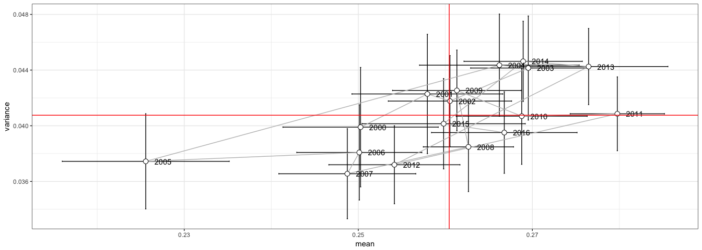
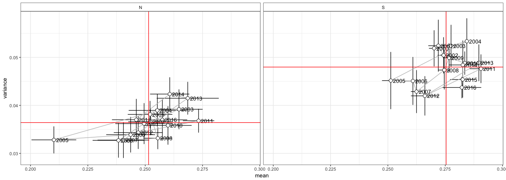

``` r
library('tidyverse')
```

Read data
=========

-   EVI mean dataframe

``` r
# Read data
evi <- read.csv(file=paste(di, "/data/evi_mean.csv", sep=""), header = TRUE, sep = ',')


evi <- evi %>% 
  mutate(
    clu_pop = as.factor(case_when(
      pop == 1 ~ "Camarate",
      pop %in% c(2,3,4,5) ~ 'Northern slope',
      pop %in% c(6,7,8) ~ 'Southern slope',
      pop == 9 ~ 'out')),
    clu_pop2 = as.factor(case_when(
      pop %in% c(1,2,3,4,5) ~ 'Northern slope',
      pop %in% c(6,7,8) ~ 'Southern slope',
      pop == 9 ~ 'out'))) %>% 
  filter(clu_pop != 'out')
```

 Trajectories EVI mean
----------------------

``` r
traj <- evi %>% group_by(pop, year) %>% 
  summarise(mean = mean(evi),
            sd = sd(evi))

traj_mean <- traj %>% 
  group_by(year) %>% 
  summarise(meanOfmean = mean(mean), 
            sdOfmean = sd(mean),
            seOfmean = sdOfmean/sqrt(length(mean)),
            meanOfsd = mean(sd),
            sdOfsd = sd(sd),
            seOfsd = sdOfsd /sqrt(length(sd))) %>% 
  as.data.frame()


traj_plot <- traj_mean %>% 
  ggplot(aes(x=meanOfmean, y=meanOfsd, label=year)) +
  geom_errorbar(aes(ymin=meanOfsd - seOfsd, ymax=meanOfsd + seOfsd)) + 
  geom_errorbarh(aes(xmin=meanOfmean - seOfmean, xmax=meanOfmean + seOfmean)) + 
  geom_path(colour='gray') +
  geom_point(size=3, shape=21, fill='white') + 
  geom_text(hjust = 0.001, nudge_x = 0.001) + 
  geom_vline(aes(xintercept = mean(meanOfmean)), colour='red') +
  geom_hline(aes(yintercept = mean(meanOfsd)), colour ='red')+
  theme_bw() + xlab('mean') + ylab('variance') + 
  theme(strip.background = element_rect(fill = "white"), 
        legend.position="none") 

traj_plot 
```



``` r
pdf(file=paste0(di, "/images/plot_trajectories_evi.pdf"), height = 6, width =6)
traj_plot
dev.off()
```

    ## quartz_off_screen 
    ##                 2

``` r
traj_mean_pop <- traj %>% 
  mutate(clu_pop = as.factor(ifelse(pop %in% c(1,2,3,4,5), 'N', 'S'))) %>% 
  group_by(clu_pop,year) %>% 
  summarise(meanOfmean = mean(mean), 
            sdOfmean = sd(mean),
            seOfmean = sdOfmean/sqrt(length(mean)),
            meanOfsd = mean(sd),
            sdOfsd = sd(sd),
            seOfsd = sdOfsd /sqrt(length(sd))) %>%
  as.data.frame() 

line_traj_mean_pop <- traj_mean_pop %>% 
  group_by(clu_pop) %>% 
  summarise(
    meanOfmean = mean(meanOfmean), 
    meanOfsd = mean(meanOfsd)
  )


traj_plot_pop <- ggplot(traj_mean_pop,
  aes(x=meanOfmean, y=meanOfsd, label=year)) +
  geom_errorbar(aes(ymin=meanOfsd - seOfsd, ymax=meanOfsd + seOfsd)) + 
  geom_errorbarh(aes(xmin=meanOfmean - seOfmean, xmax=meanOfmean + seOfmean)) + 
  geom_path(colour='gray') +
  geom_point(size=3, shape=21, fill='white') +
  geom_text(hjust = 0.001, nudge_x = 0.001) + 
  facet_wrap(~clu_pop) +
  theme_bw() + xlab('mean') + ylab('variance') + 
  theme(strip.background = element_rect(fill = "white"), 
        legend.position="none") 

traj_plot_pop <- 
  traj_plot_pop + 
  geom_vline(aes(xintercept = meanOfmean), line_traj_mean_pop,  colour='red') +
  geom_hline(aes(yintercept = meanOfsd), line_traj_mean_pop, colour ='red') 

traj_plot_pop
```



``` r
pdf(file=paste0(di, "/images/plot_trajectories_evi_clu.pdf"), height = 6, width =10)
traj_plot_pop
dev.off()
```

    ## quartz_off_screen 
    ##                 2
