Prepare data
============

``` r
# Read data
raw_evires <- read.csv(file=paste(di, "/data/resilience/resiliences.csv", sep=""), header = TRUE, sep = ',')

# add data of pop
anomalias <- read.csv(file=paste(di, "/data/anomalies/anomalias_evimean.csv", sep=""), header = TRUE, sep = ',')

attr_iv_malla_modis_id <- anomalias %>% dplyr::select(iv_malla_modi_id,long,lat,pop) %>% unique()
  

raw_evires <- raw_evires %>% inner_join(attr_iv_malla_modis_id, by='iv_malla_modi_id')

# filter by pop and add new variable

evires <- raw_evires %>% 
  mutate(
    clu_pop = as.factor(case_when(
      pop == 1 ~ "Camarate",
      pop %in% c(2,3,4,5) ~ 'Northern slope',
      pop %in% c(6,7,8) ~ 'Southern slope',
      pop == 9 ~ 'out')),
    clu_pop2 = as.factor(case_when(
      pop %in% c(1,2,3,4,5) ~ 'N',
      pop %in% c(6,7,8) ~ 'S',
      pop == 9 ~ 'out'))) %>% 
  filter(clu_pop != 'out')

# Change name of clu_pop2 and disturb_year para los analisis anovas
evires <- evires %>% rename(site = clu_pop2) %>% 
  mutate(disturb_year = as.factor(disturb_year))
```

ANOVAS
======

Recovery
--------

<table style="width:85%;">
<caption>ANOVA table: rc</caption>
<colgroup>
<col width="25%" />
<col width="6%" />
<col width="11%" />
<col width="12%" />
<col width="16%" />
<col width="12%" />
</colgroup>
<thead>
<tr class="header">
<th align="center">term</th>
<th align="center">df</th>
<th align="center">sumsq</th>
<th align="center">meansq</th>
<th align="center">statistic</th>
<th align="center">p.value</th>
</tr>
</thead>
<tbody>
<tr class="odd">
<td align="center">disturb_year</td>
<td align="center">1</td>
<td align="center">1.951</td>
<td align="center">1.951</td>
<td align="center">420.3</td>
<td align="center"><strong>0</strong></td>
</tr>
<tr class="even">
<td align="center">site</td>
<td align="center">1</td>
<td align="center">0.6528</td>
<td align="center">0.6528</td>
<td align="center">140.6</td>
<td align="center"><strong>0</strong></td>
</tr>
<tr class="odd">
<td align="center">disturb_year:site</td>
<td align="center">1</td>
<td align="center">1.969</td>
<td align="center">1.969</td>
<td align="center">424.1</td>
<td align="center"><strong>0</strong></td>
</tr>
<tr class="even">
<td align="center">Residuals</td>
<td align="center">1820</td>
<td align="center">8.45</td>
<td align="center">0.00464</td>
<td align="center"></td>
<td align="center"></td>
</tr>
</tbody>
</table>

<table style="width:49%;">
<colgroup>
<col width="33%" />
<col width="15%" />
</colgroup>
<thead>
<tr class="header">
<th align="center"> </th>
<th align="center">Statistic</th>
</tr>
</thead>
<tbody>
<tr class="odd">
<td align="center"><strong><span class="math inline"><em>R</em><sup>2</sup></span></strong></td>
<td align="center">0.35</td>
</tr>
<tr class="even">
<td align="center"><strong><span class="math inline"><em>a</em><em>d</em><em>j</em><em>R</em><sup>2</sup></span></strong></td>
<td align="center">0.35</td>
</tr>
<tr class="odd">
<td align="center"><strong><span class="math inline"><em>σ</em><sub><em>e</em></sub></span></strong></td>
<td align="center">0.07</td>
</tr>
<tr class="even">
<td align="center"><strong><span class="math inline"><em>F</em></span></strong></td>
<td align="center">328.31</td>
</tr>
<tr class="odd">
<td align="center"><strong><span class="math inline"><em>p</em></span></strong></td>
<td align="center">0.00</td>
</tr>
<tr class="even">
<td align="center"><strong><span class="math inline"><em>d</em><em>f</em><sub><em>m</em></sub></span></strong></td>
<td align="center">4.00</td>
</tr>
<tr class="odd">
<td align="center"><strong><span class="math inline"><em>l</em><em>o</em><em>g</em><em>L</em><em>i</em><em>k</em></span></strong></td>
<td align="center">2313.52</td>
</tr>
<tr class="even">
<td align="center"><strong><span class="math inline"><em>A</em><em>I</em><em>C</em></span></strong></td>
<td align="center">-4617.05</td>
</tr>
<tr class="odd">
<td align="center"><strong><span class="math inline"><em>B</em><em>I</em><em>C</em></span></strong></td>
<td align="center">-4589.50</td>
</tr>
<tr class="even">
<td align="center"><strong><span class="math inline"><em>d</em><em>e</em><em>v</em></span></strong></td>
<td align="center">8.45</td>
</tr>
<tr class="odd">
<td align="center"><strong><span class="math inline"><em>d</em><em>f</em><sub><em>e</em></sub></span></strong></td>
<td align="center">1820.00</td>
</tr>
</tbody>
</table>

``` r
# Post hoc Define model
mymodel <- aov_rc$mymodel
postH_rc <- phc(mymodel = mymodel, resp_var = resp_var)
```

    ## 
    ## ### Event ###
    ## $lsmeans
    ##  disturb_year   lsmean          SE   df lower.CL upper.CL
    ##  2005         1.120312 0.002257496 1820 1.115885 1.124740
    ##  2012         1.057062 0.002257496 1820 1.052634 1.061489
    ## 
    ## Results are averaged over the levels of: site 
    ## Confidence level used: 0.95 
    ## 
    ## $contrasts
    ##  contrast      estimate          SE   df t.ratio p.value
    ##  2005 - 2012 0.06325071 0.003192582 1820  19.812  <.0001
    ## 
    ## Results are averaged over the levels of: site 
    ## 
    ##  disturb_year   lsmean          SE   df lower.CL upper.CL .group
    ##  2012         1.057062 0.002257496 1820 1.051998 1.062126  a    
    ##  2005         1.120312 0.002257496 1820 1.115248 1.125377   b   
    ## 
    ## Results are averaged over the levels of: site 
    ## Confidence level used: 0.95 
    ## Conf-level adjustment: bonferroni method for 2 estimates 
    ## significance level used: alpha = 0.01 
    ## 
    ## ### Clu pop ###
    ## $lsmeans
    ##  site   lsmean          SE   df lower.CL upper.CL
    ##  N    1.107615 0.002220056 1820 1.103261 1.111969
    ##  S    1.069759 0.002294326 1820 1.065259 1.074259
    ## 
    ## Results are averaged over the levels of: disturb_year 
    ## Confidence level used: 0.95 
    ## 
    ## $contrasts
    ##  contrast   estimate          SE   df t.ratio p.value
    ##  N - S    0.03785579 0.003192582 1820  11.857  <.0001
    ## 
    ## Results are averaged over the levels of: disturb_year 
    ## 
    ##  site   lsmean          SE   df lower.CL upper.CL .group
    ##  S    1.069759 0.002294326 1820 1.064612 1.074906  a    
    ##  N    1.107615 0.002220056 1820 1.102635 1.112595   b   
    ## 
    ## Results are averaged over the levels of: disturb_year 
    ## Confidence level used: 0.95 
    ## Conf-level adjustment: bonferroni method for 2 estimates 
    ## significance level used: alpha = 0.01 
    ## 
    ## ### Event:Clu pop ###
    ## $lsmeans
    ##  disturb_year site   lsmean          SE   df lower.CL upper.CL
    ##  2005         N    1.172113 0.003139633 1820 1.165955 1.178271
    ##  2012         N    1.043117 0.003139633 1820 1.036959 1.049275
    ##  2005         S    1.068512 0.003244666 1820 1.062148 1.074876
    ##  2012         S    1.071007 0.003244666 1820 1.064643 1.077370
    ## 
    ## Confidence level used: 0.95 
    ## 
    ## $contrasts
    ##  contrast            estimate          SE   df t.ratio p.value
    ##  2005,N - 2012,N  0.128996090 0.004440112 1820  29.052  <.0001
    ##  2005,N - 2005,S  0.103601172 0.004514992 1820  22.946  <.0001
    ##  2005,N - 2012,S  0.101106495 0.004514992 1820  22.394  <.0001
    ##  2012,N - 2005,S -0.025394918 0.004514992 1820  -5.625  <.0001
    ##  2012,N - 2012,S -0.027889595 0.004514992 1820  -6.177  <.0001
    ##  2005,S - 2012,S -0.002494677 0.004588651 1820  -0.544  1.0000
    ## 
    ## P value adjustment: bonferroni method for 6 tests

``` r
ps
```


``` r
pd
```


``` r
picollapse
```


``` r
pi
```

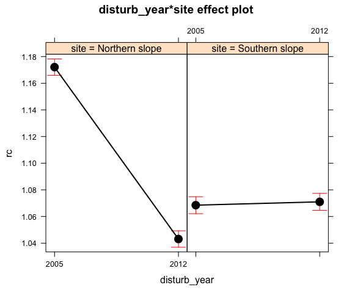

Resistance
----------

<table style="width:85%;">
<caption>ANOVA table: rt</caption>
<colgroup>
<col width="25%" />
<col width="6%" />
<col width="11%" />
<col width="12%" />
<col width="16%" />
<col width="12%" />
</colgroup>
<thead>
<tr class="header">
<th align="center">term</th>
<th align="center">df</th>
<th align="center">sumsq</th>
<th align="center">meansq</th>
<th align="center">statistic</th>
<th align="center">p.value</th>
</tr>
</thead>
<tbody>
<tr class="odd">
<td align="center">disturb_year</td>
<td align="center">1</td>
<td align="center">3.266</td>
<td align="center">3.266</td>
<td align="center">1079</td>
<td align="center"><strong>0</strong></td>
</tr>
<tr class="even">
<td align="center">site</td>
<td align="center">1</td>
<td align="center">0.6366</td>
<td align="center">0.6366</td>
<td align="center">210.2</td>
<td align="center"><strong>0</strong></td>
</tr>
<tr class="odd">
<td align="center">disturb_year:site</td>
<td align="center">1</td>
<td align="center">0.9736</td>
<td align="center">0.9736</td>
<td align="center">321.5</td>
<td align="center"><strong>0</strong></td>
</tr>
<tr class="even">
<td align="center">Residuals</td>
<td align="center">1820</td>
<td align="center">5.511</td>
<td align="center">0.00303</td>
<td align="center"></td>
<td align="center"></td>
</tr>
</tbody>
</table>

<table style="width:49%;">
<colgroup>
<col width="33%" />
<col width="15%" />
</colgroup>
<thead>
<tr class="header">
<th align="center"> </th>
<th align="center">Statistic</th>
</tr>
</thead>
<tbody>
<tr class="odd">
<td align="center"><strong><span class="math inline"><em>R</em><sup>2</sup></span></strong></td>
<td align="center">0.47</td>
</tr>
<tr class="even">
<td align="center"><strong><span class="math inline"><em>a</em><em>d</em><em>j</em><em>R</em><sup>2</sup></span></strong></td>
<td align="center">0.47</td>
</tr>
<tr class="odd">
<td align="center"><strong><span class="math inline"><em>σ</em><sub><em>e</em></sub></span></strong></td>
<td align="center">0.06</td>
</tr>
<tr class="even">
<td align="center"><strong><span class="math inline"><em>F</em></span></strong></td>
<td align="center">536.85</td>
</tr>
<tr class="odd">
<td align="center"><strong><span class="math inline"><em>p</em></span></strong></td>
<td align="center">0.00</td>
</tr>
<tr class="even">
<td align="center"><strong><span class="math inline"><em>d</em><em>f</em><sub><em>m</em></sub></span></strong></td>
<td align="center">4.00</td>
</tr>
<tr class="odd">
<td align="center"><strong><span class="math inline"><em>l</em><em>o</em><em>g</em><em>L</em><em>i</em><em>k</em></span></strong></td>
<td align="center">2703.33</td>
</tr>
<tr class="even">
<td align="center"><strong><span class="math inline"><em>A</em><em>I</em><em>C</em></span></strong></td>
<td align="center">-5396.66</td>
</tr>
<tr class="odd">
<td align="center"><strong><span class="math inline"><em>B</em><em>I</em><em>C</em></span></strong></td>
<td align="center">-5369.12</td>
</tr>
<tr class="even">
<td align="center"><strong><span class="math inline"><em>d</em><em>e</em><em>v</em></span></strong></td>
<td align="center">5.51</td>
</tr>
<tr class="odd">
<td align="center"><strong><span class="math inline"><em>d</em><em>f</em><sub><em>e</em></sub></span></strong></td>
<td align="center">1820.00</td>
</tr>
</tbody>
</table>

``` r
# Post hoc Define model
mymodel <- aov_rt$mymodel
postH_rt <- phc(mymodel = mymodel, resp_var = resp_var)
```

    ## 
    ## ### Event ###
    ## $lsmeans
    ##  disturb_year    lsmean          SE   df  lower.CL  upper.CL
    ##  2005         0.8607403 0.001823114 1820 0.8571647 0.8643159
    ##  2012         0.9438559 0.001823114 1820 0.9402803 0.9474315
    ## 
    ## Results are averaged over the levels of: site 
    ## Confidence level used: 0.95 
    ## 
    ## $contrasts
    ##  contrast       estimate          SE   df t.ratio p.value
    ##  2005 - 2012 -0.08311557 0.002578272 1820 -32.237  <.0001
    ## 
    ## Results are averaged over the levels of: site 
    ## 
    ##  disturb_year    lsmean          SE   df  lower.CL  upper.CL .group
    ##  2005         0.8607403 0.001823114 1820 0.8566506 0.8648300  a    
    ##  2012         0.9438559 0.001823114 1820 0.9397662 0.9479456   b   
    ## 
    ## Results are averaged over the levels of: site 
    ## Confidence level used: 0.95 
    ## Conf-level adjustment: bonferroni method for 2 estimates 
    ## significance level used: alpha = 0.01 
    ## 
    ## ### Clu pop ###
    ## $lsmeans
    ##  site    lsmean          SE   df  lower.CL  upper.CL
    ##  N    0.8836057 0.001792878 1820 0.8800894 0.8871220
    ##  S    0.9209905 0.001852856 1820 0.9173566 0.9246245
    ## 
    ## Results are averaged over the levels of: disturb_year 
    ## Confidence level used: 0.95 
    ## 
    ## $contrasts
    ##  contrast    estimate          SE   df t.ratio p.value
    ##  N - S    -0.03738486 0.002578272 1820   -14.5  <.0001
    ## 
    ## Results are averaged over the levels of: disturb_year 
    ## 
    ##  site    lsmean          SE   df  lower.CL  upper.CL .group
    ##  N    0.8836057 0.001792878 1820 0.8795838 0.8876276  a    
    ##  S    0.9209905 0.001852856 1820 0.9168341 0.9251470   b   
    ## 
    ## Results are averaged over the levels of: disturb_year 
    ## Confidence level used: 0.95 
    ## Conf-level adjustment: bonferroni method for 2 estimates 
    ## significance level used: alpha = 0.01 
    ## 
    ## ### Event:Clu pop ###
    ## $lsmeans
    ##  disturb_year site    lsmean          SE   df  lower.CL  upper.CL
    ##  2005         N    0.8189321 0.002535512 1820 0.8139593 0.8239049
    ##  2012         N    0.9482792 0.002535512 1820 0.9433064 0.9532521
    ##  2005         S    0.9025485 0.002620335 1820 0.8974093 0.9076877
    ##  2012         S    0.9394325 0.002620335 1820 0.9342934 0.9445717
    ## 
    ## Confidence level used: 0.95 
    ## 
    ## $contrasts
    ##  contrast           estimate          SE   df t.ratio p.value
    ##  2005,N - 2012,N -0.12934712 0.003585755 1820 -36.072  <.0001
    ##  2005,N - 2005,S -0.08361641 0.003646227 1820 -22.932  <.0001
    ##  2005,N - 2012,S -0.12050043 0.003646227 1820 -33.048  <.0001
    ##  2012,N - 2005,S  0.04573071 0.003646227 1820  12.542  <.0001
    ##  2012,N - 2012,S  0.00884669 0.003646227 1820   2.426  0.0921
    ##  2005,S - 2012,S -0.03688402 0.003705713 1820  -9.953  <.0001
    ## 
    ## P value adjustment: bonferroni method for 6 tests

``` r
ps
```


``` r
pd
```


``` r
picollapse
```

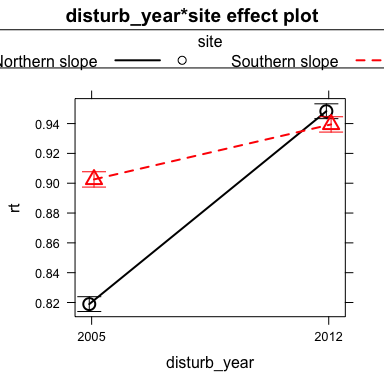

``` r
pi
```

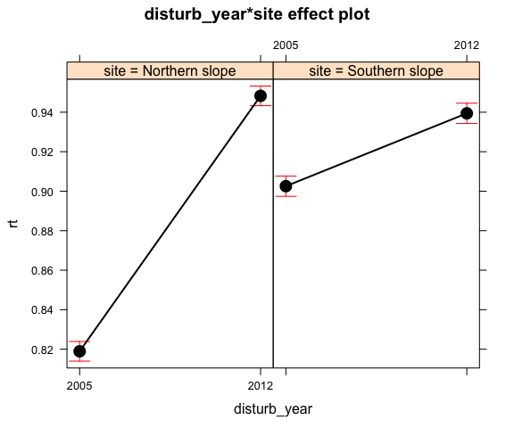

Resilience
----------

<table style="width:89%;">
<caption>ANOVA table: rs</caption>
<colgroup>
<col width="25%" />
<col width="6%" />
<col width="11%" />
<col width="12%" />
<col width="16%" />
<col width="16%" />
</colgroup>
<thead>
<tr class="header">
<th align="center">term</th>
<th align="center">df</th>
<th align="center">sumsq</th>
<th align="center">meansq</th>
<th align="center">statistic</th>
<th align="center">p.value</th>
</tr>
</thead>
<tbody>
<tr class="odd">
<td align="center">disturb_year</td>
<td align="center">1</td>
<td align="center">0.6334</td>
<td align="center">0.6334</td>
<td align="center">258.4</td>
<td align="center"><strong>0</strong></td>
</tr>
<tr class="even">
<td align="center">site</td>
<td align="center">1</td>
<td align="center">0.0533</td>
<td align="center">0.0533</td>
<td align="center">21.74</td>
<td align="center"><strong>0</strong></td>
</tr>
<tr class="odd">
<td align="center">disturb_year:site</td>
<td align="center">1</td>
<td align="center">0.01931</td>
<td align="center">0.01931</td>
<td align="center">7.875</td>
<td align="center"><strong>0.00507</strong></td>
</tr>
<tr class="even">
<td align="center">Residuals</td>
<td align="center">1820</td>
<td align="center">4.462</td>
<td align="center">0.00245</td>
<td align="center"></td>
<td align="center"></td>
</tr>
</tbody>
</table>

<table style="width:49%;">
<colgroup>
<col width="33%" />
<col width="15%" />
</colgroup>
<thead>
<tr class="header">
<th align="center"> </th>
<th align="center">Statistic</th>
</tr>
</thead>
<tbody>
<tr class="odd">
<td align="center"><strong><span class="math inline"><em>R</em><sup>2</sup></span></strong></td>
<td align="center">0.14</td>
</tr>
<tr class="even">
<td align="center"><strong><span class="math inline"><em>a</em><em>d</em><em>j</em><em>R</em><sup>2</sup></span></strong></td>
<td align="center">0.14</td>
</tr>
<tr class="odd">
<td align="center"><strong><span class="math inline"><em>σ</em><sub><em>e</em></sub></span></strong></td>
<td align="center">0.05</td>
</tr>
<tr class="even">
<td align="center"><strong><span class="math inline"><em>F</em></span></strong></td>
<td align="center">96.00</td>
</tr>
<tr class="odd">
<td align="center"><strong><span class="math inline"><em>p</em></span></strong></td>
<td align="center">0.00</td>
</tr>
<tr class="even">
<td align="center"><strong><span class="math inline"><em>d</em><em>f</em><sub><em>m</em></sub></span></strong></td>
<td align="center">4.00</td>
</tr>
<tr class="odd">
<td align="center"><strong><span class="math inline"><em>l</em><em>o</em><em>g</em><em>L</em><em>i</em><em>k</em></span></strong></td>
<td align="center">2895.92</td>
</tr>
<tr class="even">
<td align="center"><strong><span class="math inline"><em>A</em><em>I</em><em>C</em></span></strong></td>
<td align="center">-5781.83</td>
</tr>
<tr class="odd">
<td align="center"><strong><span class="math inline"><em>B</em><em>I</em><em>C</em></span></strong></td>
<td align="center">-5754.29</td>
</tr>
<tr class="even">
<td align="center"><strong><span class="math inline"><em>d</em><em>e</em><em>v</em></span></strong></td>
<td align="center">4.46</td>
</tr>
<tr class="odd">
<td align="center"><strong><span class="math inline"><em>d</em><em>f</em><sub><em>e</em></sub></span></strong></td>
<td align="center">1820.00</td>
</tr>
</tbody>
</table>

``` r
# Post hoc Define model
mymodel <- aov_rs$mymodel
postH_rs <- phc(mymodel = mymodel, resp_var = resp_var)
```

    ## 
    ## ### Event ###
    ## $lsmeans
    ##  disturb_year    lsmean          SE   df  lower.CL  upper.CL
    ##  2005         0.9587200 0.001640436 1820 0.9555027 0.9619373
    ##  2012         0.9962045 0.001640436 1820 0.9929872 0.9994219
    ## 
    ## Results are averaged over the levels of: site 
    ## Confidence level used: 0.95 
    ## 
    ## $contrasts
    ##  contrast       estimate          SE   df t.ratio p.value
    ##  2005 - 2012 -0.03748452 0.002319926 1820 -16.158  <.0001
    ## 
    ## Results are averaged over the levels of: site 
    ## 
    ##  disturb_year    lsmean          SE   df  lower.CL  upper.CL .group
    ##  2005         0.9587200 0.001640436 1820 0.9550401 0.9623999  a    
    ##  2012         0.9962045 0.001640436 1820 0.9925246 0.9998844   b   
    ## 
    ## Results are averaged over the levels of: site 
    ## Confidence level used: 0.95 
    ## Conf-level adjustment: bonferroni method for 2 estimates 
    ## significance level used: alpha = 0.01 
    ## 
    ## ### Clu pop ###
    ## $lsmeans
    ##  site    lsmean          SE   df  lower.CL  upper.CL
    ##  N    0.9720535 0.001613229 1820 0.9688896 0.9752175
    ##  S    0.9828710 0.001667198 1820 0.9796012 0.9861408
    ## 
    ## Results are averaged over the levels of: disturb_year 
    ## Confidence level used: 0.95 
    ## 
    ## $contrasts
    ##  contrast    estimate          SE   df t.ratio p.value
    ##  N - S    -0.01081743 0.002319926 1820  -4.663  <.0001
    ## 
    ## Results are averaged over the levels of: disturb_year 
    ## 
    ##  site    lsmean          SE   df  lower.CL  upper.CL .group
    ##  N    0.9720535 0.001613229 1820 0.9684347 0.9756724  a    
    ##  S    0.9828710 0.001667198 1820 0.9791310 0.9866109   b   
    ## 
    ## Results are averaged over the levels of: disturb_year 
    ## Confidence level used: 0.95 
    ## Conf-level adjustment: bonferroni method for 2 estimates 
    ## significance level used: alpha = 0.01 
    ## 
    ## ### Event:Clu pop ###
    ## $lsmeans
    ##  disturb_year site    lsmean          SE   df  lower.CL  upper.CL
    ##  2005         N    0.9565664 0.002281451 1820 0.9520919 0.9610410
    ##  2012         N    0.9875407 0.002281451 1820 0.9830661 0.9920152
    ##  2005         S    0.9608736 0.002357774 1820 0.9562493 0.9654978
    ##  2012         S    1.0048684 0.002357774 1820 1.0002442 1.0094926
    ## 
    ## Confidence level used: 0.95 
    ## 
    ## $contrasts
    ##  contrast            estimate          SE   df t.ratio p.value
    ##  2005,N - 2012,N -0.030974221 0.003226458 1820  -9.600  <.0001
    ##  2005,N - 2005,S -0.004307134 0.003280871 1820  -1.313  1.0000
    ##  2005,N - 2012,S -0.048301950 0.003280871 1820 -14.722  <.0001
    ##  2012,N - 2005,S  0.026667087 0.003280871 1820   8.128  <.0001
    ##  2012,N - 2012,S -0.017327728 0.003280871 1820  -5.281  <.0001
    ##  2005,S - 2012,S -0.043994816 0.003334396 1820 -13.194  <.0001
    ## 
    ## P value adjustment: bonferroni method for 6 tests

``` r
ps
```


``` r
pd
```

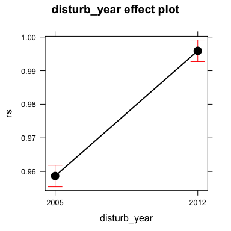

``` r
picollapse
```

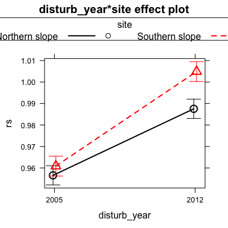

``` r
pi
```


Relative Resilience
-------------------

<table style="width:85%;">
<caption>ANOVA table: rrs</caption>
<colgroup>
<col width="25%" />
<col width="6%" />
<col width="11%" />
<col width="12%" />
<col width="16%" />
<col width="12%" />
</colgroup>
<thead>
<tr class="header">
<th align="center">term</th>
<th align="center">df</th>
<th align="center">sumsq</th>
<th align="center">meansq</th>
<th align="center">statistic</th>
<th align="center">p.value</th>
</tr>
</thead>
<tbody>
<tr class="odd">
<td align="center">disturb_year</td>
<td align="center">1</td>
<td align="center">1.023</td>
<td align="center">1.023</td>
<td align="center">321.9</td>
<td align="center"><strong>0</strong></td>
</tr>
<tr class="even">
<td align="center">site</td>
<td align="center">1</td>
<td align="center">0.3215</td>
<td align="center">0.3215</td>
<td align="center">101.2</td>
<td align="center"><strong>0</strong></td>
</tr>
<tr class="odd">
<td align="center">disturb_year:site</td>
<td align="center">1</td>
<td align="center">1.267</td>
<td align="center">1.267</td>
<td align="center">398.7</td>
<td align="center"><strong>0</strong></td>
</tr>
<tr class="even">
<td align="center">Residuals</td>
<td align="center">1820</td>
<td align="center">5.783</td>
<td align="center">0.00318</td>
<td align="center"></td>
<td align="center"></td>
</tr>
</tbody>
</table>

<table style="width:49%;">
<colgroup>
<col width="33%" />
<col width="15%" />
</colgroup>
<thead>
<tr class="header">
<th align="center"> </th>
<th align="center">Statistic</th>
</tr>
</thead>
<tbody>
<tr class="odd">
<td align="center"><strong><span class="math inline"><em>R</em><sup>2</sup></span></strong></td>
<td align="center">0.31</td>
</tr>
<tr class="even">
<td align="center"><strong><span class="math inline"><em>a</em><em>d</em><em>j</em><em>R</em><sup>2</sup></span></strong></td>
<td align="center">0.31</td>
</tr>
<tr class="odd">
<td align="center"><strong><span class="math inline"><em>σ</em><sub><em>e</em></sub></span></strong></td>
<td align="center">0.06</td>
</tr>
<tr class="even">
<td align="center"><strong><span class="math inline"><em>F</em></span></strong></td>
<td align="center">273.95</td>
</tr>
<tr class="odd">
<td align="center"><strong><span class="math inline"><em>p</em></span></strong></td>
<td align="center">0.00</td>
</tr>
<tr class="even">
<td align="center"><strong><span class="math inline"><em>d</em><em>f</em><sub><em>m</em></sub></span></strong></td>
<td align="center">4.00</td>
</tr>
<tr class="odd">
<td align="center"><strong><span class="math inline"><em>l</em><em>o</em><em>g</em><em>L</em><em>i</em><em>k</em></span></strong></td>
<td align="center">2659.30</td>
</tr>
<tr class="even">
<td align="center"><strong><span class="math inline"><em>A</em><em>I</em><em>C</em></span></strong></td>
<td align="center">-5308.61</td>
</tr>
<tr class="odd">
<td align="center"><strong><span class="math inline"><em>B</em><em>I</em><em>C</em></span></strong></td>
<td align="center">-5281.06</td>
</tr>
<tr class="even">
<td align="center"><strong><span class="math inline"><em>d</em><em>e</em><em>v</em></span></strong></td>
<td align="center">5.78</td>
</tr>
<tr class="odd">
<td align="center"><strong><span class="math inline"><em>d</em><em>f</em><sub><em>e</em></sub></span></strong></td>
<td align="center">1820.00</td>
</tr>
</tbody>
</table>

``` r
# Post hoc Define model
mymodel <- aov_rrs$mymodel
postH_rrs <- phc(mymodel = mymodel, resp_var = resp_var)
```

    ## 
    ## ### Event ###
    ## $lsmeans
    ##  disturb_year     lsmean          SE   df   lower.CL  upper.CL
    ##  2005         0.09797968 0.001867656 1820 0.09431670 0.1016427
    ##  2012         0.05234863 0.001867656 1820 0.04868565 0.0560116
    ## 
    ## Results are averaged over the levels of: site 
    ## Confidence level used: 0.95 
    ## 
    ## $contrasts
    ##  contrast      estimate          SE   df t.ratio p.value
    ##  2005 - 2012 0.04563105 0.002641264 1820  17.276  <.0001
    ## 
    ## Results are averaged over the levels of: site 
    ## 
    ##  disturb_year     lsmean          SE   df   lower.CL   upper.CL .group
    ##  2012         0.05234863 0.001867656 1820 0.04815899 0.05653826  a    
    ##  2005         0.09797968 0.001867656 1820 0.09379004 0.10216931   b   
    ## 
    ## Results are averaged over the levels of: site 
    ## Confidence level used: 0.95 
    ## Conf-level adjustment: bonferroni method for 2 estimates 
    ## significance level used: alpha = 0.01 
    ## 
    ## ### Clu pop ###
    ## $lsmeans
    ##  site     lsmean          SE   df   lower.CL   upper.CL
    ##  N    0.08844787 0.001836681 1820 0.08484564 0.09205009
    ##  S    0.06188044 0.001898125 1820 0.05815770 0.06560317
    ## 
    ## Results are averaged over the levels of: disturb_year 
    ## Confidence level used: 0.95 
    ## 
    ## $contrasts
    ##  contrast   estimate          SE   df t.ratio p.value
    ##  N - S    0.02656743 0.002641264 1820  10.059  <.0001
    ## 
    ## Results are averaged over the levels of: disturb_year 
    ## 
    ##  site     lsmean          SE   df   lower.CL   upper.CL .group
    ##  S    0.06188044 0.001898125 1820 0.05762245 0.06613842  a    
    ##  N    0.08844787 0.001836681 1820 0.08432772 0.09256802   b   
    ## 
    ## Results are averaged over the levels of: disturb_year 
    ## Confidence level used: 0.95 
    ## Conf-level adjustment: bonferroni method for 2 estimates 
    ## significance level used: alpha = 0.01 
    ## 
    ## ### Event:Clu pop ###
    ## $lsmeans
    ##  disturb_year site     lsmean          SE   df  lower.CL   upper.CL
    ##  2005         N    0.13763432 0.002597459 1820 0.1325400 0.14272863
    ##  2012         N    0.03926142 0.002597459 1820 0.0341671 0.04435573
    ##  2005         S    0.05832504 0.002684355 1820 0.0530603 0.06358978
    ##  2012         S    0.06543584 0.002684355 1820 0.0601711 0.07070057
    ## 
    ## Confidence level used: 0.95 
    ## 
    ## $contrasts
    ##  contrast            estimate          SE   df t.ratio p.value
    ##  2005,N - 2012,N  0.098372900 0.003673362 1820  26.780  <.0001
    ##  2005,N - 2005,S  0.079309278 0.003735312 1820  21.232  <.0001
    ##  2005,N - 2012,S  0.072198481 0.003735312 1820  19.329  <.0001
    ##  2012,N - 2005,S -0.019063621 0.003735312 1820  -5.104  <.0001
    ##  2012,N - 2012,S -0.026174419 0.003735312 1820  -7.007  <.0001
    ##  2005,S - 2012,S -0.007110797 0.003796251 1820  -1.873  0.3673
    ## 
    ## P value adjustment: bonferroni method for 6 tests

``` r
ps
```

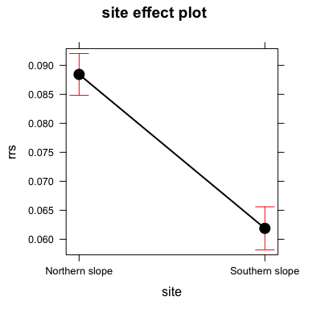

``` r
pd
```

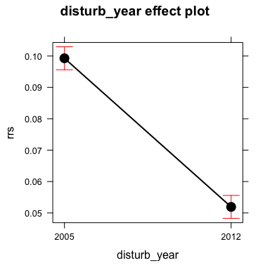

``` r
picollapse
```

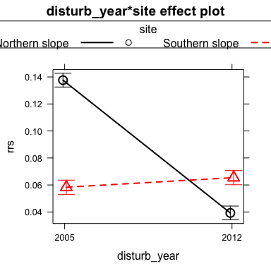

``` r
pi
```


### mean + sd

``` r
grid.arrange(plot_mdSE, plot_msSE, plot_mdsSE, ncol=3)
```

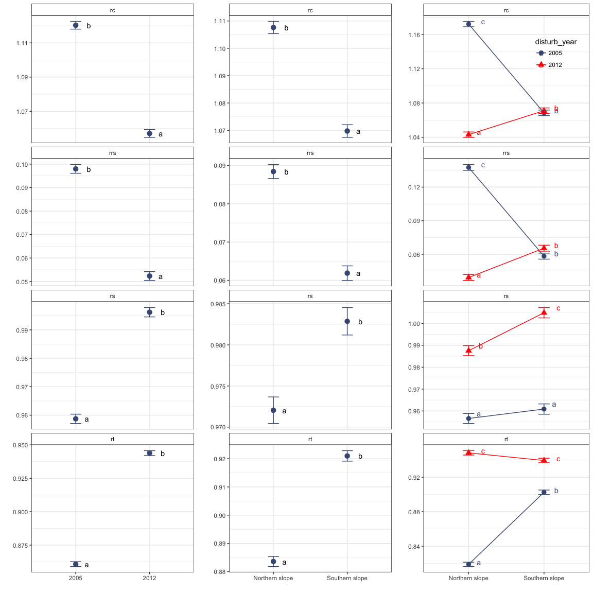

### mean + ci

``` r
grid.arrange(plot_mdCI, plot_msCI, plot_mdsCI, ncol=3)
```

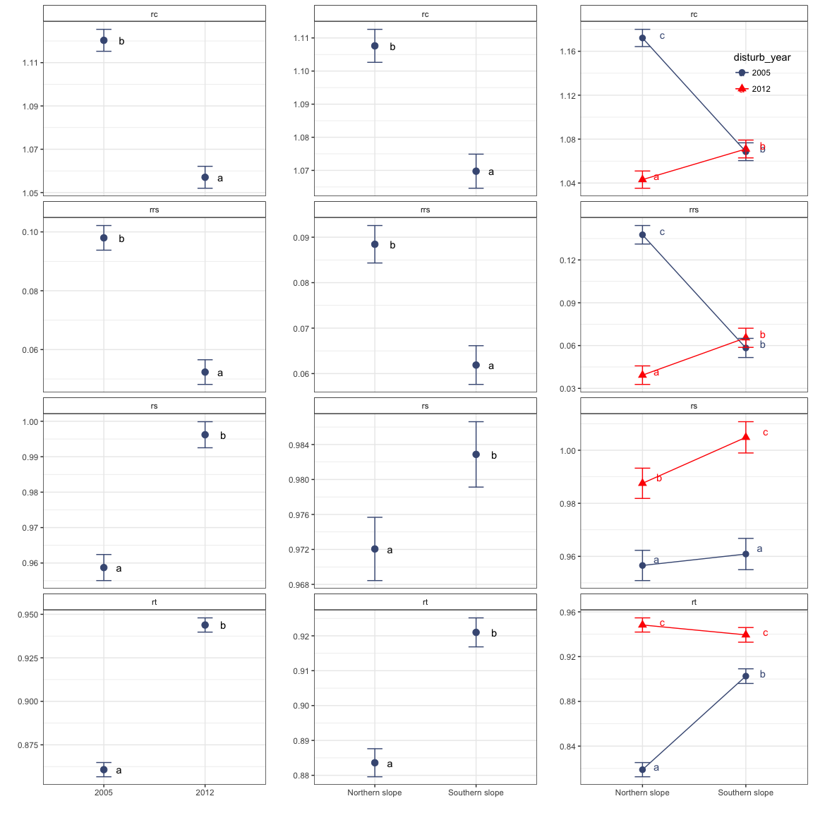

    ## quartz_off_screen 
    ##                 2

    ## quartz_off_screen 
    ##                 2

<table style="width:94%;">
<colgroup>
<col width="25%" />
<col width="6%" />
<col width="11%" />
<col width="12%" />
<col width="16%" />
<col width="15%" />
<col width="6%" />
</colgroup>
<thead>
<tr class="header">
<th align="center">term</th>
<th align="center">df</th>
<th align="center">sumsq</th>
<th align="center">meansq</th>
<th align="center">statistic</th>
<th align="center">p.value</th>
<th align="center">var</th>
</tr>
</thead>
<tbody>
<tr class="odd">
<td align="center">disturb_year</td>
<td align="center">1</td>
<td align="center">1.951</td>
<td align="center">1.951</td>
<td align="center">420.3</td>
<td align="center">3.368e-84</td>
<td align="center">rc</td>
</tr>
<tr class="even">
<td align="center">site</td>
<td align="center">1</td>
<td align="center">0.6528</td>
<td align="center">0.6528</td>
<td align="center">140.6</td>
<td align="center">2.706e-31</td>
<td align="center">rc</td>
</tr>
<tr class="odd">
<td align="center">disturb_year:site</td>
<td align="center">1</td>
<td align="center">1.969</td>
<td align="center">1.969</td>
<td align="center">424.1</td>
<td align="center">7.127e-85</td>
<td align="center">rc</td>
</tr>
<tr class="even">
<td align="center">Residuals</td>
<td align="center">1820</td>
<td align="center">8.45</td>
<td align="center">0.004643</td>
<td align="center">NA</td>
<td align="center">NA</td>
<td align="center">rc</td>
</tr>
<tr class="odd">
<td align="center">disturb_year</td>
<td align="center">1</td>
<td align="center">3.266</td>
<td align="center">3.266</td>
<td align="center">1079</td>
<td align="center">3.446e-186</td>
<td align="center">rt</td>
</tr>
<tr class="even">
<td align="center">site</td>
<td align="center">1</td>
<td align="center">0.6366</td>
<td align="center">0.6366</td>
<td align="center">210.2</td>
<td align="center">3.608e-45</td>
<td align="center">rt</td>
</tr>
<tr class="odd">
<td align="center">disturb_year:site</td>
<td align="center">1</td>
<td align="center">0.9736</td>
<td align="center">0.9736</td>
<td align="center">321.5</td>
<td align="center">2.446e-66</td>
<td align="center">rt</td>
</tr>
<tr class="even">
<td align="center">Residuals</td>
<td align="center">1820</td>
<td align="center">5.511</td>
<td align="center">0.003028</td>
<td align="center">NA</td>
<td align="center">NA</td>
<td align="center">rt</td>
</tr>
<tr class="odd">
<td align="center">disturb_year</td>
<td align="center">1</td>
<td align="center">0.6334</td>
<td align="center">0.6334</td>
<td align="center">258.4</td>
<td align="center">1.817e-54</td>
<td align="center">rs</td>
</tr>
<tr class="even">
<td align="center">site</td>
<td align="center">1</td>
<td align="center">0.0533</td>
<td align="center">0.0533</td>
<td align="center">21.74</td>
<td align="center">3.346e-06</td>
<td align="center">rs</td>
</tr>
<tr class="odd">
<td align="center">disturb_year:site</td>
<td align="center">1</td>
<td align="center">0.01931</td>
<td align="center">0.01931</td>
<td align="center">7.875</td>
<td align="center">0.005066</td>
<td align="center">rs</td>
</tr>
<tr class="even">
<td align="center">Residuals</td>
<td align="center">1820</td>
<td align="center">4.462</td>
<td align="center">0.002452</td>
<td align="center">NA</td>
<td align="center">NA</td>
<td align="center">rs</td>
</tr>
<tr class="odd">
<td align="center">disturb_year</td>
<td align="center">1</td>
<td align="center">1.023</td>
<td align="center">1.023</td>
<td align="center">321.9</td>
<td align="center">2.05e-66</td>
<td align="center">rrs</td>
</tr>
<tr class="even">
<td align="center">site</td>
<td align="center">1</td>
<td align="center">0.3215</td>
<td align="center">0.3215</td>
<td align="center">101.2</td>
<td align="center">3.356e-23</td>
<td align="center">rrs</td>
</tr>
<tr class="odd">
<td align="center">disturb_year:site</td>
<td align="center">1</td>
<td align="center">1.267</td>
<td align="center">1.267</td>
<td align="center">398.7</td>
<td align="center">2.249e-80</td>
<td align="center">rrs</td>
</tr>
<tr class="even">
<td align="center">Residuals</td>
<td align="center">1820</td>
<td align="center">5.783</td>
<td align="center">0.003178</td>
<td align="center">NA</td>
<td align="center">NA</td>
<td align="center">rrs</td>
</tr>
</tbody>
</table>

<table>
<colgroup>
<col width="30%" />
<col width="17%" />
<col width="17%" />
<col width="16%" />
<col width="16%" />
</colgroup>
<thead>
<tr class="header">
<th align="center"> </th>
<th align="center">rc</th>
<th align="center">rt</th>
<th align="center">rs</th>
<th align="center">rrs</th>
</tr>
</thead>
<tbody>
<tr class="odd">
<td align="center"><strong><span class="math inline"><em>R</em><sup>2</sup></span></strong></td>
<td align="center">0.3511444</td>
<td align="center">0.4694715</td>
<td align="center">0.1366188</td>
<td align="center">0.3110905</td>
</tr>
<tr class="even">
<td align="center"><strong><span class="math inline"><em>a</em><em>d</em><em>j</em><em>R</em><sup>2</sup></span></strong></td>
<td align="center">0.3500749</td>
<td align="center">0.4685970</td>
<td align="center">0.1351956</td>
<td align="center">0.3099549</td>
</tr>
<tr class="odd">
<td align="center"><strong><span class="math inline"><em>σ</em><sub><em>e</em></sub></span></strong></td>
<td align="center">0.06813799</td>
<td align="center">0.05502703</td>
<td align="center">0.04951326</td>
<td align="center">0.05637145</td>
</tr>
<tr class="even">
<td align="center"><strong><span class="math inline"><em>F</em></span></strong></td>
<td align="center">328.31282</td>
<td align="center">536.84720</td>
<td align="center">95.99708</td>
<td align="center">273.95212</td>
</tr>
<tr class="odd">
<td align="center"><strong><span class="math inline"><em>p</em></span></strong></td>
<td align="center">2.291209e-170</td>
<td align="center">7.130860e-250</td>
<td align="center">1.111125e-57</td>
<td align="center">1.015581e-146</td>
</tr>
<tr class="even">
<td align="center"><strong><span class="math inline"><em>d</em><em>f</em><sub><em>m</em></sub></span></strong></td>
<td align="center">4</td>
<td align="center">4</td>
<td align="center">4</td>
<td align="center">4</td>
</tr>
<tr class="odd">
<td align="center"><strong><span class="math inline"><em>l</em><em>o</em><em>g</em><em>L</em><em>i</em><em>k</em></span></strong></td>
<td align="center">2313.524</td>
<td align="center">2703.332</td>
<td align="center">2895.917</td>
<td align="center">2659.304</td>
</tr>
<tr class="even">
<td align="center"><strong><span class="math inline"><em>A</em><em>I</em><em>C</em></span></strong></td>
<td align="center">-4617.048</td>
<td align="center">-5396.664</td>
<td align="center">-5781.835</td>
<td align="center">-5308.608</td>
</tr>
<tr class="odd">
<td align="center"><strong><span class="math inline"><em>B</em><em>I</em><em>C</em></span></strong></td>
<td align="center">-4589.504</td>
<td align="center">-5369.120</td>
<td align="center">-5754.291</td>
<td align="center">-5281.064</td>
</tr>
<tr class="even">
<td align="center"><strong><span class="math inline"><em>d</em><em>e</em><em>v</em></span></strong></td>
<td align="center">8.449871</td>
<td align="center">5.510913</td>
<td align="center">4.461844</td>
<td align="center">5.783487</td>
</tr>
<tr class="odd">
<td align="center"><strong><span class="math inline"><em>d</em><em>f</em><sub><em>e</em></sub></span></strong></td>
<td align="center">1820</td>
<td align="center">1820</td>
<td align="center">1820</td>
<td align="center">1820</td>
</tr>
<tr class="even">
<td align="center"><strong><span class="math inline"><em>v</em><em>a</em><em>r</em><em>i</em><em>a</em><em>b</em><em>l</em><em>e</em></span></strong></td>
<td align="center">rc</td>
<td align="center">rt</td>
<td align="center">rs</td>
<td align="center">rrs</td>
</tr>
</tbody>
</table>

Asumptions
==========

``` r
shapirosNormal <- function(df, resp_var, factor_vars) {
  rv <- enquo(resp_var)
  out <- df %>%
    group_by_(.dots=factor_vars) %>%
    summarise(statistic = round(shapiro.test(!!rv)$statistic,5),
              p_value = round(shapiro.test(!!rv)$p.value,5)) %>%
    data.frame()

  return(out)
}

homogetest <- function(resp_var, factores, df){

  out_factores <- c()

  for (f in factores){
    hv <- c()
    myformula <- as.formula(paste0(resp_var, "~", f))
    #tests
    fk <- fligner.test(myformula, data = df)
    lv <- leveneTest(myformula, data = df)
    # out
    hv$fk_stat <- fk$statistic
    hv$fk_pvalue <- fk$p.value
    hv$lev_stat <- lv$`F value`[1]
    hv$lev_pvalue <- lv$`Pr(>F)`[1]
    hv$factor <- f
    hv <- as.data.frame(hv)
    row.names(hv) <- NULL

    out_factores <- rbind(out_factores, hv)}
  return(out_factores)

}
```

-   Explorar si se cumplen los supuestos de normalidad y homocedasticidad. Tenemos que comprobar que cada uno de los grupos son normales (2005 vs 2012; N vs S; e interactions)

Normalidad
----------

``` r
# See auxiliar::shapirosNormal
### Resilience 
nrsA<- shapirosNormal(evires, resp_var = rs, 'disturb_year')
nrsA$var <- 'rs'
nrsB <- shapirosNormal(evires, resp_var = rs, 'site') 
nrsB$var <- 'rs'
nrsAB <- shapirosNormal(evires, resp_var = rs, c('disturb_year','site'))
nrsAB$var <- 'rs'

### Recovery
nrcA <- shapirosNormal(evires, resp_var = rc, 'disturb_year')
nrcA$var <- 'rc'
nrcB <- shapirosNormal(evires, resp_var = rc, 'site') 
nrcB$var <- 'rc'
nrcAB <- shapirosNormal(evires, resp_var = rc, c('disturb_year','site'))
nrcAB$var <- 'rc'

### Resistance
nrtA <- shapirosNormal(evires, resp_var = rt, 'disturb_year')
nrtA$var <- 'rt'
nrtB <- shapirosNormal(evires, resp_var = rt, 'site') 
nrtB$var <- 'rt'
nrtAB <- shapirosNormal(evires, resp_var = rt, c('disturb_year','site'))
nrtAB$var <- 'rt'


### Relative Resilience 
nrrsA <- shapirosNormal(evires, resp_var = rrs, 'disturb_year')
nrrsA$var <- 'rrs'
nrrsB <- shapirosNormal(evires, resp_var = rrs, 'site') 
nrrsB$var <- 'rrs'
nrrsAB <- shapirosNormal(evires, resp_var = rrs, c('disturb_year','site'))
nrrsAB$var <- 'rrs'
```

``` r
normtestA <- rbind(nrcA, nrtA, nrsA, nrrsA) 
normtestA %>% pander()
```

<table style="width:58%;">
<colgroup>
<col width="20%" />
<col width="16%" />
<col width="13%" />
<col width="6%" />
</colgroup>
<thead>
<tr class="header">
<th align="center">disturb_year</th>
<th align="center">statistic</th>
<th align="center">p_value</th>
<th align="center">var</th>
</tr>
</thead>
<tbody>
<tr class="odd">
<td align="center">2005</td>
<td align="center">0.9937</td>
<td align="center">0.00069</td>
<td align="center">rc</td>
</tr>
<tr class="even">
<td align="center">2012</td>
<td align="center">0.9952</td>
<td align="center">0.00573</td>
<td align="center">rc</td>
</tr>
<tr class="odd">
<td align="center">2005</td>
<td align="center">0.9962</td>
<td align="center">0.0248</td>
<td align="center">rt</td>
</tr>
<tr class="even">
<td align="center">2012</td>
<td align="center">0.9976</td>
<td align="center">0.2164</td>
<td align="center">rt</td>
</tr>
<tr class="odd">
<td align="center">2005</td>
<td align="center">0.9989</td>
<td align="center">0.8793</td>
<td align="center">rs</td>
</tr>
<tr class="even">
<td align="center">2012</td>
<td align="center">0.9938</td>
<td align="center">8e-04</td>
<td align="center">rs</td>
</tr>
<tr class="odd">
<td align="center">2005</td>
<td align="center">0.9977</td>
<td align="center">0.2435</td>
<td align="center">rrs</td>
</tr>
<tr class="even">
<td align="center">2012</td>
<td align="center">0.9916</td>
<td align="center">5e-05</td>
<td align="center">rrs</td>
</tr>
</tbody>
</table>

``` r
write.csv(normtestA, 
          file=paste0(di, '/out/anovas_resilience/normo_disturb_year.csv'), row.names = F)
```

``` r
normtestB <- rbind(nrcB, nrtB, nrsB, nrrsB) 
normtestB %>% pander()
```

<table style="width:47%;">
<colgroup>
<col width="9%" />
<col width="16%" />
<col width="13%" />
<col width="6%" />
</colgroup>
<thead>
<tr class="header">
<th align="center">site</th>
<th align="center">statistic</th>
<th align="center">p_value</th>
<th align="center">var</th>
</tr>
</thead>
<tbody>
<tr class="odd">
<td align="center">N</td>
<td align="center">0.9768</td>
<td align="center">0</td>
<td align="center">rc</td>
</tr>
<tr class="even">
<td align="center">S</td>
<td align="center">0.9889</td>
<td align="center">0</td>
<td align="center">rc</td>
</tr>
<tr class="odd">
<td align="center">N</td>
<td align="center">0.9909</td>
<td align="center">1e-05</td>
<td align="center">rt</td>
</tr>
<tr class="even">
<td align="center">S</td>
<td align="center">0.9981</td>
<td align="center">0.4341</td>
<td align="center">rt</td>
</tr>
<tr class="odd">
<td align="center">N</td>
<td align="center">0.9901</td>
<td align="center">1e-05</td>
<td align="center">rs</td>
</tr>
<tr class="even">
<td align="center">S</td>
<td align="center">0.9968</td>
<td align="center">0.0752</td>
<td align="center">rs</td>
</tr>
<tr class="odd">
<td align="center">N</td>
<td align="center">0.9942</td>
<td align="center">0.00113</td>
<td align="center">rrs</td>
</tr>
<tr class="even">
<td align="center">S</td>
<td align="center">0.9905</td>
<td align="center">2e-05</td>
<td align="center">rrs</td>
</tr>
</tbody>
</table>

``` r
write.csv(normtestB, 
          file=paste0(di, '/out/anovas_resilience/normo_site.csv'), row.names = F)
```

``` r
normtestAB <- rbind(nrcAB, nrtAB, nrsAB, nrrsAB) 
normtestAB%>% pander()
```

<table style="width:68%;">
<colgroup>
<col width="20%" />
<col width="9%" />
<col width="16%" />
<col width="13%" />
<col width="6%" />
</colgroup>
<thead>
<tr class="header">
<th align="center">disturb_year</th>
<th align="center">site</th>
<th align="center">statistic</th>
<th align="center">p_value</th>
<th align="center">var</th>
</tr>
</thead>
<tbody>
<tr class="odd">
<td align="center">2005</td>
<td align="center">N</td>
<td align="center">0.9873</td>
<td align="center">0.00041</td>
<td align="center">rc</td>
</tr>
<tr class="even">
<td align="center">2005</td>
<td align="center">S</td>
<td align="center">0.9922</td>
<td align="center">0.02101</td>
<td align="center">rc</td>
</tr>
<tr class="odd">
<td align="center">2012</td>
<td align="center">N</td>
<td align="center">0.9907</td>
<td align="center">0.0045</td>
<td align="center">rc</td>
</tr>
<tr class="even">
<td align="center">2012</td>
<td align="center">S</td>
<td align="center">0.9905</td>
<td align="center">0.00597</td>
<td align="center">rc</td>
</tr>
<tr class="odd">
<td align="center">2005</td>
<td align="center">N</td>
<td align="center">0.9932</td>
<td align="center">0.03304</td>
<td align="center">rt</td>
</tr>
<tr class="even">
<td align="center">2005</td>
<td align="center">S</td>
<td align="center">0.994</td>
<td align="center">0.07917</td>
<td align="center">rt</td>
</tr>
<tr class="odd">
<td align="center">2012</td>
<td align="center">N</td>
<td align="center">0.9959</td>
<td align="center">0.2602</td>
<td align="center">rt</td>
</tr>
<tr class="even">
<td align="center">2012</td>
<td align="center">S</td>
<td align="center">0.9964</td>
<td align="center">0.4178</td>
<td align="center">rt</td>
</tr>
<tr class="odd">
<td align="center">2005</td>
<td align="center">N</td>
<td align="center">0.9949</td>
<td align="center">0.1252</td>
<td align="center">rs</td>
</tr>
<tr class="even">
<td align="center">2005</td>
<td align="center">S</td>
<td align="center">0.9959</td>
<td align="center">0.3181</td>
<td align="center">rs</td>
</tr>
<tr class="odd">
<td align="center">2012</td>
<td align="center">N</td>
<td align="center">0.9832</td>
<td align="center">3e-05</td>
<td align="center">rs</td>
</tr>
<tr class="even">
<td align="center">2012</td>
<td align="center">S</td>
<td align="center">0.9916</td>
<td align="center">0.01349</td>
<td align="center">rs</td>
</tr>
<tr class="odd">
<td align="center">2005</td>
<td align="center">N</td>
<td align="center">0.994</td>
<td align="center">0.05822</td>
<td align="center">rrs</td>
</tr>
<tr class="even">
<td align="center">2005</td>
<td align="center">S</td>
<td align="center">0.9962</td>
<td align="center">0.3659</td>
<td align="center">rrs</td>
</tr>
<tr class="odd">
<td align="center">2012</td>
<td align="center">N</td>
<td align="center">0.9961</td>
<td align="center">0.3059</td>
<td align="center">rrs</td>
</tr>
<tr class="even">
<td align="center">2012</td>
<td align="center">S</td>
<td align="center">0.9843</td>
<td align="center">0.00011</td>
<td align="center">rrs</td>
</tr>
</tbody>
</table>

``` r
write.csv(normtestAB, 
          file=paste0(di, '/out/anovas_resilience/normo_disturb_year_site.csv'), row.names = F)
```

``` r
# rm(nrcA, nrcB, nrcAB, 
#    nrsA, nrsB, nrsAB,
#    nrrsA, nrrsB, nrrsAB,
#    nrtA, nrtB, nrtAB)
```

-   No se cumplen los requisitos de normalidad

Heterocedasticidad
------------------

``` r
## See auxiliar::homogetest

factores <- c('disturb_year', 'site', 'interaction(disturb_year, site)') 
responses <- c('rs', 'rc', 'rt', 'rrs')
homo <- c() 


for (i in responses){ 
  ht <- homogetest(resp_var = i, factores = factores, df = evires)
  ht <- ht %>% mutate(response = i)
  homo <- rbind(homo, ht)
}

homo %>% pander()
```

<table>
<colgroup>
<col width="12%" />
<col width="14%" />
<col width="13%" />
<col width="15%" />
<col width="31%" />
<col width="12%" />
</colgroup>
<thead>
<tr class="header">
<th align="center">fk_stat</th>
<th align="center">fk_pvalue</th>
<th align="center">lev_stat</th>
<th align="center">lev_pvalue</th>
<th align="center">factor</th>
<th align="center">response</th>
</tr>
</thead>
<tbody>
<tr class="odd">
<td align="center">2.525</td>
<td align="center">0.1121</td>
<td align="center">2.648</td>
<td align="center">0.1039</td>
<td align="center">disturb_year</td>
<td align="center">rs</td>
</tr>
<tr class="even">
<td align="center">3.839</td>
<td align="center">0.05008</td>
<td align="center">3.789</td>
<td align="center">0.05174</td>
<td align="center">site</td>
<td align="center">rs</td>
</tr>
<tr class="odd">
<td align="center">17.51</td>
<td align="center">0.0005562</td>
<td align="center">5.914</td>
<td align="center">0.0005166</td>
<td align="center">interaction(disturb_year, site)</td>
<td align="center">rs</td>
</tr>
<tr class="even">
<td align="center">211.9</td>
<td align="center">5.368e-48</td>
<td align="center">246.3</td>
<td align="center">3.656e-52</td>
<td align="center">disturb_year</td>
<td align="center">rc</td>
</tr>
<tr class="odd">
<td align="center">141.3</td>
<td align="center">1.413e-32</td>
<td align="center">150.6</td>
<td align="center">2.554e-33</td>
<td align="center">site</td>
<td align="center">rc</td>
</tr>
<tr class="even">
<td align="center">190.7</td>
<td align="center">4.314e-41</td>
<td align="center">70.07</td>
<td align="center">6.952e-43</td>
<td align="center">interaction(disturb_year, site)</td>
<td align="center">rc</td>
</tr>
<tr class="odd">
<td align="center">63.89</td>
<td align="center">1.317e-15</td>
<td align="center">66.3</td>
<td align="center">7.115e-16</td>
<td align="center">disturb_year</td>
<td align="center">rt</td>
</tr>
<tr class="even">
<td align="center">125.1</td>
<td align="center">4.959e-29</td>
<td align="center">131.9</td>
<td align="center">1.555e-29</td>
<td align="center">site</td>
<td align="center">rt</td>
</tr>
<tr class="odd">
<td align="center">12.28</td>
<td align="center">0.006492</td>
<td align="center">4.056</td>
<td align="center">0.006951</td>
<td align="center">interaction(disturb_year, site)</td>
<td align="center">rt</td>
</tr>
<tr class="even">
<td align="center">130.1</td>
<td align="center">3.979e-30</td>
<td align="center">146.9</td>
<td align="center">1.419e-32</td>
<td align="center">disturb_year</td>
<td align="center">rrs</td>
</tr>
<tr class="odd">
<td align="center">99.79</td>
<td align="center">1.69e-23</td>
<td align="center">105.6</td>
<td align="center">4.123e-24</td>
<td align="center">site</td>
<td align="center">rrs</td>
</tr>
<tr class="even">
<td align="center">140.8</td>
<td align="center">2.564e-30</td>
<td align="center">50.69</td>
<td align="center">1.832e-31</td>
<td align="center">interaction(disturb_year, site)</td>
<td align="center">rrs</td>
</tr>
</tbody>
</table>

``` r
write.csv(homo, 
          file=paste0(di, '/out/anovas_resilience/homocedasticidad.csv'), row.names = F)
```

-   Tampoco se cumplen los requisitos de homogeneidad de varianzas entre grupos

Transformación datos
====================

Log
---

-   Probamos a transformar los datos con log y reanalizar los supuestos de homocedasticidad

``` r
factores <- c('disturb_year', 'site', 'interaction(disturb_year, site)') 
responses <- c('logrs', 'logrc', 'logrt', 'logrrs')
homo_log <- c() 

evires <- evires %>% 
  mutate(
    logrs = log(rs),
    logrc = log(rc),
    logrt = log(rc),
    logrrs = log(rrs)
)

for (i in responses){ 
  ht <- homogetest(resp_var = i, factores = factores, df = evires)
  ht <- ht %>% mutate(response = i)
  homo_log <- rbind(homo_log, ht)
}

homo_log %>% pander()
```

<table>
<colgroup>
<col width="12%" />
<col width="14%" />
<col width="13%" />
<col width="15%" />
<col width="31%" />
<col width="12%" />
</colgroup>
<thead>
<tr class="header">
<th align="center">fk_stat</th>
<th align="center">fk_pvalue</th>
<th align="center">lev_stat</th>
<th align="center">lev_pvalue</th>
<th align="center">factor</th>
<th align="center">response</th>
</tr>
</thead>
<tbody>
<tr class="odd">
<td align="center">0.2861</td>
<td align="center">0.5927</td>
<td align="center">0.2493</td>
<td align="center">0.6176</td>
<td align="center">disturb_year</td>
<td align="center">logrs</td>
</tr>
<tr class="even">
<td align="center">4.653</td>
<td align="center">0.031</td>
<td align="center">4.631</td>
<td align="center">0.03153</td>
<td align="center">site</td>
<td align="center">logrs</td>
</tr>
<tr class="odd">
<td align="center">18.81</td>
<td align="center">0.0002987</td>
<td align="center">6.272</td>
<td align="center">0.0003116</td>
<td align="center">interaction(disturb_year, site)</td>
<td align="center">logrs</td>
</tr>
<tr class="even">
<td align="center">181.4</td>
<td align="center">2.449e-41</td>
<td align="center">208.7</td>
<td align="center">7.253e-45</td>
<td align="center">disturb_year</td>
<td align="center">logrc</td>
</tr>
<tr class="odd">
<td align="center">127.8</td>
<td align="center">1.217e-29</td>
<td align="center">136.2</td>
<td align="center">2.146e-30</td>
<td align="center">site</td>
<td align="center">logrc</td>
</tr>
<tr class="even">
<td align="center">165.2</td>
<td align="center">1.367e-35</td>
<td align="center">60.48</td>
<td align="center">2.844e-37</td>
<td align="center">interaction(disturb_year, site)</td>
<td align="center">logrc</td>
</tr>
<tr class="odd">
<td align="center">181.4</td>
<td align="center">2.449e-41</td>
<td align="center">208.7</td>
<td align="center">7.253e-45</td>
<td align="center">disturb_year</td>
<td align="center">logrt</td>
</tr>
<tr class="even">
<td align="center">127.8</td>
<td align="center">1.217e-29</td>
<td align="center">136.2</td>
<td align="center">2.146e-30</td>
<td align="center">site</td>
<td align="center">logrt</td>
</tr>
<tr class="odd">
<td align="center">165.2</td>
<td align="center">1.367e-35</td>
<td align="center">60.48</td>
<td align="center">2.844e-37</td>
<td align="center">interaction(disturb_year, site)</td>
<td align="center">logrt</td>
</tr>
<tr class="even">
<td align="center">2.26</td>
<td align="center">0.1328</td>
<td align="center">2.944</td>
<td align="center">0.0864</td>
<td align="center">disturb_year</td>
<td align="center">logrrs</td>
</tr>
<tr class="odd">
<td align="center">19.95</td>
<td align="center">7.953e-06</td>
<td align="center">16.68</td>
<td align="center">4.642e-05</td>
<td align="center">site</td>
<td align="center">logrrs</td>
</tr>
<tr class="even">
<td align="center">116.2</td>
<td align="center">5.156e-25</td>
<td align="center">32.45</td>
<td align="center">2.308e-20</td>
<td align="center">interaction(disturb_year, site)</td>
<td align="center">logrrs</td>
</tr>
</tbody>
</table>

``` r
write.csv(homo_log, 
          file=paste0(di, '/out/anovas_resilience/homocedasticidad_log.csv'), row.names = F)
```

-   Tampoco se cumplen

Log + 1
-------

``` r
factores <- c('disturb_year', 'site', 'interaction(disturb_year, site)') 
responses <- c('log1rs', 'log1rc', 'log1rt', 'log1rrs')
homo_log1 <- c() 

evires <- evires %>% 
  mutate(
    log1rs = log(rs + 1),
    log1rc = log(rc + 1),
    log1rt = log(rc + 1),
    log1rrs = log(rrs +1 )
)

for (i in responses){ 
  ht <- homogetest(resp_var = i, factores = factores, df = evires)
  ht <- ht %>% mutate(response = i)
  homo_log1 <- rbind(homo_log1, ht)
}

homo_log1 %>% pander()
```

<table>
<colgroup>
<col width="12%" />
<col width="14%" />
<col width="13%" />
<col width="15%" />
<col width="31%" />
<col width="12%" />
</colgroup>
<thead>
<tr class="header">
<th align="center">fk_stat</th>
<th align="center">fk_pvalue</th>
<th align="center">lev_stat</th>
<th align="center">lev_pvalue</th>
<th align="center">factor</th>
<th align="center">response</th>
</tr>
</thead>
<tbody>
<tr class="odd">
<td align="center">1.128</td>
<td align="center">0.2883</td>
<td align="center">1.152</td>
<td align="center">0.2833</td>
<td align="center">disturb_year</td>
<td align="center">log1rs</td>
</tr>
<tr class="even">
<td align="center">4.259</td>
<td align="center">0.03905</td>
<td align="center">4.202</td>
<td align="center">0.04052</td>
<td align="center">site</td>
<td align="center">log1rs</td>
</tr>
<tr class="odd">
<td align="center">17.94</td>
<td align="center">0.0004531</td>
<td align="center">6.002</td>
<td align="center">0.0004567</td>
<td align="center">interaction(disturb_year, site)</td>
<td align="center">log1rs</td>
</tr>
<tr class="even">
<td align="center">196.2</td>
<td align="center">1.4e-44</td>
<td align="center">227.4</td>
<td align="center">1.624e-48</td>
<td align="center">disturb_year</td>
<td align="center">log1rc</td>
</tr>
<tr class="odd">
<td align="center">134.3</td>
<td align="center">4.666e-31</td>
<td align="center">143.7</td>
<td align="center">6.465e-32</td>
<td align="center">site</td>
<td align="center">log1rc</td>
</tr>
<tr class="even">
<td align="center">176.4</td>
<td align="center">5.39e-38</td>
<td align="center">64.66</td>
<td align="center">1.001e-39</td>
<td align="center">interaction(disturb_year, site)</td>
<td align="center">log1rc</td>
</tr>
<tr class="odd">
<td align="center">196.2</td>
<td align="center">1.4e-44</td>
<td align="center">227.4</td>
<td align="center">1.624e-48</td>
<td align="center">disturb_year</td>
<td align="center">log1rt</td>
</tr>
<tr class="even">
<td align="center">134.3</td>
<td align="center">4.666e-31</td>
<td align="center">143.7</td>
<td align="center">6.465e-32</td>
<td align="center">site</td>
<td align="center">log1rt</td>
</tr>
<tr class="odd">
<td align="center">176.4</td>
<td align="center">5.39e-38</td>
<td align="center">64.66</td>
<td align="center">1.001e-39</td>
<td align="center">interaction(disturb_year, site)</td>
<td align="center">log1rt</td>
</tr>
<tr class="even">
<td align="center">107.1</td>
<td align="center">4.152e-25</td>
<td align="center">119.2</td>
<td align="center">6.458e-27</td>
<td align="center">disturb_year</td>
<td align="center">log1rrs</td>
</tr>
<tr class="odd">
<td align="center">86.45</td>
<td align="center">1.431e-20</td>
<td align="center">91.37</td>
<td align="center">3.696e-21</td>
<td align="center">site</td>
<td align="center">log1rrs</td>
</tr>
<tr class="even">
<td align="center">136.2</td>
<td align="center">2.493e-29</td>
<td align="center">49.05</td>
<td align="center">1.747e-30</td>
<td align="center">interaction(disturb_year, site)</td>
<td align="center">log1rrs</td>
</tr>
</tbody>
</table>

``` r
write.csv(homo_log, 
          file=paste0(di, '/out/anovas_resilience/homocedasticidad_log_plus_1.csv'), row.names = F)
```

-   Tampoco se cumplen

Buscar mejor transformación de Box-Cox
--------------------------------------

-   Buscamos el mejor lambda para cada variable para estudiar posibles transformaciones

#### Lambda Resilience

``` r
m  <- lm(rs ~ disturb_year*site, evires)
b <- boxcox(m)
```

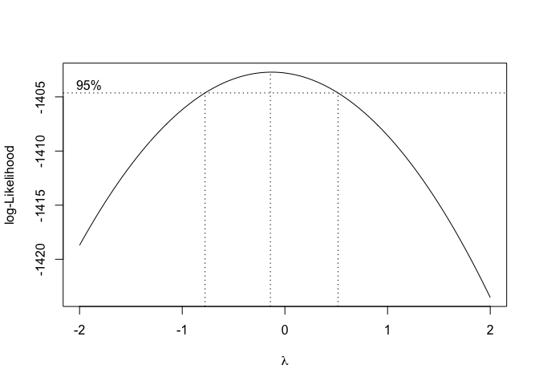

``` r
b$x[which.max(b$y)]
```

    ## [1] -0.1414141

#### Lambda Resistance

``` r
m  <- lm(rt ~ disturb_year*site, evires)
b <- boxcox(m)
```


``` r
b$x[which.max(b$y)]
```

    ## [1] 0.8282828

#### Lambda Recovery

``` r
m  <- lm(rc ~ disturb_year*site, evires)
b <- boxcox(m)
```

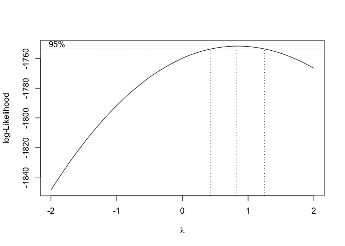

``` r
b$x[which.max(b$y)]
```

    ## [1] -1.151515

#### Lambda Relative Resilience

``` r
m  <- lm(rrs ~ disturb_year*site, evires)
b <- boxcox(m)
b$x[which.max(b$y)]
```

Obtengo diferentes lambdas, lo cual complica las transformaciones. Por lo que opto por ROBUST ANOVA

ROBUST ANOVA
============

-   Ver Wilcox (2005, 2012)
-   Vamos a realizar un Robust factorial ANOVA. En concreto:

-   Two-way robust factorial ANOVA on M-estimator
-   pkg WRS2

``` r
robustANOVA <- function(df, resp_var, factores, 
         alpha, nboot, treshold) {
  # alpha: alpha ci for huber m-estimation 
  # nboot: numer of iterations 
  # treshoold for letter (posthoc)
  # See http://rcompanion.org/rcompanion/d_08a.html 
  
  
  # Create interaction 
  df$interaction <- interaction(df$disturb_year, df$site)
  
  # Formulas 
  formulaFull <- as.formula(paste0(resp_var,  " ~ ",
                                 paste(factores, collapse = '+')))
  
  formula_A <- as.formula(paste0(resp_var,  " ~ ", factores[1]))
  formula_B <- as.formula(paste0(resp_var,  " ~ ", factores[2]))
  formula_AB <- as.formula(paste0(resp_var,  " ~ interaction"))
  
  
  # Produce Huber M-estimators and confidence intervals by group
  mest <- groupwiseHuber(formulaFull, data = df, ci.type = 'wald', conf.level = alpha)
  mest_a <- groupwiseHuber(formula_A, data = df, ci.type = 'wald', conf.level = alpha)
  mest_b <- groupwiseHuber(formula_B, data = df, ci.type = 'wald', conf.level = alpha)

  # Two-way robust analysis 
  x <- pbad2way(formulaFull, data = df, est = "mom", nboot = nboot) 
  
  out_ra <- data.frame(
    term = c(x$varnames[2], 
             x$varnames[3], 
             paste0(x$varnames[2], ':', x$varnames[3])),
    p_value = c(x$A.p.value, x$B.p.value, x$AB.p.value)) 
  
  # post-hoc 
  ## factor A
  pha <- pairwiseRobustTest(formula_A, data = df, est = "mom", 
                            nboot = nboot, method="bonferroni")
  
  ## factor B
  phb <- pairwiseRobustTest(formula_B, data = df, est = "mom", 
                            nboot = nboot, method="bonferroni")
  ## interaction effect (AB)
  phab <- pairwiseRobustTest(formula_AB, data = df, est = "mom", 
                            nboot = nboot, method="bonferroni")
  
  ph <- rbind(pha, phb, phab)
  
  phRWS2 <- mcp2a(formulaFull, data=df, est = "mom", nboot = nboot)
  
  out <- list()  
  out$mest <- mest # Huber M-estimators and Confidence Intervals
  out$mest_a <- mest_a
  out$mest_b <- mest_b
  out$ra <- out_ra # Output for Two-way robust analysis (M-estimators)
  out$ph <- ph # posthoc comparison usinng pairwiseRobustTest 
  out$pha <- pha
  out$phb <- phb
  out$phab <- phab

  
  print(out_ra)
  print(phRWS2)
  
  return(out)
}
```

``` r
factores = c('disturb_year', 'site', 'disturb_year:site')
```

``` r
rars <- robustANOVA(df=evires, resp_var='rs', factores=factores,
              alpha = 0.95, nboot = 3000, treshold = 0.01)
```

    ## [1] "comparison 1 ..."
    ## 
    ##  
    ## [1] "comparison 1 ..."
    ## 
    ##  
    ## [1] "comparison 1 ..."
    ## [1] "comparison 2 ..."
    ## [1] "comparison 3 ..."
    ## [1] "comparison 4 ..."
    ## [1] "comparison 5 ..."
    ## [1] "comparison 6 ..."
    ## 
    ##  
    ##                term    p_value
    ## 1      disturb_year 0.00000000
    ## 2              site 0.00000000
    ## 3 disturb_year:site 0.04033333
    ## Call:
    ## mcp2a(formula = formulaFull, data = df, est = "mom", nboot = nboot)
    ## 
    ##                       psihat ci.lower ci.upper p-value
    ## disturb_year1       -0.07125 -0.07953 -0.06301 0.00000
    ## site1               -0.02635 -0.03504 -0.01823 0.00000
    ## disturb_year1:site1  0.01036  0.00275  0.01936 0.01167

#### Rs Letters

``` r
x <-rars

letraArs <- cldList(comparison = x$pha$Comparison, p.value = x$pha$p.adjust, threshold  = 0.01) %>% mutate(var ='rs')
letraArs 
```

    ##   Group Letter MonoLetter var
    ## 1    25      a         a   rs
    ## 2   212      b          b  rs

``` r
letraBrs <- cldList(comparison = x$phb$Comparison, p.value = x$phb$p.adjust, threshold  = 0.01) %>% mutate(var ='rs')
letraBrs 
```

    ##   Group Letter MonoLetter var
    ## 1     N      a         a   rs
    ## 2     S      b          b  rs

``` r
letraABrs  <- cldList(comparison = x$phab$Comparison, p.value = x$phab$p.adjust, threshold  = 0.01) %>% mutate(var ='rs')
letraABrs  
```

    ##   Group Letter MonoLetter var
    ## 1  25.N      a        a    rs
    ## 2 212.N      b         b   rs
    ## 3  25.S      a        a    rs
    ## 4 212.S      c          c  rs

``` r
rarc <- robustANOVA(df=evires, resp_var='rc', factores=factores,
              alpha = 0.95, nboot = 3000, treshold = 0.01)
```

    ## [1] "comparison 1 ..."
    ## 
    ##  
    ## [1] "comparison 1 ..."
    ## 
    ##  
    ## [1] "comparison 1 ..."
    ## [1] "comparison 2 ..."
    ## [1] "comparison 3 ..."
    ## [1] "comparison 4 ..."
    ## [1] "comparison 5 ..."
    ## [1] "comparison 6 ..."
    ## 
    ##  
    ##                term p_value
    ## 1      disturb_year       0
    ## 2              site       0
    ## 3 disturb_year:site       0
    ## Call:
    ## mcp2a(formula = formulaFull, data = df, est = "mom", nboot = nboot)
    ## 
    ##                      psihat ci.lower ci.upper p-value
    ## disturb_year1       0.12129  0.11102  0.13382       0
    ## site1               0.07067  0.05811  0.08116       0
    ## disturb_year1:site1 0.13400  0.12240  0.14529       0

#### Rc Letters

``` r
x <-rarc

letraArc <- cldList(comparison = x$pha$Comparison, p.value = x$pha$p.adjust, threshold  = 0.01) %>% mutate(var ='rc')
letraArc
```

    ##   Group Letter MonoLetter var
    ## 1    25      a         a   rc
    ## 2   212      b          b  rc

``` r
letraBrc <- cldList(comparison = x$phb$Comparison, p.value = x$phb$p.adjust, threshold  = 0.01) %>% mutate(var ='rc')
letraBrc
```

    ##   Group Letter MonoLetter var
    ## 1     N      a         a   rc
    ## 2     S      b          b  rc

``` r
letraABrc <- cldList(comparison = x$phab$Comparison, p.value = x$phab$p.adjust, threshold  = 0.01) %>% mutate(var ='rc')
letraABrc 
```

    ##   Group Letter MonoLetter var
    ## 1  25.N      a        a    rc
    ## 2 212.N      b         b   rc
    ## 3  25.S      c          c  rc
    ## 4 212.S      c          c  rc

``` r
rart <- robustANOVA(df=evires, resp_var='rt', factores=factores,
              alpha = 0.95, nboot = 3000, treshold = 0.01)
```

    ## [1] "comparison 1 ..."
    ## 
    ##  
    ## [1] "comparison 1 ..."
    ## 
    ##  
    ## [1] "comparison 1 ..."
    ## [1] "comparison 2 ..."
    ## [1] "comparison 3 ..."
    ## [1] "comparison 4 ..."
    ## [1] "comparison 5 ..."
    ## [1] "comparison 6 ..."
    ## 
    ##  
    ##                term p_value
    ## 1      disturb_year       0
    ## 2              site       0
    ## 3 disturb_year:site       0
    ## Call:
    ## mcp2a(formula = formulaFull, data = df, est = "mom", nboot = nboot)
    ## 
    ##                       psihat ci.lower ci.upper p-value
    ## disturb_year1       -0.16567 -0.17509 -0.15617       0
    ## site1               -0.07410 -0.08281 -0.06433       0
    ## disturb_year1:site1 -0.09022 -0.09977 -0.08074       0

#### Rt Letters

``` r
x <-rart

letraArt <- cldList(comparison = x$pha$Comparison, p.value = x$pha$p.adjust, threshold  = 0.01) %>% mutate(var ='rt')
letraArt 
```

    ##   Group Letter MonoLetter var
    ## 1    25      a         a   rt
    ## 2   212      b          b  rt

``` r
letraBrt <- cldList(comparison = x$phb$Comparison, p.value = x$phb$p.adjust, threshold  = 0.01) %>% mutate(var ='rt')
letraBrt
```

    ##   Group Letter MonoLetter var
    ## 1     N      a         a   rt
    ## 2     S      b          b  rt

``` r
letraABrt <- cldList(comparison = x$phab$Comparison, p.value = x$phab$p.adjust, threshold  = 0.01) %>% mutate(var ='rt')
letraABrt 
```

    ##   Group Letter MonoLetter var
    ## 1  25.N      a        a    rt
    ## 2 212.N      b         b   rt
    ## 3  25.S      c          c  rt
    ## 4 212.S      b         b   rt

``` r
rarrs <- robustANOVA(df=evires, resp_var='rrs', factores=factores,
              alpha = 0.95, nboot = 3000, treshold = 0.01)
```

    ## [1] "comparison 1 ..."
    ## 
    ##  
    ## [1] "comparison 1 ..."
    ## 
    ##  
    ## [1] "comparison 1 ..."
    ## [1] "comparison 2 ..."
    ## [1] "comparison 3 ..."
    ## [1] "comparison 4 ..."
    ## [1] "comparison 5 ..."
    ## [1] "comparison 6 ..."
    ## 
    ##  
    ##                term p_value
    ## 1      disturb_year       0
    ## 2              site       0
    ## 3 disturb_year:site       0
    ## Call:
    ## mcp2a(formula = formulaFull, data = df, est = "mom", nboot = nboot)
    ## 
    ##                      psihat ci.lower ci.upper p-value
    ## disturb_year1       0.09017  0.08035  0.09907       0
    ## site1               0.04760  0.03762  0.05721       0
    ## disturb_year1:site1 0.10647  0.09693  0.11631       0

``` r
x <-rarrs

letraArrs <- cldList(comparison = x$pha$Comparison, p.value = x$pha$p.adjust, threshold  = 0.01) %>% mutate(var ='rrs')
letraArrs
```

    ##   Group Letter MonoLetter var
    ## 1    25      a         a  rrs
    ## 2   212      b          b rrs

``` r
letraBrrs <- cldList(comparison = x$phb$Comparison, p.value = x$phb$p.adjust, threshold  = 0.01) %>% mutate(var ='rrs')
letraBrrs
```

    ##   Group Letter MonoLetter var
    ## 1     N      a         a  rrs
    ## 2     S      b          b rrs

``` r
letraABrrs <- cldList(comparison = x$phab$Comparison, p.value = x$phab$p.adjust, threshold  = 0.01) %>% mutate(var ='rrs')
letraABrrs 
```

    ##   Group Letter MonoLetter var
    ## 1  25.N      a        a   rrs
    ## 2 212.N      b         b  rrs
    ## 3  25.S      c          c rrs
    ## 4 212.S      c          c rrs

``` r
letrasA <- rbind(letraArs, letraArc, letraArt, letraArrs) %>% 
  mutate(disturb_year = 
           case_when(Group == "25" ~ "2005",
                     Group == "212" ~ "2012")) %>% 
  dplyr::select(-Group)

letrasB <- rbind(letraBrs, letraBrc, letraBrt, letraBrrs) %>% rename(site = Group)

letrasAB <- rbind(letraABrs, letraABrc, letraABrt, letraABrrs) %>% 
  separate(Group, into=c('disturb_year', 'site')) %>% 
  mutate(disturb_year = 
           case_when(disturb_year == "25" ~ "2005",
                     disturb_year == "212" ~ "2012"))
```

### Estimadores de huber

``` r
rars$mest$var <- 'rs'
rarc$mest$var <- 'rc'
rart$mest$var <- 'rt'
rarrs$mest$var <- 'rrs'

mhuber <- rbind(rarc$mest, rart$mest, rars$mest, rarrs$mest)

# add letras 
mhuber <- mhuber %>% inner_join(letrasAB, by=c('var','disturb_year', 'site'))

mhuber_agg <- mhuber %>% 
  mutate(M.Huber = round(M.Huber, 4),
         lower.ci = round(lower.ci, 4),
         upper.ci = round(upper.ci, 4)) %>% 
  unite_("ci", c("lower.ci", "upper.ci"), sep=",") %>% 
  mutate(ci = paste0('(', ci, ')')) %>% 
  dplyr::select(-MonoLetter) %>% 
  dplyr::select(var, disturb_year:ci, Letter) %>% as.data.frame()

mhuber_agg %>% pander() 
```

<table style="width:92%;">
<colgroup>
<col width="8%" />
<col width="20%" />
<col width="9%" />
<col width="5%" />
<col width="13%" />
<col width="22%" />
<col width="11%" />
</colgroup>
<thead>
<tr class="header">
<th align="center">var</th>
<th align="center">disturb_year</th>
<th align="center">site</th>
<th align="center">n</th>
<th align="center">M.Huber</th>
<th align="center">ci</th>
<th align="center">Letter</th>
</tr>
</thead>
<tbody>
<tr class="odd">
<td align="center">rc</td>
<td align="center">2005</td>
<td align="center">N</td>
<td align="center">471</td>
<td align="center">1.169</td>
<td align="center">(1.161,1.1768)</td>
<td align="center">a</td>
</tr>
<tr class="even">
<td align="center">rc</td>
<td align="center">2005</td>
<td align="center">S</td>
<td align="center">441</td>
<td align="center">1.066</td>
<td align="center">(1.0584,1.0741)</td>
<td align="center">c</td>
</tr>
<tr class="odd">
<td align="center">rc</td>
<td align="center">2012</td>
<td align="center">N</td>
<td align="center">471</td>
<td align="center">1.042</td>
<td align="center">(1.0364,1.047)</td>
<td align="center">b</td>
</tr>
<tr class="even">
<td align="center">rc</td>
<td align="center">2012</td>
<td align="center">S</td>
<td align="center">441</td>
<td align="center">1.071</td>
<td align="center">(1.0674,1.0748)</td>
<td align="center">c</td>
</tr>
<tr class="odd">
<td align="center">rt</td>
<td align="center">2005</td>
<td align="center">N</td>
<td align="center">471</td>
<td align="center">0.819</td>
<td align="center">(0.8137,0.8243)</td>
<td align="center">a</td>
</tr>
<tr class="even">
<td align="center">rt</td>
<td align="center">2005</td>
<td align="center">S</td>
<td align="center">441</td>
<td align="center">0.9016</td>
<td align="center">(0.8958,0.9074)</td>
<td align="center">c</td>
</tr>
<tr class="odd">
<td align="center">rt</td>
<td align="center">2012</td>
<td align="center">N</td>
<td align="center">471</td>
<td align="center">0.9472</td>
<td align="center">(0.9423,0.9521)</td>
<td align="center">b</td>
</tr>
<tr class="even">
<td align="center">rt</td>
<td align="center">2012</td>
<td align="center">S</td>
<td align="center">441</td>
<td align="center">0.9387</td>
<td align="center">(0.9336,0.9438)</td>
<td align="center">b</td>
</tr>
<tr class="odd">
<td align="center">rs</td>
<td align="center">2005</td>
<td align="center">N</td>
<td align="center">471</td>
<td align="center">0.9553</td>
<td align="center">(0.9507,0.9599)</td>
<td align="center">a</td>
</tr>
<tr class="even">
<td align="center">rs</td>
<td align="center">2005</td>
<td align="center">S</td>
<td align="center">441</td>
<td align="center">0.9618</td>
<td align="center">(0.9573,0.9663)</td>
<td align="center">a</td>
</tr>
<tr class="odd">
<td align="center">rs</td>
<td align="center">2012</td>
<td align="center">N</td>
<td align="center">471</td>
<td align="center">0.9855</td>
<td align="center">(0.9805,0.9905)</td>
<td align="center">b</td>
</tr>
<tr class="even">
<td align="center">rs</td>
<td align="center">2012</td>
<td align="center">S</td>
<td align="center">441</td>
<td align="center">1.004</td>
<td align="center">(0.9996,1.0081)</td>
<td align="center">c</td>
</tr>
<tr class="odd">
<td align="center">rrs</td>
<td align="center">2005</td>
<td align="center">N</td>
<td align="center">471</td>
<td align="center">0.1362</td>
<td align="center">(0.1304,0.142)</td>
<td align="center">a</td>
</tr>
<tr class="even">
<td align="center">rrs</td>
<td align="center">2005</td>
<td align="center">S</td>
<td align="center">441</td>
<td align="center">0.0582</td>
<td align="center">(0.0514,0.065)</td>
<td align="center">c</td>
</tr>
<tr class="odd">
<td align="center">rrs</td>
<td align="center">2012</td>
<td align="center">N</td>
<td align="center">471</td>
<td align="center">0.0388</td>
<td align="center">(0.034,0.0437)</td>
<td align="center">b</td>
</tr>
<tr class="even">
<td align="center">rrs</td>
<td align="center">2012</td>
<td align="center">S</td>
<td align="center">441</td>
<td align="center">0.0662</td>
<td align="center">(0.0629,0.0695)</td>
<td align="center">c</td>
</tr>
</tbody>
</table>

``` r
rars$mest_a$var <- 'rs'
rarc$mest_a$var <- 'rc'
rart$mest_a$var <- 'rt'
rarrs$mest_a$var <- 'rrs'

mhuber_a <- rbind(rarc$mest_a, rart$mest_a, rars$mest_a, rarrs$mest_a)
mhuber_a <- mhuber_a %>% inner_join(letrasA, by=c('var','disturb_year'))


mhuber_agg_a <- mhuber_a %>% 
  mutate(M.Huber = round(M.Huber, 4),
         lower.ci = round(lower.ci, 4),
         upper.ci = round(upper.ci, 4)) %>% 
  unite_("ci", c("lower.ci", "upper.ci"), sep=",") %>% 
  mutate(ci = paste0('(', ci, ')')) %>% 
  dplyr::select(-MonoLetter) %>% 
  dplyr::select(var, disturb_year:ci, Letter) %>% as.data.frame()

mhuber_agg_a %>% pander() 
```

<table style="width:82%;">
<colgroup>
<col width="8%" />
<col width="20%" />
<col width="5%" />
<col width="13%" />
<col width="22%" />
<col width="11%" />
</colgroup>
<thead>
<tr class="header">
<th align="center">var</th>
<th align="center">disturb_year</th>
<th align="center">n</th>
<th align="center">M.Huber</th>
<th align="center">ci</th>
<th align="center">Letter</th>
</tr>
</thead>
<tbody>
<tr class="odd">
<td align="center">rc</td>
<td align="center">2005</td>
<td align="center">912</td>
<td align="center">1.12</td>
<td align="center">(1.1131,1.1262)</td>
<td align="center">a</td>
</tr>
<tr class="even">
<td align="center">rc</td>
<td align="center">2012</td>
<td align="center">912</td>
<td align="center">1.057</td>
<td align="center">(1.0537,1.0604)</td>
<td align="center">b</td>
</tr>
<tr class="odd">
<td align="center">rt</td>
<td align="center">2005</td>
<td align="center">912</td>
<td align="center">0.8584</td>
<td align="center">(0.8535,0.8633)</td>
<td align="center">a</td>
</tr>
<tr class="even">
<td align="center">rt</td>
<td align="center">2012</td>
<td align="center">912</td>
<td align="center">0.9431</td>
<td align="center">(0.9396,0.9466)</td>
<td align="center">b</td>
</tr>
<tr class="odd">
<td align="center">rs</td>
<td align="center">2005</td>
<td align="center">912</td>
<td align="center">0.9585</td>
<td align="center">(0.9553,0.9617)</td>
<td align="center">a</td>
</tr>
<tr class="even">
<td align="center">rs</td>
<td align="center">2012</td>
<td align="center">912</td>
<td align="center">0.9947</td>
<td align="center">(0.9913,0.998)</td>
<td align="center">b</td>
</tr>
<tr class="odd">
<td align="center">rrs</td>
<td align="center">2005</td>
<td align="center">912</td>
<td align="center">0.0999</td>
<td align="center">(0.0948,0.1051)</td>
<td align="center">a</td>
</tr>
<tr class="even">
<td align="center">rrs</td>
<td align="center">2012</td>
<td align="center">912</td>
<td align="center">0.0533</td>
<td align="center">(0.0502,0.0563)</td>
<td align="center">b</td>
</tr>
</tbody>
</table>

``` r
rars$mest_b$var <- 'rs'
rarc$mest_b$var <- 'rc'
rart$mest_b$var <- 'rt'
rarrs$mest_b$var <- 'rrs'

mhuber_b <- rbind(rarc$mest_b, rart$mest_b, rars$mest_b, rarrs$mest_b)
mhuber_b <- mhuber_b %>% inner_join(letrasB, by=c('var','site'))

mhuber_agg_b <- mhuber_b %>% 
  mutate(M.Huber = round(M.Huber, 4),
         lower.ci = round(lower.ci, 4),
         upper.ci = round(upper.ci, 4)) %>% 
  unite_("ci", c("lower.ci", "upper.ci"), sep=",") %>% 
  mutate(ci = paste0('(', ci, ')')) %>% 
  dplyr::select(-MonoLetter) %>% 
  dplyr::select(var, site:ci, Letter) %>% as.data.frame()

mhuber_agg_b %>% pander()
```

<table style="width:71%;">
<colgroup>
<col width="8%" />
<col width="9%" />
<col width="5%" />
<col width="13%" />
<col width="22%" />
<col width="11%" />
</colgroup>
<thead>
<tr class="header">
<th align="center">var</th>
<th align="center">site</th>
<th align="center">n</th>
<th align="center">M.Huber</th>
<th align="center">ci</th>
<th align="center">Letter</th>
</tr>
</thead>
<tbody>
<tr class="odd">
<td align="center">rc</td>
<td align="center">N</td>
<td align="center">942</td>
<td align="center">1.102</td>
<td align="center">(1.0958,1.1084)</td>
<td align="center">a</td>
</tr>
<tr class="even">
<td align="center">rc</td>
<td align="center">S</td>
<td align="center">882</td>
<td align="center">1.069</td>
<td align="center">(1.0652,1.0729)</td>
<td align="center">b</td>
</tr>
<tr class="odd">
<td align="center">rt</td>
<td align="center">N</td>
<td align="center">942</td>
<td align="center">0.8835</td>
<td align="center">(0.8777,0.8893)</td>
<td align="center">a</td>
</tr>
<tr class="even">
<td align="center">rt</td>
<td align="center">S</td>
<td align="center">882</td>
<td align="center">0.9207</td>
<td align="center">(0.9167,0.9246)</td>
<td align="center">b</td>
</tr>
<tr class="odd">
<td align="center">rs</td>
<td align="center">N</td>
<td align="center">942</td>
<td align="center">0.9701</td>
<td align="center">(0.9666,0.9737)</td>
<td align="center">a</td>
</tr>
<tr class="even">
<td align="center">rs</td>
<td align="center">S</td>
<td align="center">882</td>
<td align="center">0.983</td>
<td align="center">(0.9797,0.9864)</td>
<td align="center">b</td>
</tr>
<tr class="odd">
<td align="center">rrs</td>
<td align="center">N</td>
<td align="center">942</td>
<td align="center">0.0866</td>
<td align="center">(0.0816,0.0917)</td>
<td align="center">a</td>
</tr>
<tr class="even">
<td align="center">rrs</td>
<td align="center">S</td>
<td align="center">882</td>
<td align="center">0.063</td>
<td align="center">(0.0596,0.0664)</td>
<td align="center">b</td>
</tr>
</tbody>
</table>

### Pairwise comparison

``` r
rars$ph$var <- 'rs'
rarc$ph$var <- 'rc'
rart$ph$var <- 'rt'
rarrs$ph$var <- 'rrs'

pairwise <- rbind(rarc$ph, rart$ph, rars$ph, rarrs$ph) 
pairwise %>% pander()
```

<table style="width:81%;">
<colgroup>
<col width="27%" />
<col width="16%" />
<col width="13%" />
<col width="15%" />
<col width="6%" />
</colgroup>
<thead>
<tr class="header">
<th align="center">Comparison</th>
<th align="center">Statistic</th>
<th align="center">p.value</th>
<th align="center">p.adjust</th>
<th align="center">var</th>
</tr>
</thead>
<tbody>
<tr class="odd">
<td align="center">2005 - 2012 = 0</td>
<td align="center">0.05994</td>
<td align="center">0</td>
<td align="center">0</td>
<td align="center">rc</td>
</tr>
<tr class="even">
<td align="center">N - S = 0</td>
<td align="center">0.03308</td>
<td align="center">0</td>
<td align="center">0</td>
<td align="center">rc</td>
</tr>
<tr class="odd">
<td align="center">2005.N - 2012.N = 0</td>
<td align="center">0.1276</td>
<td align="center">0</td>
<td align="center">0</td>
<td align="center">rc</td>
</tr>
<tr class="even">
<td align="center">2005.N - 2005.S = 0</td>
<td align="center">0.1023</td>
<td align="center">0</td>
<td align="center">0</td>
<td align="center">rc</td>
</tr>
<tr class="odd">
<td align="center">2005.N - 2012.S = 0</td>
<td align="center">0.09598</td>
<td align="center">0</td>
<td align="center">0</td>
<td align="center">rc</td>
</tr>
<tr class="even">
<td align="center">2012.N - 2005.S = 0</td>
<td align="center">-0.02531</td>
<td align="center">0</td>
<td align="center">0</td>
<td align="center">rc</td>
</tr>
<tr class="odd">
<td align="center">2012.N - 2012.S = 0</td>
<td align="center">-0.03167</td>
<td align="center">0</td>
<td align="center">0</td>
<td align="center">rc</td>
</tr>
<tr class="even">
<td align="center">2005.S - 2012.S = 0</td>
<td align="center">-0.006357</td>
<td align="center">0.2007</td>
<td align="center">1</td>
<td align="center">rc</td>
</tr>
<tr class="odd">
<td align="center">2005 - 2012 = 0</td>
<td align="center">-0.0853</td>
<td align="center">0</td>
<td align="center">0</td>
<td align="center">rt</td>
</tr>
<tr class="even">
<td align="center">N - S = 0</td>
<td align="center">-0.03784</td>
<td align="center">0</td>
<td align="center">0</td>
<td align="center">rt</td>
</tr>
<tr class="odd">
<td align="center">2005.N - 2012.N = 0</td>
<td align="center">-0.1279</td>
<td align="center">0</td>
<td align="center">0</td>
<td align="center">rt</td>
</tr>
<tr class="even">
<td align="center">2005.N - 2005.S = 0</td>
<td align="center">-0.08216</td>
<td align="center">0</td>
<td align="center">0</td>
<td align="center">rt</td>
</tr>
<tr class="odd">
<td align="center">2005.N - 2012.S = 0</td>
<td align="center">-0.1199</td>
<td align="center">0</td>
<td align="center">0</td>
<td align="center">rt</td>
</tr>
<tr class="even">
<td align="center">2012.N - 2005.S = 0</td>
<td align="center">0.04579</td>
<td align="center">0</td>
<td align="center">0</td>
<td align="center">rt</td>
</tr>
<tr class="odd">
<td align="center">2012.N - 2012.S = 0</td>
<td align="center">0.008059</td>
<td align="center">0.03</td>
<td align="center">0.18</td>
<td align="center">rt</td>
</tr>
<tr class="even">
<td align="center">2005.S - 2012.S = 0</td>
<td align="center">-0.03773</td>
<td align="center">0</td>
<td align="center">0</td>
<td align="center">rt</td>
</tr>
<tr class="odd">
<td align="center">2005 - 2012 = 0</td>
<td align="center">-0.03583</td>
<td align="center">0</td>
<td align="center">0</td>
<td align="center">rs</td>
</tr>
<tr class="even">
<td align="center">N - S = 0</td>
<td align="center">-0.01344</td>
<td align="center">0</td>
<td align="center">0</td>
<td align="center">rs</td>
</tr>
<tr class="odd">
<td align="center">2005.N - 2012.N = 0</td>
<td align="center">-0.03045</td>
<td align="center">0</td>
<td align="center">0</td>
<td align="center">rs</td>
</tr>
<tr class="even">
<td align="center">2005.N - 2005.S = 0</td>
<td align="center">-0.007997</td>
<td align="center">0.03</td>
<td align="center">0.18</td>
<td align="center">rs</td>
</tr>
<tr class="odd">
<td align="center">2005.N - 2012.S = 0</td>
<td align="center">-0.0488</td>
<td align="center">0</td>
<td align="center">0</td>
<td align="center">rs</td>
</tr>
<tr class="even">
<td align="center">2012.N - 2005.S = 0</td>
<td align="center">0.02245</td>
<td align="center">0</td>
<td align="center">0</td>
<td align="center">rs</td>
</tr>
<tr class="odd">
<td align="center">2012.N - 2012.S = 0</td>
<td align="center">-0.01835</td>
<td align="center">0</td>
<td align="center">0</td>
<td align="center">rs</td>
</tr>
<tr class="even">
<td align="center">2005.S - 2012.S = 0</td>
<td align="center">-0.0408</td>
<td align="center">0</td>
<td align="center">0</td>
<td align="center">rs</td>
</tr>
<tr class="odd">
<td align="center">2005 - 2012 = 0</td>
<td align="center">0.04601</td>
<td align="center">0</td>
<td align="center">0</td>
<td align="center">rrs</td>
</tr>
<tr class="even">
<td align="center">N - S = 0</td>
<td align="center">0.02191</td>
<td align="center">0</td>
<td align="center">0</td>
<td align="center">rrs</td>
</tr>
<tr class="odd">
<td align="center">2005.N - 2012.N = 0</td>
<td align="center">0.09832</td>
<td align="center">0</td>
<td align="center">0</td>
<td align="center">rrs</td>
</tr>
<tr class="even">
<td align="center">2005.N - 2005.S = 0</td>
<td align="center">0.07703</td>
<td align="center">0</td>
<td align="center">0</td>
<td align="center">rrs</td>
</tr>
<tr class="odd">
<td align="center">2005.N - 2012.S = 0</td>
<td align="center">0.06889</td>
<td align="center">0</td>
<td align="center">0</td>
<td align="center">rrs</td>
</tr>
<tr class="even">
<td align="center">2012.N - 2005.S = 0</td>
<td align="center">-0.02129</td>
<td align="center">0</td>
<td align="center">0</td>
<td align="center">rrs</td>
</tr>
<tr class="odd">
<td align="center">2012.N - 2012.S = 0</td>
<td align="center">-0.02943</td>
<td align="center">0</td>
<td align="center">0</td>
<td align="center">rrs</td>
</tr>
<tr class="even">
<td align="center">2005.S - 2012.S = 0</td>
<td align="center">-0.008148</td>
<td align="center">0.03467</td>
<td align="center">0.208</td>
<td align="center">rrs</td>
</tr>
</tbody>
</table>

Interaction plot
----------------

###  Response ~ (x=Drought)

``` r
mhuber<- mhuber %>% 
  mutate(var_sorted = case_when(var == "rc" ~ "1_rc",
                                var == "rt" ~ "0_rt",
                                var == "rs" ~ "2_rs",
                                var == "rrs" ~ "3_rrs"))

pd <- position_dodge(.2)

robust_plot_evi_drought <- ggplot(mhuber, aes(x=disturb_year, y=M.Huber, color = site, group=site, fill=site)) + 
  geom_errorbar(aes(ymin=lower.ci, ymax=upper.ci), 
                width=.1, size=0.7, position=pd) + 
  geom_line(aes(group=site,color=site, linetype=site), position=pd) + 
  geom_point(shape=21, size=3.5, position=pd) +
  facet_wrap(~var_sorted, nrow = 2, scales = 'free_y',
             labeller=as_labeller(c('0_rt' = 'Resistance', 
                                 '1_rc' = 'Recovery',
                                 '2_rs' = 'Resilience',
                                 '3_rrs' = 'Relative Resilience'))) +
  scale_color_manual(values=c('black','blue')) + 
  scale_fill_manual(values=c('black','blue')) + theme_bw() +
  scale_linetype_manual(values=c("solid", "dashed")) +
  theme(panel.grid.minor = element_blank(), 
        strip.background = element_rect(colour='black', 
                                        fill='white'),
        legend.position="bottom") +
  ylab('') + xlab('Drought event')

robust_plot_evi_drought 
```

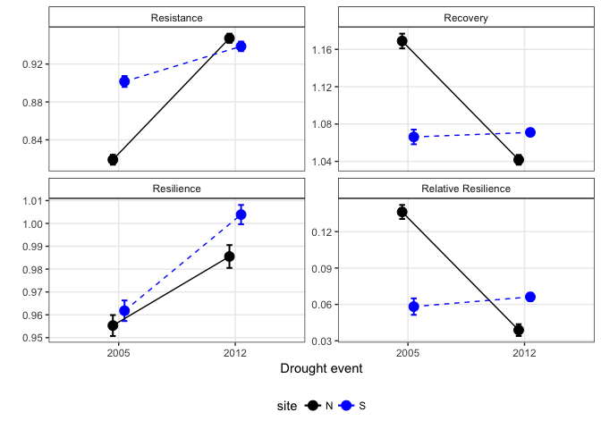

``` r
pdf(paste0(di, '/images/resilience/robust_plot_evi_drought.pdf'), width=9, height = 9)
robust_plot_evi_drought 
dev.off()
```

    ## quartz_off_screen 
    ##                 2

###  Response ~ (x=site)

``` r
pd <- position_dodge(.2)

robust_plot_evi_site <- ggplot(mhuber, aes(x=site, y=M.Huber, color = disturb_year, group=disturb_year, fill=disturb_year)) + 
  geom_errorbar(aes(ymin=lower.ci, ymax=upper.ci), 
                width=.1, size=0.7, position=pd) + 
  geom_line(aes(group=disturb_year,color=disturb_year, linetype=disturb_year), position=pd) + 
  geom_point(shape=21, size=3.5, position=pd) +
  facet_wrap(~var_sorted, nrow = 2, scales = 'free_y',
             labeller=as_labeller(c('0_rt' = 'Resistance', 
                                 '1_rc' = 'Recovery',
                                 '2_rs' = 'Resilience',
                                 '3_rrs' = 'Relative Resilience'))) +
  scale_color_manual(values=c('black','blue')) + 
  scale_fill_manual(values=c('black','blue')) + theme_bw() +
  scale_linetype_manual(values=c("solid", "dashed")) +
  theme(panel.grid.minor = element_blank(), 
        strip.background = element_rect(colour='black', 
                                        fill='white'),
        legend.position="bottom") +
  ylab('') + xlab('Drought event')


robust_plot_evi_site 
```

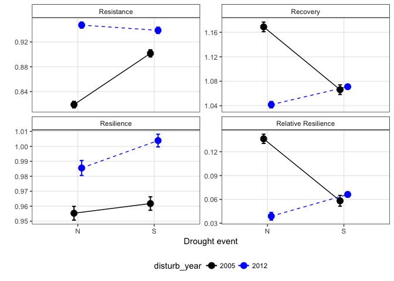

``` r
pdf(paste0(di, '/images/resilience/robust_plot_evi_site.pdf'), width=9, height = 9)
robust_plot_evi_site 
dev.off()
```

    ## quartz_off_screen 
    ##                 2

``` r
# Export data 
write.csv(mhuber, file=paste0(di, '/out/anovas_resilience/robust_mhuber.csv'), row.names = F)
write.csv(mhuber_agg, file=paste0(di, '/out/anovas_resilience/robust_mhuber_agg.csv'), row.names = F)
write.csv(mhuber_a, file=paste0(di, '/out/anovas_resilience/robust_mhuber_a.csv'), row.names = F)
write.csv(mhuber_agg_a, file=paste0(di, '/out/anovas_resilience/robust_mhuber_agg_a.csv'), row.names = F)
write.csv(mhuber_b, file=paste0(di, '/out/anovas_resilience/robust_mhuber_b.csv'), row.names = F)
write.csv(mhuber_agg_b, file=paste0(di, '/out/anovas_resilience/robust_mhuber_agg_b.csv'), row.names = F)

write.csv(pairwise, file=paste0(di, '/out/anovas_resilience/robust_pairwise.csv'), row.names = F)
```
