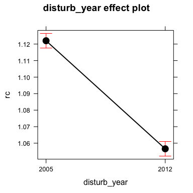
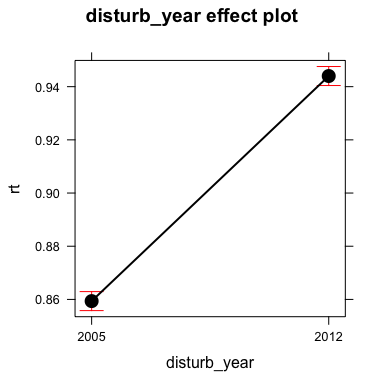

``` r
library('dplyr')
library('tidyverse')
library('broom')
library('pander')
library('lsmeans')
library('effects')
library('gridExtra')
```

Prepare data
============

``` r
# Read data
raw_evires <- read.csv(file=paste(di, "/data/resilience/resiliences.csv", sep=""), header = TRUE, sep = ',')

# add data of pop
anomalias <- read.csv(file=paste(di, "/data/anomalies/anomalias_evimean.csv", sep=""), header = TRUE, sep = ',')

attr_iv_malla_modis_id <- anomalias %>% dplyr::select(iv_malla_modi_id,long,lat,pop) %>% unique()
  

raw_evires <- raw_evires %>% inner_join(attr_iv_malla_modis_id, by='iv_malla_modi_id')

# filter by pop and add new variable

evires <- raw_evires %>% 
  mutate(
    clu_pop = as.factor(case_when(
      pop == 1 ~ "Camarate",
      pop %in% c(2,3,4,5) ~ 'Northern slope',
      pop %in% c(6,7,8) ~ 'Southern slope',
      pop == 9 ~ 'out')),
    clu_pop2 = as.factor(case_when(
      pop %in% c(1,2,3,4,5) ~ 'Northern slope',
      pop %in% c(6,7,8) ~ 'Southern slope',
      pop == 9 ~ 'out'))) %>% 
  filter(clu_pop != 'out')

# Change name of clu_pop2 and disturb_year para los analisis anovas
evires <- evires %>% rename(site = clu_pop2) %>% 
  mutate(disturb_year = as.factor(disturb_year))
```

``` r
# Custom Function to compute ANOVAS
aovas <- function(df, vars, resp_var){ 
  require('dplyr')
  require('broom')
  
  # Create subset 
  dfsel <- df %>% dplyr::select_(.dots=c(vars, resp_var)) 
    
  # Model 
  myformula <- as.formula(paste0(resp_var,  " ~ ",
                                 paste(vars, collapse = '*')))
  
  mymodel <- aov(myformula, data=dfsel)
  
  # Output model Summary http://my.ilstu.edu/~wjschne/444/ANOVA.html#(1)
  model_coeff <- broom::tidy(mymodel)
  model_summary <- broom::glance(mymodel)
  
  out <- c() 
  out$model_coeff <- model_coeff
  out$model_summary <- model_summary
  out$mymodel <- mymodel
  
  return(out)
}


# Post-Hoc comparison
phc <- function(mymodel, resp_var){
  require(lsmeans)

  # Disturb Event 
  ph_event <- lsmeans(mymodel, pairwise ~ disturb_year, adjust = "bon")
  
  # differences letters 
  cld_event <- cld(ph_event, alpha   = 0.01, 
                   Letters = letters, 
                   adjust  = "bon")
  
  # Site  
  ph_site <- lsmeans(mymodel, pairwise ~ site, adjust = "bon")
  cld_site <- cld(ph_site, alpha   = 0.01, 
                 Letters = letters, 
                 adjust  = "bon")

  # interaction 
  ph_i <- lsmeans(mymodel, pairwise ~ disturb_year:site, adjust = "bon")
  cld_i <- cld(ph_i, alpha   = 0.01, 
                 Letters = letters, 
                 adjust  = "bon")
  
  # Objets for plot
  aux_ph_site <- as.data.frame(summary(ph_site$lsmeans)) 
  aux_ph_site <- aux_ph_site %>% mutate(var = resp_var)
  aux_ph_event <- as.data.frame(summary(ph_event$lsmeans)) 
  aux_ph_event <- aux_ph_event %>% mutate(var = resp_var)
  aux_ph_i <- as.data.frame(summary(ph_i$lsmeans)) 
  aux_ph_i <- aux_ph_i %>% mutate(var = resp_var)
  
  # Return objects
  cat('\n### Event ###\n')
  print(ph_event)
  print(cld_event)
  cat('\n### Clu pop ###\n')
  print(ph_site)
  print(cld_site)
  cat('\n### Event:Clu pop ###\n')
  print(ph_i)
  return(list(aux_ph_site, aux_ph_event, aux_ph_i, cld_site, cld_event, cld_i))
}
```

ANOVAs
------

### Recovery

``` r
resp_var <- 'rc'
vars <- c('disturb_year','site')

# AOV
aov_rc <- aovas(evires, vars=vars, resp_var = resp_var)

mc <- aov_rc$model_coeff

pander(mc, round=5,
       caption = paste0("ANOVA table: ", resp_var), missing = '', 
       emphasize.strong.cells = 
         which(mc < 0.1 & mc == mc$p.value, arr.ind = T))
```

<table style="width:93%;">
<caption>ANOVA table: rc</caption>
<colgroup>
<col width="27%" />
<col width="9%" />
<col width="12%" />
<col width="13%" />
<col width="16%" />
<col width="12%" />
</colgroup>
<thead>
<tr class="header">
<th align="center">term</th>
<th align="center">df</th>
<th align="center">sumsq</th>
<th align="center">meansq</th>
<th align="center">statistic</th>
<th align="center">p.value</th>
</tr>
</thead>
<tbody>
<tr class="odd">
<td align="center">disturb_year</td>
<td align="center">1</td>
<td align="center">1.951</td>
<td align="center">1.951</td>
<td align="center">420.3</td>
<td align="center"><strong>0</strong></td>
</tr>
<tr class="even">
<td align="center">site</td>
<td align="center">1</td>
<td align="center">0.6528</td>
<td align="center">0.6528</td>
<td align="center">140.6</td>
<td align="center"><strong>0</strong></td>
</tr>
<tr class="odd">
<td align="center">disturb_year:site</td>
<td align="center">1</td>
<td align="center">1.969</td>
<td align="center">1.969</td>
<td align="center">424.1</td>
<td align="center"><strong>0</strong></td>
</tr>
<tr class="even">
<td align="center">Residuals</td>
<td align="center">1820</td>
<td align="center">8.45</td>
<td align="center">0.00464</td>
<td align="center"></td>
<td align="center"></td>
</tr>
</tbody>
</table>

``` r
gm <- aov_rc$model_summary

gm <- apply(gm, 1, formatC, digits = 2, format = "f") %>% t()
colnames(gm) <- paste0("$",c("R^2","\\mathrm{adj}R^2","\\sigma_e","F","p","df_m","\\mathrm{logLik}","AIC","BIC","\\mathrm{dev}","df_e"),"$")
rownames(gm) <- "Statistic"
pander(t(gm)) 
```

<table style="width:49%;">
<colgroup>
<col width="33%" />
<col width="15%" />
</colgroup>
<thead>
<tr class="header">
<th align="center"> </th>
<th align="center">Statistic</th>
</tr>
</thead>
<tbody>
<tr class="odd">
<td align="center"><strong><span class="math inline"><em>R</em><sup>2</sup></span></strong></td>
<td align="center">0.35</td>
</tr>
<tr class="even">
<td align="center"><strong><span class="math inline"><em>a</em><em>d</em><em>j</em><em>R</em><sup>2</sup></span></strong></td>
<td align="center">0.35</td>
</tr>
<tr class="odd">
<td align="center"><strong><span class="math inline"><em>σ</em><sub><em>e</em></sub></span></strong></td>
<td align="center">0.07</td>
</tr>
<tr class="even">
<td align="center"><strong><span class="math inline"><em>F</em></span></strong></td>
<td align="center">328.31</td>
</tr>
<tr class="odd">
<td align="center"><strong><span class="math inline"><em>p</em></span></strong></td>
<td align="center">0.00</td>
</tr>
<tr class="even">
<td align="center"><strong><span class="math inline"><em>d</em><em>f</em><sub><em>m</em></sub></span></strong></td>
<td align="center">4.00</td>
</tr>
<tr class="odd">
<td align="center"><strong><span class="math inline"><em>l</em><em>o</em><em>g</em><em>L</em><em>i</em><em>k</em></span></strong></td>
<td align="center">2313.52</td>
</tr>
<tr class="even">
<td align="center"><strong><span class="math inline"><em>A</em><em>I</em><em>C</em></span></strong></td>
<td align="center">-4617.05</td>
</tr>
<tr class="odd">
<td align="center"><strong><span class="math inline"><em>B</em><em>I</em><em>C</em></span></strong></td>
<td align="center">-4589.50</td>
</tr>
<tr class="even">
<td align="center"><strong><span class="math inline"><em>d</em><em>e</em><em>v</em></span></strong></td>
<td align="center">8.45</td>
</tr>
<tr class="odd">
<td align="center"><strong><span class="math inline"><em>d</em><em>f</em><sub><em>e</em></sub></span></strong></td>
<td align="center">1820.00</td>
</tr>
</tbody>
</table>

``` r
# Post hoc Define model
mymodel <- aov_rc$mymodel
postH_rc <- phc(mymodel = mymodel, resp_var = resp_var)
```

    ## 
    ## ### Event ###
    ## $lsmeans
    ##  disturb_year   lsmean          SE   df lower.CL upper.CL
    ##  2005         1.120312 0.002257496 1820 1.115885 1.124740
    ##  2012         1.057062 0.002257496 1820 1.052634 1.061489
    ## 
    ## Results are averaged over the levels of: site 
    ## Confidence level used: 0.95 
    ## 
    ## $contrasts
    ##  contrast      estimate          SE   df t.ratio p.value
    ##  2005 - 2012 0.06325071 0.003192582 1820  19.812  <.0001
    ## 
    ## Results are averaged over the levels of: site 
    ## 
    ##  disturb_year   lsmean          SE   df lower.CL upper.CL .group
    ##  2012         1.057062 0.002257496 1820 1.051998 1.062126  a    
    ##  2005         1.120312 0.002257496 1820 1.115248 1.125377   b   
    ## 
    ## Results are averaged over the levels of: site 
    ## Confidence level used: 0.95 
    ## Conf-level adjustment: bonferroni method for 2 estimates 
    ## significance level used: alpha = 0.01 
    ## 
    ## ### Clu pop ###
    ## $lsmeans
    ##  site             lsmean          SE   df lower.CL upper.CL
    ##  Northern slope 1.107615 0.002220056 1820 1.103261 1.111969
    ##  Southern slope 1.069759 0.002294326 1820 1.065259 1.074259
    ## 
    ## Results are averaged over the levels of: disturb_year 
    ## Confidence level used: 0.95 
    ## 
    ## $contrasts
    ##  contrast                          estimate          SE   df t.ratio
    ##  Northern slope - Southern slope 0.03785579 0.003192582 1820  11.857
    ##  p.value
    ##   <.0001
    ## 
    ## Results are averaged over the levels of: disturb_year 
    ## 
    ##  site             lsmean          SE   df lower.CL upper.CL .group
    ##  Southern slope 1.069759 0.002294326 1820 1.064612 1.074906  a    
    ##  Northern slope 1.107615 0.002220056 1820 1.102635 1.112595   b   
    ## 
    ## Results are averaged over the levels of: disturb_year 
    ## Confidence level used: 0.95 
    ## Conf-level adjustment: bonferroni method for 2 estimates 
    ## significance level used: alpha = 0.01 
    ## 
    ## ### Event:Clu pop ###
    ## $lsmeans
    ##  disturb_year site             lsmean          SE   df lower.CL upper.CL
    ##  2005         Northern slope 1.172113 0.003139633 1820 1.165955 1.178271
    ##  2012         Northern slope 1.043117 0.003139633 1820 1.036959 1.049275
    ##  2005         Southern slope 1.068512 0.003244666 1820 1.062148 1.074876
    ##  2012         Southern slope 1.071007 0.003244666 1820 1.064643 1.077370
    ## 
    ## Confidence level used: 0.95 
    ## 
    ## $contrasts
    ##  contrast                                      estimate          SE   df
    ##  2005,Northern slope - 2012,Northern slope  0.128996090 0.004440112 1820
    ##  2005,Northern slope - 2005,Southern slope  0.103601172 0.004514992 1820
    ##  2005,Northern slope - 2012,Southern slope  0.101106495 0.004514992 1820
    ##  2012,Northern slope - 2005,Southern slope -0.025394918 0.004514992 1820
    ##  2012,Northern slope - 2012,Southern slope -0.027889595 0.004514992 1820
    ##  2005,Southern slope - 2012,Southern slope -0.002494677 0.004588651 1820
    ##  t.ratio p.value
    ##   29.052  <.0001
    ##   22.946  <.0001
    ##   22.394  <.0001
    ##   -5.625  <.0001
    ##   -6.177  <.0001
    ##   -0.544  1.0000
    ## 
    ## P value adjustment: bonferroni method for 6 tests

``` r
#### ~ Site
ps <- plot(effect("site",mymodel))
#### ~ Disturb Year
pd <- plot(effect('disturb_year', mymodel))
#### Disturb Year:Site
picollapse <- plot(effect("disturb_year:site",mymodel), multiline = TRUE, ci.style = 'bars')
pi <- plot(effect("disturb_year:site",mymodel), layout=c(2,1))
```

``` r
ps
```


``` r
pd
```


``` r
picollapse
```



``` r
pi
```


### Resistance

``` r
# Variable
resp_var <- 'rt'

vars <- c('disturb_year','site')

# AOV
aov_rt <- aovas(evires, vars=vars, resp_var = resp_var)

mc <- aov_rt$model_coeff

pander(mc, round=5,
       caption = paste0("ANOVA table: ", resp_var), missing = '', 
       emphasize.strong.cells = 
         which(mc < 0.1 & mc == mc$p.value, arr.ind = T))
```

<table style="width:93%;">
<caption>ANOVA table: rt</caption>
<colgroup>
<col width="27%" />
<col width="9%" />
<col width="12%" />
<col width="13%" />
<col width="16%" />
<col width="12%" />
</colgroup>
<thead>
<tr class="header">
<th align="center">term</th>
<th align="center">df</th>
<th align="center">sumsq</th>
<th align="center">meansq</th>
<th align="center">statistic</th>
<th align="center">p.value</th>
</tr>
</thead>
<tbody>
<tr class="odd">
<td align="center">disturb_year</td>
<td align="center">1</td>
<td align="center">3.266</td>
<td align="center">3.266</td>
<td align="center">1079</td>
<td align="center"><strong>0</strong></td>
</tr>
<tr class="even">
<td align="center">site</td>
<td align="center">1</td>
<td align="center">0.6366</td>
<td align="center">0.6366</td>
<td align="center">210.2</td>
<td align="center"><strong>0</strong></td>
</tr>
<tr class="odd">
<td align="center">disturb_year:site</td>
<td align="center">1</td>
<td align="center">0.9736</td>
<td align="center">0.9736</td>
<td align="center">321.5</td>
<td align="center"><strong>0</strong></td>
</tr>
<tr class="even">
<td align="center">Residuals</td>
<td align="center">1820</td>
<td align="center">5.511</td>
<td align="center">0.00303</td>
<td align="center"></td>
<td align="center"></td>
</tr>
</tbody>
</table>

``` r
gm <- aov_rt$model_summary

gm <- apply(gm, 1, formatC, digits = 2, format = "f") %>% t()
colnames(gm) <- paste0("$",c("R^2","\\mathrm{adj}R^2","\\sigma_e","F","p","df_m","\\mathrm{logLik}","AIC","BIC","\\mathrm{dev}","df_e"),"$")
rownames(gm) <- "Statistic"
pander(t(gm)) 
```

<table style="width:49%;">
<colgroup>
<col width="33%" />
<col width="15%" />
</colgroup>
<thead>
<tr class="header">
<th align="center"> </th>
<th align="center">Statistic</th>
</tr>
</thead>
<tbody>
<tr class="odd">
<td align="center"><strong><span class="math inline"><em>R</em><sup>2</sup></span></strong></td>
<td align="center">0.47</td>
</tr>
<tr class="even">
<td align="center"><strong><span class="math inline"><em>a</em><em>d</em><em>j</em><em>R</em><sup>2</sup></span></strong></td>
<td align="center">0.47</td>
</tr>
<tr class="odd">
<td align="center"><strong><span class="math inline"><em>σ</em><sub><em>e</em></sub></span></strong></td>
<td align="center">0.06</td>
</tr>
<tr class="even">
<td align="center"><strong><span class="math inline"><em>F</em></span></strong></td>
<td align="center">536.85</td>
</tr>
<tr class="odd">
<td align="center"><strong><span class="math inline"><em>p</em></span></strong></td>
<td align="center">0.00</td>
</tr>
<tr class="even">
<td align="center"><strong><span class="math inline"><em>d</em><em>f</em><sub><em>m</em></sub></span></strong></td>
<td align="center">4.00</td>
</tr>
<tr class="odd">
<td align="center"><strong><span class="math inline"><em>l</em><em>o</em><em>g</em><em>L</em><em>i</em><em>k</em></span></strong></td>
<td align="center">2703.33</td>
</tr>
<tr class="even">
<td align="center"><strong><span class="math inline"><em>A</em><em>I</em><em>C</em></span></strong></td>
<td align="center">-5396.66</td>
</tr>
<tr class="odd">
<td align="center"><strong><span class="math inline"><em>B</em><em>I</em><em>C</em></span></strong></td>
<td align="center">-5369.12</td>
</tr>
<tr class="even">
<td align="center"><strong><span class="math inline"><em>d</em><em>e</em><em>v</em></span></strong></td>
<td align="center">5.51</td>
</tr>
<tr class="odd">
<td align="center"><strong><span class="math inline"><em>d</em><em>f</em><sub><em>e</em></sub></span></strong></td>
<td align="center">1820.00</td>
</tr>
</tbody>
</table>

``` r
# Post hoc Define model
mymodel <- aov_rt$mymodel
postH_rt <- phc(mymodel = mymodel, resp_var = resp_var)
```

    ## 
    ## ### Event ###
    ## $lsmeans
    ##  disturb_year    lsmean          SE   df  lower.CL  upper.CL
    ##  2005         0.8607403 0.001823114 1820 0.8571647 0.8643159
    ##  2012         0.9438559 0.001823114 1820 0.9402803 0.9474315
    ## 
    ## Results are averaged over the levels of: site 
    ## Confidence level used: 0.95 
    ## 
    ## $contrasts
    ##  contrast       estimate          SE   df t.ratio p.value
    ##  2005 - 2012 -0.08311557 0.002578272 1820 -32.237  <.0001
    ## 
    ## Results are averaged over the levels of: site 
    ## 
    ##  disturb_year    lsmean          SE   df  lower.CL  upper.CL .group
    ##  2005         0.8607403 0.001823114 1820 0.8566506 0.8648300  a    
    ##  2012         0.9438559 0.001823114 1820 0.9397662 0.9479456   b   
    ## 
    ## Results are averaged over the levels of: site 
    ## Confidence level used: 0.95 
    ## Conf-level adjustment: bonferroni method for 2 estimates 
    ## significance level used: alpha = 0.01 
    ## 
    ## ### Clu pop ###
    ## $lsmeans
    ##  site              lsmean          SE   df  lower.CL  upper.CL
    ##  Northern slope 0.8836057 0.001792878 1820 0.8800894 0.8871220
    ##  Southern slope 0.9209905 0.001852856 1820 0.9173566 0.9246245
    ## 
    ## Results are averaged over the levels of: disturb_year 
    ## Confidence level used: 0.95 
    ## 
    ## $contrasts
    ##  contrast                           estimate          SE   df t.ratio
    ##  Northern slope - Southern slope -0.03738486 0.002578272 1820   -14.5
    ##  p.value
    ##   <.0001
    ## 
    ## Results are averaged over the levels of: disturb_year 
    ## 
    ##  site              lsmean          SE   df  lower.CL  upper.CL .group
    ##  Northern slope 0.8836057 0.001792878 1820 0.8795838 0.8876276  a    
    ##  Southern slope 0.9209905 0.001852856 1820 0.9168341 0.9251470   b   
    ## 
    ## Results are averaged over the levels of: disturb_year 
    ## Confidence level used: 0.95 
    ## Conf-level adjustment: bonferroni method for 2 estimates 
    ## significance level used: alpha = 0.01 
    ## 
    ## ### Event:Clu pop ###
    ## $lsmeans
    ##  disturb_year site              lsmean          SE   df  lower.CL
    ##  2005         Northern slope 0.8189321 0.002535512 1820 0.8139593
    ##  2012         Northern slope 0.9482792 0.002535512 1820 0.9433064
    ##  2005         Southern slope 0.9025485 0.002620335 1820 0.8974093
    ##  2012         Southern slope 0.9394325 0.002620335 1820 0.9342934
    ##   upper.CL
    ##  0.8239049
    ##  0.9532521
    ##  0.9076877
    ##  0.9445717
    ## 
    ## Confidence level used: 0.95 
    ## 
    ## $contrasts
    ##  contrast                                     estimate          SE   df
    ##  2005,Northern slope - 2012,Northern slope -0.12934712 0.003585755 1820
    ##  2005,Northern slope - 2005,Southern slope -0.08361641 0.003646227 1820
    ##  2005,Northern slope - 2012,Southern slope -0.12050043 0.003646227 1820
    ##  2012,Northern slope - 2005,Southern slope  0.04573071 0.003646227 1820
    ##  2012,Northern slope - 2012,Southern slope  0.00884669 0.003646227 1820
    ##  2005,Southern slope - 2012,Southern slope -0.03688402 0.003705713 1820
    ##  t.ratio p.value
    ##  -36.072  <.0001
    ##  -22.932  <.0001
    ##  -33.048  <.0001
    ##   12.542  <.0001
    ##    2.426  0.0921
    ##   -9.953  <.0001
    ## 
    ## P value adjustment: bonferroni method for 6 tests

``` r
#### ~ Site
ps <- plot(effect("site",mymodel))
#### ~ Disturb Year
pd <- plot(effect('disturb_year', mymodel))
#### Disturb Year:Site
picollapse <- plot(effect("disturb_year:site",mymodel), multiline = TRUE, ci.style = 'bars')
pi <- plot(effect("disturb_year:site",mymodel), layout=c(2,1))
```

``` r
ps
```


``` r
pd
```


``` r
picollapse
```


``` r
pi
```



### Resilience

``` r
# Variable
resp_var <- 'rs'

vars <- c('disturb_year','site')

# AOV
aov_rs <- aovas(evires, vars=vars, resp_var = resp_var)

mc <- aov_rs$model_coeff

pander(mc, round=5,
       caption = paste0("ANOVA table: ", resp_var), missing = '', 
       emphasize.strong.cells = 
         which(mc < 0.1 & mc == mc$p.value, arr.ind = T))
```

<table style="width:100%;">
<caption>ANOVA table: rs</caption>
<colgroup>
<col width="27%" />
<col width="9%" />
<col width="13%" />
<col width="13%" />
<col width="16%" />
<col width="18%" />
</colgroup>
<thead>
<tr class="header">
<th align="center">term</th>
<th align="center">df</th>
<th align="center">sumsq</th>
<th align="center">meansq</th>
<th align="center">statistic</th>
<th align="center">p.value</th>
</tr>
</thead>
<tbody>
<tr class="odd">
<td align="center">disturb_year</td>
<td align="center">1</td>
<td align="center">0.6334</td>
<td align="center">0.6334</td>
<td align="center">258.4</td>
<td align="center"><strong>0</strong></td>
</tr>
<tr class="even">
<td align="center">site</td>
<td align="center">1</td>
<td align="center">0.0533</td>
<td align="center">0.0533</td>
<td align="center">21.74</td>
<td align="center"><strong>0</strong></td>
</tr>
<tr class="odd">
<td align="center">disturb_year:site</td>
<td align="center">1</td>
<td align="center">0.01931</td>
<td align="center">0.01931</td>
<td align="center">7.875</td>
<td align="center"><strong>0.00507</strong></td>
</tr>
<tr class="even">
<td align="center">Residuals</td>
<td align="center">1820</td>
<td align="center">4.462</td>
<td align="center">0.00245</td>
<td align="center"></td>
<td align="center"></td>
</tr>
</tbody>
</table>

``` r
gm <- aov_rs$model_summary

gm <- apply(gm, 1, formatC, digits = 2, format = "f") %>% t()
colnames(gm) <- paste0("$",c("R^2","\\mathrm{adj}R^2","\\sigma_e","F","p","df_m","\\mathrm{logLik}","AIC","BIC","\\mathrm{dev}","df_e"),"$")
rownames(gm) <- "Statistic"
pander(t(gm)) 
```

<table style="width:49%;">
<colgroup>
<col width="33%" />
<col width="15%" />
</colgroup>
<thead>
<tr class="header">
<th align="center"> </th>
<th align="center">Statistic</th>
</tr>
</thead>
<tbody>
<tr class="odd">
<td align="center"><strong><span class="math inline"><em>R</em><sup>2</sup></span></strong></td>
<td align="center">0.14</td>
</tr>
<tr class="even">
<td align="center"><strong><span class="math inline"><em>a</em><em>d</em><em>j</em><em>R</em><sup>2</sup></span></strong></td>
<td align="center">0.14</td>
</tr>
<tr class="odd">
<td align="center"><strong><span class="math inline"><em>σ</em><sub><em>e</em></sub></span></strong></td>
<td align="center">0.05</td>
</tr>
<tr class="even">
<td align="center"><strong><span class="math inline"><em>F</em></span></strong></td>
<td align="center">96.00</td>
</tr>
<tr class="odd">
<td align="center"><strong><span class="math inline"><em>p</em></span></strong></td>
<td align="center">0.00</td>
</tr>
<tr class="even">
<td align="center"><strong><span class="math inline"><em>d</em><em>f</em><sub><em>m</em></sub></span></strong></td>
<td align="center">4.00</td>
</tr>
<tr class="odd">
<td align="center"><strong><span class="math inline"><em>l</em><em>o</em><em>g</em><em>L</em><em>i</em><em>k</em></span></strong></td>
<td align="center">2895.92</td>
</tr>
<tr class="even">
<td align="center"><strong><span class="math inline"><em>A</em><em>I</em><em>C</em></span></strong></td>
<td align="center">-5781.83</td>
</tr>
<tr class="odd">
<td align="center"><strong><span class="math inline"><em>B</em><em>I</em><em>C</em></span></strong></td>
<td align="center">-5754.29</td>
</tr>
<tr class="even">
<td align="center"><strong><span class="math inline"><em>d</em><em>e</em><em>v</em></span></strong></td>
<td align="center">4.46</td>
</tr>
<tr class="odd">
<td align="center"><strong><span class="math inline"><em>d</em><em>f</em><sub><em>e</em></sub></span></strong></td>
<td align="center">1820.00</td>
</tr>
</tbody>
</table>

``` r
# Post hoc Define model
mymodel <- aov_rs$mymodel
postH_rs <- phc(mymodel = mymodel, resp_var = resp_var)
```

    ## 
    ## ### Event ###
    ## $lsmeans
    ##  disturb_year    lsmean          SE   df  lower.CL  upper.CL
    ##  2005         0.9587200 0.001640436 1820 0.9555027 0.9619373
    ##  2012         0.9962045 0.001640436 1820 0.9929872 0.9994219
    ## 
    ## Results are averaged over the levels of: site 
    ## Confidence level used: 0.95 
    ## 
    ## $contrasts
    ##  contrast       estimate          SE   df t.ratio p.value
    ##  2005 - 2012 -0.03748452 0.002319926 1820 -16.158  <.0001
    ## 
    ## Results are averaged over the levels of: site 
    ## 
    ##  disturb_year    lsmean          SE   df  lower.CL  upper.CL .group
    ##  2005         0.9587200 0.001640436 1820 0.9550401 0.9623999  a    
    ##  2012         0.9962045 0.001640436 1820 0.9925246 0.9998844   b   
    ## 
    ## Results are averaged over the levels of: site 
    ## Confidence level used: 0.95 
    ## Conf-level adjustment: bonferroni method for 2 estimates 
    ## significance level used: alpha = 0.01 
    ## 
    ## ### Clu pop ###
    ## $lsmeans
    ##  site              lsmean          SE   df  lower.CL  upper.CL
    ##  Northern slope 0.9720535 0.001613229 1820 0.9688896 0.9752175
    ##  Southern slope 0.9828710 0.001667198 1820 0.9796012 0.9861408
    ## 
    ## Results are averaged over the levels of: disturb_year 
    ## Confidence level used: 0.95 
    ## 
    ## $contrasts
    ##  contrast                           estimate          SE   df t.ratio
    ##  Northern slope - Southern slope -0.01081743 0.002319926 1820  -4.663
    ##  p.value
    ##   <.0001
    ## 
    ## Results are averaged over the levels of: disturb_year 
    ## 
    ##  site              lsmean          SE   df  lower.CL  upper.CL .group
    ##  Northern slope 0.9720535 0.001613229 1820 0.9684347 0.9756724  a    
    ##  Southern slope 0.9828710 0.001667198 1820 0.9791310 0.9866109   b   
    ## 
    ## Results are averaged over the levels of: disturb_year 
    ## Confidence level used: 0.95 
    ## Conf-level adjustment: bonferroni method for 2 estimates 
    ## significance level used: alpha = 0.01 
    ## 
    ## ### Event:Clu pop ###
    ## $lsmeans
    ##  disturb_year site              lsmean          SE   df  lower.CL
    ##  2005         Northern slope 0.9565664 0.002281451 1820 0.9520919
    ##  2012         Northern slope 0.9875407 0.002281451 1820 0.9830661
    ##  2005         Southern slope 0.9608736 0.002357774 1820 0.9562493
    ##  2012         Southern slope 1.0048684 0.002357774 1820 1.0002442
    ##   upper.CL
    ##  0.9610410
    ##  0.9920152
    ##  0.9654978
    ##  1.0094926
    ## 
    ## Confidence level used: 0.95 
    ## 
    ## $contrasts
    ##  contrast                                      estimate          SE   df
    ##  2005,Northern slope - 2012,Northern slope -0.030974221 0.003226458 1820
    ##  2005,Northern slope - 2005,Southern slope -0.004307134 0.003280871 1820
    ##  2005,Northern slope - 2012,Southern slope -0.048301950 0.003280871 1820
    ##  2012,Northern slope - 2005,Southern slope  0.026667087 0.003280871 1820
    ##  2012,Northern slope - 2012,Southern slope -0.017327728 0.003280871 1820
    ##  2005,Southern slope - 2012,Southern slope -0.043994816 0.003334396 1820
    ##  t.ratio p.value
    ##   -9.600  <.0001
    ##   -1.313  1.0000
    ##  -14.722  <.0001
    ##    8.128  <.0001
    ##   -5.281  <.0001
    ##  -13.194  <.0001
    ## 
    ## P value adjustment: bonferroni method for 6 tests

``` r
#### ~ Site
ps <- plot(effect("site",mymodel))
#### ~ Disturb Year
pd <- plot(effect('disturb_year', mymodel))
#### Disturb Year:Site
picollapse <- plot(effect("disturb_year:site",mymodel), multiline = TRUE, ci.style = 'bars')
pi <- plot(effect("disturb_year:site",mymodel), layout=c(2,1))
```

``` r
ps
```


``` r
pd
```


``` r
picollapse
```


``` r
pi
```


### Relative Resilience

``` r
# Variable
resp_var <- 'rrs'

vars <- c('disturb_year','site')

# AOV
aov_rrs <- aovas(evires, vars=vars, resp_var = resp_var)

mc <- aov_rrs$model_coeff

pander(mc, round=5,
       caption = paste0("ANOVA table: ", resp_var), missing = '', 
       emphasize.strong.cells = 
         which(mc < 0.1 & mc == mc$p.value, arr.ind = T))
```

<table style="width:93%;">
<caption>ANOVA table: rrs</caption>
<colgroup>
<col width="27%" />
<col width="9%" />
<col width="12%" />
<col width="13%" />
<col width="16%" />
<col width="12%" />
</colgroup>
<thead>
<tr class="header">
<th align="center">term</th>
<th align="center">df</th>
<th align="center">sumsq</th>
<th align="center">meansq</th>
<th align="center">statistic</th>
<th align="center">p.value</th>
</tr>
</thead>
<tbody>
<tr class="odd">
<td align="center">disturb_year</td>
<td align="center">1</td>
<td align="center">1.023</td>
<td align="center">1.023</td>
<td align="center">321.9</td>
<td align="center"><strong>0</strong></td>
</tr>
<tr class="even">
<td align="center">site</td>
<td align="center">1</td>
<td align="center">0.3215</td>
<td align="center">0.3215</td>
<td align="center">101.2</td>
<td align="center"><strong>0</strong></td>
</tr>
<tr class="odd">
<td align="center">disturb_year:site</td>
<td align="center">1</td>
<td align="center">1.267</td>
<td align="center">1.267</td>
<td align="center">398.7</td>
<td align="center"><strong>0</strong></td>
</tr>
<tr class="even">
<td align="center">Residuals</td>
<td align="center">1820</td>
<td align="center">5.783</td>
<td align="center">0.00318</td>
<td align="center"></td>
<td align="center"></td>
</tr>
</tbody>
</table>

``` r
gm <- aov_rrs$model_summary

gm <- apply(gm, 1, formatC, digits = 2, format = "f") %>% t()
colnames(gm) <- paste0("$",c("R^2","\\mathrm{adj}R^2","\\sigma_e","F","p","df_m","\\mathrm{logLik}","AIC","BIC","\\mathrm{dev}","df_e"),"$")
rownames(gm) <- "Statistic"
pander(t(gm)) 
```

<table style="width:49%;">
<colgroup>
<col width="33%" />
<col width="15%" />
</colgroup>
<thead>
<tr class="header">
<th align="center"> </th>
<th align="center">Statistic</th>
</tr>
</thead>
<tbody>
<tr class="odd">
<td align="center"><strong><span class="math inline"><em>R</em><sup>2</sup></span></strong></td>
<td align="center">0.31</td>
</tr>
<tr class="even">
<td align="center"><strong><span class="math inline"><em>a</em><em>d</em><em>j</em><em>R</em><sup>2</sup></span></strong></td>
<td align="center">0.31</td>
</tr>
<tr class="odd">
<td align="center"><strong><span class="math inline"><em>σ</em><sub><em>e</em></sub></span></strong></td>
<td align="center">0.06</td>
</tr>
<tr class="even">
<td align="center"><strong><span class="math inline"><em>F</em></span></strong></td>
<td align="center">273.95</td>
</tr>
<tr class="odd">
<td align="center"><strong><span class="math inline"><em>p</em></span></strong></td>
<td align="center">0.00</td>
</tr>
<tr class="even">
<td align="center"><strong><span class="math inline"><em>d</em><em>f</em><sub><em>m</em></sub></span></strong></td>
<td align="center">4.00</td>
</tr>
<tr class="odd">
<td align="center"><strong><span class="math inline"><em>l</em><em>o</em><em>g</em><em>L</em><em>i</em><em>k</em></span></strong></td>
<td align="center">2659.30</td>
</tr>
<tr class="even">
<td align="center"><strong><span class="math inline"><em>A</em><em>I</em><em>C</em></span></strong></td>
<td align="center">-5308.61</td>
</tr>
<tr class="odd">
<td align="center"><strong><span class="math inline"><em>B</em><em>I</em><em>C</em></span></strong></td>
<td align="center">-5281.06</td>
</tr>
<tr class="even">
<td align="center"><strong><span class="math inline"><em>d</em><em>e</em><em>v</em></span></strong></td>
<td align="center">5.78</td>
</tr>
<tr class="odd">
<td align="center"><strong><span class="math inline"><em>d</em><em>f</em><sub><em>e</em></sub></span></strong></td>
<td align="center">1820.00</td>
</tr>
</tbody>
</table>

``` r
# Post hoc Define model
mymodel <- aov_rrs$mymodel
postH_rrs <- phc(mymodel = mymodel, resp_var = resp_var)
```

    ## 
    ## ### Event ###
    ## $lsmeans
    ##  disturb_year     lsmean          SE   df   lower.CL  upper.CL
    ##  2005         0.09797968 0.001867656 1820 0.09431670 0.1016427
    ##  2012         0.05234863 0.001867656 1820 0.04868565 0.0560116
    ## 
    ## Results are averaged over the levels of: site 
    ## Confidence level used: 0.95 
    ## 
    ## $contrasts
    ##  contrast      estimate          SE   df t.ratio p.value
    ##  2005 - 2012 0.04563105 0.002641264 1820  17.276  <.0001
    ## 
    ## Results are averaged over the levels of: site 
    ## 
    ##  disturb_year     lsmean          SE   df   lower.CL   upper.CL .group
    ##  2012         0.05234863 0.001867656 1820 0.04815899 0.05653826  a    
    ##  2005         0.09797968 0.001867656 1820 0.09379004 0.10216931   b   
    ## 
    ## Results are averaged over the levels of: site 
    ## Confidence level used: 0.95 
    ## Conf-level adjustment: bonferroni method for 2 estimates 
    ## significance level used: alpha = 0.01 
    ## 
    ## ### Clu pop ###
    ## $lsmeans
    ##  site               lsmean          SE   df   lower.CL   upper.CL
    ##  Northern slope 0.08844787 0.001836681 1820 0.08484564 0.09205009
    ##  Southern slope 0.06188044 0.001898125 1820 0.05815770 0.06560317
    ## 
    ## Results are averaged over the levels of: disturb_year 
    ## Confidence level used: 0.95 
    ## 
    ## $contrasts
    ##  contrast                          estimate          SE   df t.ratio
    ##  Northern slope - Southern slope 0.02656743 0.002641264 1820  10.059
    ##  p.value
    ##   <.0001
    ## 
    ## Results are averaged over the levels of: disturb_year 
    ## 
    ##  site               lsmean          SE   df   lower.CL   upper.CL .group
    ##  Southern slope 0.06188044 0.001898125 1820 0.05762245 0.06613842  a    
    ##  Northern slope 0.08844787 0.001836681 1820 0.08432772 0.09256802   b   
    ## 
    ## Results are averaged over the levels of: disturb_year 
    ## Confidence level used: 0.95 
    ## Conf-level adjustment: bonferroni method for 2 estimates 
    ## significance level used: alpha = 0.01 
    ## 
    ## ### Event:Clu pop ###
    ## $lsmeans
    ##  disturb_year site               lsmean          SE   df  lower.CL
    ##  2005         Northern slope 0.13763432 0.002597459 1820 0.1325400
    ##  2012         Northern slope 0.03926142 0.002597459 1820 0.0341671
    ##  2005         Southern slope 0.05832504 0.002684355 1820 0.0530603
    ##  2012         Southern slope 0.06543584 0.002684355 1820 0.0601711
    ##    upper.CL
    ##  0.14272863
    ##  0.04435573
    ##  0.06358978
    ##  0.07070057
    ## 
    ## Confidence level used: 0.95 
    ## 
    ## $contrasts
    ##  contrast                                      estimate          SE   df
    ##  2005,Northern slope - 2012,Northern slope  0.098372900 0.003673362 1820
    ##  2005,Northern slope - 2005,Southern slope  0.079309278 0.003735312 1820
    ##  2005,Northern slope - 2012,Southern slope  0.072198481 0.003735312 1820
    ##  2012,Northern slope - 2005,Southern slope -0.019063621 0.003735312 1820
    ##  2012,Northern slope - 2012,Southern slope -0.026174419 0.003735312 1820
    ##  2005,Southern slope - 2012,Southern slope -0.007110797 0.003796251 1820
    ##  t.ratio p.value
    ##   26.780  <.0001
    ##   21.232  <.0001
    ##   19.329  <.0001
    ##   -5.104  <.0001
    ##   -7.007  <.0001
    ##   -1.873  0.3673
    ## 
    ## P value adjustment: bonferroni method for 6 tests

``` r
#### ~ Site
ps <- plot(effect("site",mymodel))
#### ~ Disturb Year
pd <- plot(effect('disturb_year', mymodel))
#### Disturb Year:Site
picollapse <- plot(effect("disturb_year:site",mymodel), multiline = TRUE, ci.style = 'bars')
pi <- plot(effect("disturb_year:site",mymodel), layout=c(2,1))
```

``` r
ps
```


``` r
pd
```


``` r
picollapse
```


``` r
pi
```


``` r
means_site <- postH_rc[[4]] %>% mutate(var = 'rc') %>% 
  bind_rows(postH_rt[[4]] %>% mutate(var = 'rt')) %>% 
  bind_rows(postH_rs[[4]] %>% mutate(var = 'rs')) %>% 
  bind_rows(postH_rrs[[4]] %>% mutate(var = 'rrs')) %>% 
  rename(letras = .group)

means_disturb <- postH_rc[[5]] %>% mutate(var = 'rc') %>% 
  bind_rows(postH_rt[[5]] %>% mutate(var = 'rt')) %>% 
  bind_rows(postH_rs[[5]] %>% mutate(var = 'rs')) %>% 
  bind_rows(postH_rrs[[5]] %>% mutate(var = 'rrs')) %>% 
  rename(letras = .group)

means_distub_site <- postH_rc[[6]] %>% mutate(var = 'rc') %>% 
  bind_rows(postH_rt[[6]] %>% mutate(var = 'rt')) %>% 
  bind_rows(postH_rs[[6]] %>% mutate(var = 'rs')) %>% 
  bind_rows(postH_rrs[[6]] %>% mutate(var = 'rrs')) %>% 
  rename(letras = .group)
```

``` r
dodge <- position_dodge(width = 0.3)
micolor <- '#455883'
mierrorbarSE <- aes(ymin=lsmean - SE, ymax=lsmean + SE)
mierrorbar <- aes(ymin=lower.CL, ymax=upper.CL)
```

``` r
plot_ms <- means_site %>%  
  ggplot(aes(x=site, y=lsmean)) + 
  geom_point(colour=micolor, 
             size=3, position = dodge) +
  theme_bw() + xlab('') + ylab('') + 
  facet_wrap(~var, scales='free_y', ncol = 1) +
  geom_text(aes(y=lsmean, label=letras), nudge_x = 0.15) +
  theme(strip.background = element_rect(colour = "black", fill = "white"))

plot_msSE <- plot_ms + geom_errorbar(mierrorbarSE,color=micolor, 
                                     size=.5, width=.15, position = dodge) 

plot_msCI <- plot_ms + geom_errorbar(mierrorbar,color=micolor, 
                                     size=.5, width=.15, position = dodge)
```

``` r
plot_md <- means_disturb %>%  
  ggplot(aes(x=disturb_year, y=lsmean)) + 
  geom_point(colour=micolor, 
             size=3, position = dodge) +
  theme_bw() + xlab('') + ylab('') + 
  facet_wrap(~var, scales='free_y', ncol = 1) +
  geom_text(aes(y=lsmean, label=letras), nudge_x = 0.15) +
  theme(strip.background = element_rect(colour = "black", fill = "white"))


plot_mdSE <- plot_md + geom_errorbar(mierrorbarSE,color=micolor, 
                                     size=.5, width=.15, position = dodge) 

plot_mdCI <- plot_md + geom_errorbar(mierrorbar,color=micolor, 
                                     size=.5, width=.15, position = dodge)
```

``` r
plot_mds <- means_distub_site %>%  
  ggplot(aes(x=site, y=lsmean, group=disturb_year, colour=disturb_year)) + 
  geom_point(aes(shape=disturb_year), size=3) + 
  geom_line() +
  theme_bw() + xlab('') + ylab('') + 
  facet_wrap(~var, scales='free_y', ncol = 1) +
  geom_text(aes(y=lsmean+SE, label=letras), nudge_x = 0.15)+
  theme(strip.background = element_rect(colour = "black", fill = "white"),
        legend.position = c(0.8, 0.93),
        legend.background = element_blank()) +
  scale_colour_manual(values = c(micolor, "red")) 


plot_mdsSE <- plot_mds + geom_errorbar(mierrorbarSE, size=.5, width=.15)
plot_mdsCI <- plot_mds + geom_errorbar(mierrorbar, size=.5, width=.15)
```

``` r
pdf(paste0(di, '/images/resilience/interaction_plotsSE.pdf'), width=9, height = 9)
grid.arrange(plot_mdSE, plot_msSE, plot_mdsSE, ncol=3)
dev.off()
```

    ## quartz_off_screen 
    ##                 2

``` r
pdf(paste0(di, '/images/resilience/interaction_plotsCI.pdf'), width=9, height = 9)
grid.arrange(plot_mdCI, plot_msCI, plot_mdsCI, ncol=3)
dev.off()
```

    ## quartz_off_screen 
    ##                 2

``` r
aovas_coeff <- aov_rc$model_coeff %>% mutate(var = 'rc') %>% 
  bind_rows(aov_rt$model_coeff %>% mutate(var = 'rt')) %>% 
  bind_rows(aov_rs$model_coeff %>% mutate(var = 'rs')) %>% 
  bind_rows(aov_rrs$model_coeff%>% mutate(var = 'rrs')) 

write.csv(aovas_coeff, file=paste0(di, '/out/anovas_resilience/anovas_statistics.csv'), row.names = F)

aovas_coeff %>% pander()
```

<table>
<colgroup>
<col width="25%" />
<col width="8%" />
<col width="12%" />
<col width="14%" />
<col width="15%" />
<col width="16%" />
<col width="6%" />
</colgroup>
<thead>
<tr class="header">
<th align="center">term</th>
<th align="center">df</th>
<th align="center">sumsq</th>
<th align="center">meansq</th>
<th align="center">statistic</th>
<th align="center">p.value</th>
<th align="center">var</th>
</tr>
</thead>
<tbody>
<tr class="odd">
<td align="center">disturb_year</td>
<td align="center">1</td>
<td align="center">1.951</td>
<td align="center">1.951</td>
<td align="center">420.3</td>
<td align="center">3.368e-84</td>
<td align="center">rc</td>
</tr>
<tr class="even">
<td align="center">site</td>
<td align="center">1</td>
<td align="center">0.6528</td>
<td align="center">0.6528</td>
<td align="center">140.6</td>
<td align="center">2.706e-31</td>
<td align="center">rc</td>
</tr>
<tr class="odd">
<td align="center">disturb_year:site</td>
<td align="center">1</td>
<td align="center">1.969</td>
<td align="center">1.969</td>
<td align="center">424.1</td>
<td align="center">7.127e-85</td>
<td align="center">rc</td>
</tr>
<tr class="even">
<td align="center">Residuals</td>
<td align="center">1820</td>
<td align="center">8.45</td>
<td align="center">0.004643</td>
<td align="center">NA</td>
<td align="center">NA</td>
<td align="center">rc</td>
</tr>
<tr class="odd">
<td align="center">disturb_year</td>
<td align="center">1</td>
<td align="center">3.266</td>
<td align="center">3.266</td>
<td align="center">1079</td>
<td align="center">3.446e-186</td>
<td align="center">rt</td>
</tr>
<tr class="even">
<td align="center">site</td>
<td align="center">1</td>
<td align="center">0.6366</td>
<td align="center">0.6366</td>
<td align="center">210.2</td>
<td align="center">3.608e-45</td>
<td align="center">rt</td>
</tr>
<tr class="odd">
<td align="center">disturb_year:site</td>
<td align="center">1</td>
<td align="center">0.9736</td>
<td align="center">0.9736</td>
<td align="center">321.5</td>
<td align="center">2.446e-66</td>
<td align="center">rt</td>
</tr>
<tr class="even">
<td align="center">Residuals</td>
<td align="center">1820</td>
<td align="center">5.511</td>
<td align="center">0.003028</td>
<td align="center">NA</td>
<td align="center">NA</td>
<td align="center">rt</td>
</tr>
<tr class="odd">
<td align="center">disturb_year</td>
<td align="center">1</td>
<td align="center">0.6334</td>
<td align="center">0.6334</td>
<td align="center">258.4</td>
<td align="center">1.817e-54</td>
<td align="center">rs</td>
</tr>
<tr class="even">
<td align="center">site</td>
<td align="center">1</td>
<td align="center">0.0533</td>
<td align="center">0.0533</td>
<td align="center">21.74</td>
<td align="center">3.346e-06</td>
<td align="center">rs</td>
</tr>
<tr class="odd">
<td align="center">disturb_year:site</td>
<td align="center">1</td>
<td align="center">0.01931</td>
<td align="center">0.01931</td>
<td align="center">7.875</td>
<td align="center">0.005066</td>
<td align="center">rs</td>
</tr>
<tr class="even">
<td align="center">Residuals</td>
<td align="center">1820</td>
<td align="center">4.462</td>
<td align="center">0.002452</td>
<td align="center">NA</td>
<td align="center">NA</td>
<td align="center">rs</td>
</tr>
<tr class="odd">
<td align="center">disturb_year</td>
<td align="center">1</td>
<td align="center">1.023</td>
<td align="center">1.023</td>
<td align="center">321.9</td>
<td align="center">2.05e-66</td>
<td align="center">rrs</td>
</tr>
<tr class="even">
<td align="center">site</td>
<td align="center">1</td>
<td align="center">0.3215</td>
<td align="center">0.3215</td>
<td align="center">101.2</td>
<td align="center">3.356e-23</td>
<td align="center">rrs</td>
</tr>
<tr class="odd">
<td align="center">disturb_year:site</td>
<td align="center">1</td>
<td align="center">1.267</td>
<td align="center">1.267</td>
<td align="center">398.7</td>
<td align="center">2.249e-80</td>
<td align="center">rrs</td>
</tr>
<tr class="even">
<td align="center">Residuals</td>
<td align="center">1820</td>
<td align="center">5.783</td>
<td align="center">0.003178</td>
<td align="center">NA</td>
<td align="center">NA</td>
<td align="center">rrs</td>
</tr>
</tbody>
</table>

``` r
aovas_model_summary <- aov_rc$model_summary %>% mutate(var = 'rc') %>% 
  bind_rows(aov_rt$model_summary %>% mutate(var = 'rt')) %>% 
  bind_rows(aov_rs$model_summary %>% mutate(var = 'rs')) %>% 
  bind_rows(aov_rrs$model_summary%>% mutate(var = 'rrs')) 

write.csv(aovas_model_summary, 
          file=paste0(di, '/out/anovas_resilience/anovas_summary_modelos.csv'), row.names = F)


gm <- apply(aovas_model_summary, 1, formatC, digits = 2, format = "f") 
rownames(gm) <- paste0("$",c("R^2","\\mathrm{adj}R^2","\\sigma_e","F","p","df_m","\\mathrm{logLik}","AIC","BIC","\\mathrm{dev}","df_e", "variable"),"$")
colnames(gm) <- c("rc", "rt", "rs", "rrs")

pander(gm)
```

<table>
<caption>Table continues below</caption>
<colgroup>
<col width="33%" />
<col width="22%" />
<col width="22%" />
<col width="22%" />
</colgroup>
<thead>
<tr class="header">
<th align="center"> </th>
<th align="center">rc</th>
<th align="center">rt</th>
<th align="center">rs</th>
</tr>
</thead>
<tbody>
<tr class="odd">
<td align="center"><strong><span class="math inline"><em>R</em><sup>2</sup></span></strong></td>
<td align="center">0.3511444</td>
<td align="center">0.4694715</td>
<td align="center">0.1366188</td>
</tr>
<tr class="even">
<td align="center"><strong><span class="math inline"><em>a</em><em>d</em><em>j</em><em>R</em><sup>2</sup></span></strong></td>
<td align="center">0.3500749</td>
<td align="center">0.4685970</td>
<td align="center">0.1351956</td>
</tr>
<tr class="odd">
<td align="center"><strong><span class="math inline"><em>σ</em><sub><em>e</em></sub></span></strong></td>
<td align="center">0.06813799</td>
<td align="center">0.05502703</td>
<td align="center">0.04951326</td>
</tr>
<tr class="even">
<td align="center"><strong><span class="math inline"><em>F</em></span></strong></td>
<td align="center">328.31282</td>
<td align="center">536.84720</td>
<td align="center">95.99708</td>
</tr>
<tr class="odd">
<td align="center"><strong><span class="math inline"><em>p</em></span></strong></td>
<td align="center">2.291209e-170</td>
<td align="center">7.130860e-250</td>
<td align="center">1.111125e-57</td>
</tr>
<tr class="even">
<td align="center"><strong><span class="math inline"><em>d</em><em>f</em><sub><em>m</em></sub></span></strong></td>
<td align="center">4</td>
<td align="center">4</td>
<td align="center">4</td>
</tr>
<tr class="odd">
<td align="center"><strong><span class="math inline"><em>l</em><em>o</em><em>g</em><em>L</em><em>i</em><em>k</em></span></strong></td>
<td align="center">2313.524</td>
<td align="center">2703.332</td>
<td align="center">2895.917</td>
</tr>
<tr class="even">
<td align="center"><strong><span class="math inline"><em>A</em><em>I</em><em>C</em></span></strong></td>
<td align="center">-4617.048</td>
<td align="center">-5396.664</td>
<td align="center">-5781.835</td>
</tr>
<tr class="odd">
<td align="center"><strong><span class="math inline"><em>B</em><em>I</em><em>C</em></span></strong></td>
<td align="center">-4589.504</td>
<td align="center">-5369.120</td>
<td align="center">-5754.291</td>
</tr>
<tr class="even">
<td align="center"><strong><span class="math inline"><em>d</em><em>e</em><em>v</em></span></strong></td>
<td align="center">8.449871</td>
<td align="center">5.510913</td>
<td align="center">4.461844</td>
</tr>
<tr class="odd">
<td align="center"><strong><span class="math inline"><em>d</em><em>f</em><sub><em>e</em></sub></span></strong></td>
<td align="center">1820</td>
<td align="center">1820</td>
<td align="center">1820</td>
</tr>
<tr class="even">
<td align="center"><strong><span class="math inline"><em>v</em><em>a</em><em>r</em><em>i</em><em>a</em><em>b</em><em>l</em><em>e</em></span></strong></td>
<td align="center">rc</td>
<td align="center">rt</td>
<td align="center">rs</td>
</tr>
</tbody>
</table>

<table style="width:54%;">
<colgroup>
<col width="33%" />
<col width="20%" />
</colgroup>
<thead>
<tr class="header">
<th align="center"> </th>
<th align="center">rrs</th>
</tr>
</thead>
<tbody>
<tr class="odd">
<td align="center"><strong><span class="math inline"><em>R</em><sup>2</sup></span></strong></td>
<td align="center">0.3110905</td>
</tr>
<tr class="even">
<td align="center"><strong><span class="math inline"><em>a</em><em>d</em><em>j</em><em>R</em><sup>2</sup></span></strong></td>
<td align="center">0.3099549</td>
</tr>
<tr class="odd">
<td align="center"><strong><span class="math inline"><em>σ</em><sub><em>e</em></sub></span></strong></td>
<td align="center">0.05637145</td>
</tr>
<tr class="even">
<td align="center"><strong><span class="math inline"><em>F</em></span></strong></td>
<td align="center">273.95212</td>
</tr>
<tr class="odd">
<td align="center"><strong><span class="math inline"><em>p</em></span></strong></td>
<td align="center">1.015581e-146</td>
</tr>
<tr class="even">
<td align="center"><strong><span class="math inline"><em>d</em><em>f</em><sub><em>m</em></sub></span></strong></td>
<td align="center">4</td>
</tr>
<tr class="odd">
<td align="center"><strong><span class="math inline"><em>l</em><em>o</em><em>g</em><em>L</em><em>i</em><em>k</em></span></strong></td>
<td align="center">2659.304</td>
</tr>
<tr class="even">
<td align="center"><strong><span class="math inline"><em>A</em><em>I</em><em>C</em></span></strong></td>
<td align="center">-5308.608</td>
</tr>
<tr class="odd">
<td align="center"><strong><span class="math inline"><em>B</em><em>I</em><em>C</em></span></strong></td>
<td align="center">-5281.064</td>
</tr>
<tr class="even">
<td align="center"><strong><span class="math inline"><em>d</em><em>e</em><em>v</em></span></strong></td>
<td align="center">5.783487</td>
</tr>
<tr class="odd">
<td align="center"><strong><span class="math inline"><em>d</em><em>f</em><sub><em>e</em></sub></span></strong></td>
<td align="center">1820</td>
</tr>
<tr class="even">
<td align="center"><strong><span class="math inline"><em>v</em><em>a</em><em>r</em><em>i</em><em>a</em><em>b</em><em>l</em><em>e</em></span></strong></td>
<td align="center">rrs</td>
</tr>
</tbody>
</table>
