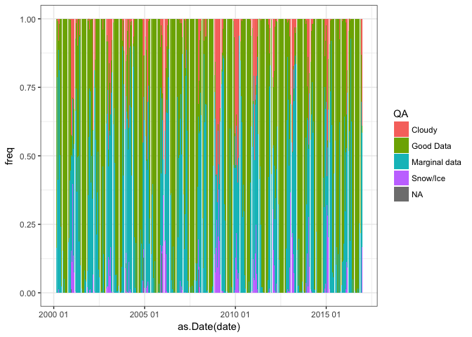
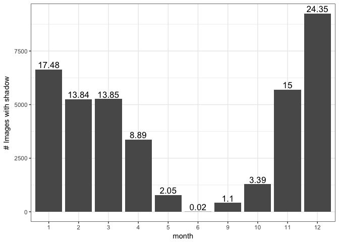
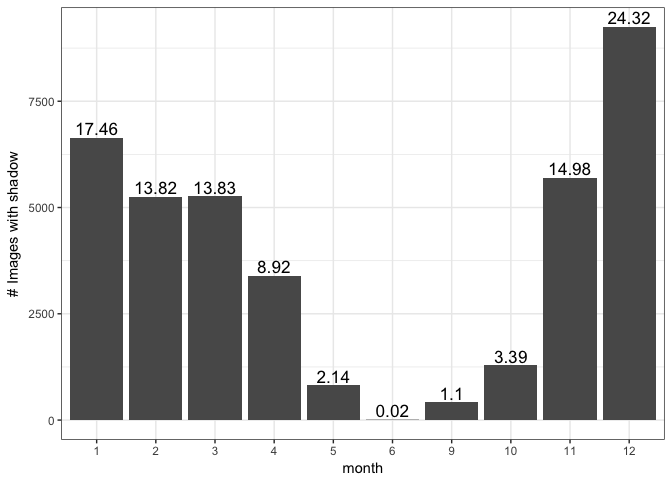
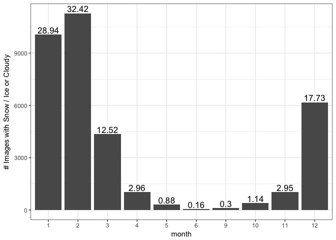
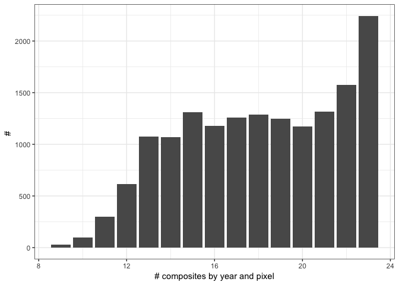

-   [Prepare Data](#prepare-data)
-   [Some metadata of the time series](#some-metadata-of-the-time-series)
    -   [Temporal range of the time series](#temporal-range-of-the-time-series)
-   [Quality assessment](#quality-assessment)
    -   [Number of images per year](#number-of-images-per-year)
    -   [Summary table of layer summaryQA](#summary-table-of-layer-summaryqa)
    -   [Explore temporal distribution of QA](#explore-temporal-distribution-of-qa)
-   [QA detailed](#qa-detailed)
    -   [Quality](#quality)
    -   [Quality usefulness](#quality-usefulness)
    -   [Aerosol](#aerosol)
    -   [Clouds](#clouds)
    -   [Snow](#snow)
    -   [Shadow](#shadow)
    -   [Filter](#filter)
-   [Prepare data](#prepare-data-1)
    -   [Get the composite of the images and the season](#get-the-composite-of-the-images-and-the-season)
    -   [Scale factor of the NDVI and EVI data](#scale-factor-of-the-ndvi-and-evi-data)
    -   [ ***iv\_composite***](#iv_composite)
    -   [ ***evi\_mean***](#evi_mean)
    -   [***evi\_seasonal*** and ***ndvi\_seasonal***](#evi_seasonal-and-ndvi_seasonal)
    -   [Export dataframes](#export-dataframes)

``` r
library("tidyverse")
library("knitr")
library("binaryLogic")
source(paste0(di,"/script/R/getComposite.R"))
```

``` r
# Read data
rawdata <- read.csv(file=paste(di, "/data_raw/evi/iv_qp_raw_qa_2017.csv", sep= ""), header = TRUE, sep = ',')
```

Prepare Data
------------

-   Raw data come from GEE script (see [`/script/GEE/get_iv_modis.qp.js`](/script/GEE/get_iv_modis.qp.js)

-   Date:
-   Get date of the image (from hdf title, system.index)
-   Store as date (date format) and create new variable for year

-   Select and rename variables of interest

``` r
raw <- rawdata %>% 
  mutate(
    # Date
    date = as.Date(substr(system.index,1,10), format = "%Y_%m_%d"),
    # date2 = as.Date(substr(system.index,1,10), format = "%Y_%m_%d"),
    year = lubridate::year(date), 
    
    # GEE index
    gee_index = stringr::str_replace(
      substr(system.index,22, nchar(as.character(system.index))),
    pattern = '_', "")) %>% 
    # test = ifelse(date == date2, 0, 1))
  dplyr::select(doy = DayOfYear, evi = EVI, ndvi = NDVI, summQA = SummaryQA, iv_malla_modi_id,
                pop, date, year, gee_index, lat, long, 
                qa_quality, qa_use, qa_aerosol, qa_adj_cloud, 
                qa_atmos, qa_mix_cloud, qa_landwater, qa_snow, qa_shadow)
```

Some metadata of the time series
--------------------------------

### Temporal range of the time series

``` r
# Get temporal range of the data
# Start date
unique(min(as.Date(raw$date)))
```

    ## [1] "2000-02-18"

``` r
# End date 
unique(max(as.Date(raw$date)))
```

    ## [1] "2016-12-18"

Quality assessment
------------------

### Number of images per year

``` r
# See n of images per year and per pixel 
n_images_pixel <- raw %>% 
  mutate(year = lubridate::year(date)) %>% 
  group_by(year) %>%
  summarise(n = n(),
            n_pixel = n()/length(unique(iv_malla_modi_id)))

kable(n_images_pixel)
```

|  year|      n|  n\_pixel|
|-----:|------:|---------:|
|  2000|  17632|        19|
|  2001|  21344|        23|
|  2002|  21344|        23|
|  2003|  21344|        23|
|  2004|  21344|        23|
|  2005|  21344|        23|
|  2006|  21344|        23|
|  2007|  21344|        23|
|  2008|  21344|        23|
|  2009|  21344|        23|
|  2010|  21344|        23|
|  2011|  21344|        23|
|  2012|  21344|        23|
|  2013|  21344|        23|
|  2014|  21344|        23|
|  2015|  20416|        22|
|  2016|  21344|        23|

### Summary table of layer summaryQA

``` r
# Table of QA
raw %>% group_by(summQA) %>% 
  summarise(npixels = n()) %>% 
  mutate(freq = round((npixels / sum(npixels)*100),2),
         QA = plyr::mapvalues(summQA, c(0, 1, 2, 3), c("Good Data", "Marginal data", "Snow/Ice", "Cloudy"))) %>% 
  kable() 
```

|  summQA|  npixels|   freq| QA            |
|-------:|--------:|------:|:--------------|
|       0|   207616|  57.96| Good Data     |
|       1|   115378|  32.21| Marginal data |
|       2|     9268|   2.59| Snow/Ice      |
|       3|    25502|   7.12| Cloudy        |
|      NA|      444|   0.12| NA            |

### Explore temporal distribution of QA

``` r
qadate <- raw %>% 
  group_by(date, summQA) %>% 
  count(date, summQA) %>% 
  mutate(freq = round((n / sum(n))*100, 2),
         QA = plyr::mapvalues(summQA, c(0, 1, 2, 3), 
                              c("Good Data", "Marginal data", "Snow/Ice", "Cloudy"))) 

kable(qadate)
```

| date       |  summQA|    n|    freq| QA            |
|:-----------|-------:|----:|-------:|:--------------|
| 2000-02-18 |       0|  775|   83.51| Good Data     |
| 2000-02-18 |       1|  153|   16.49| Marginal data |
| 2000-03-05 |       0|  199|   21.44| Good Data     |
| 2000-03-05 |       1|  729|   78.56| Marginal data |
| 2000-03-21 |       0|  536|   57.76| Good Data     |
| 2000-03-21 |       1|  384|   41.38| Marginal data |
| 2000-03-21 |       3|    8|    0.86| Cloudy        |
| 2000-04-06 |       0|   31|    3.34| Good Data     |
| 2000-04-06 |       1|  811|   87.39| Marginal data |
| 2000-04-06 |       2|   12|    1.29| Snow/Ice      |
| 2000-04-06 |       3|   74|    7.97| Cloudy        |
| 2000-04-22 |       0|  157|   16.92| Good Data     |
| 2000-04-22 |       1|  753|   81.14| Marginal data |
| 2000-04-22 |       3|   18|    1.94| Cloudy        |
| 2000-05-24 |       0|  705|   75.97| Good Data     |
| 2000-05-24 |       1|  223|   24.03| Marginal data |
| 2000-06-09 |       0|  907|   97.74| Good Data     |
| 2000-06-09 |       1|   21|    2.26| Marginal data |
| 2000-06-25 |       0|  785|   84.59| Good Data     |
| 2000-06-25 |       1|  143|   15.41| Marginal data |
| 2000-07-11 |       0|  928|  100.00| Good Data     |
| 2000-07-27 |       0|  881|   94.94| Good Data     |
| 2000-07-27 |       1|   47|    5.06| Marginal data |
| 2000-08-12 |       0|  928|  100.00| Good Data     |
| 2000-08-28 |       0|  928|  100.00| Good Data     |
| 2000-09-13 |       0|  928|  100.00| Good Data     |
| 2000-09-29 |       0|  928|  100.00| Good Data     |
| 2000-10-15 |       0|  757|   81.57| Good Data     |
| 2000-10-15 |       1|  171|   18.43| Marginal data |
| 2000-10-31 |       0|  743|   80.06| Good Data     |
| 2000-10-31 |       1|  185|   19.94| Marginal data |
| 2000-11-16 |       0|  544|   58.62| Good Data     |
| 2000-11-16 |       1|  380|   40.95| Marginal data |
| 2000-11-16 |       3|    4|    0.43| Cloudy        |
| 2000-12-02 |       0|  510|   54.96| Good Data     |
| 2000-12-02 |       1|  415|   44.72| Marginal data |
| 2000-12-02 |       3|    3|    0.32| Cloudy        |
| 2000-12-18 |       0|   69|    7.44| Good Data     |
| 2000-12-18 |       1|  324|   34.91| Marginal data |
| 2000-12-18 |       2|  132|   14.22| Snow/Ice      |
| 2000-12-18 |       3|  392|   42.24| Cloudy        |
| 2000-12-18 |      NA|   11|    1.19| NA            |
| 2001-01-01 |       0|   69|    7.44| Good Data     |
| 2001-01-01 |       1|  357|   38.47| Marginal data |
| 2001-01-01 |       2|  104|   11.21| Snow/Ice      |
| 2001-01-01 |       3|  398|   42.89| Cloudy        |
| 2001-01-17 |       0|    5|    0.54| Good Data     |
| 2001-01-17 |       1|  289|   31.14| Marginal data |
| 2001-01-17 |       2|  368|   39.66| Snow/Ice      |
| 2001-01-17 |       3|  266|   28.66| Cloudy        |
| 2001-02-02 |       0|  170|   18.32| Good Data     |
| 2001-02-02 |       1|  361|   38.90| Marginal data |
| 2001-02-02 |       2|  126|   13.58| Snow/Ice      |
| 2001-02-02 |       3|  271|   29.20| Cloudy        |
| 2001-02-18 |       0|  119|   12.82| Good Data     |
| 2001-02-18 |       1|  435|   46.88| Marginal data |
| 2001-02-18 |       2|   68|    7.33| Snow/Ice      |
| 2001-02-18 |       3|  306|   32.97| Cloudy        |
| 2001-03-06 |       0|  245|   26.40| Good Data     |
| 2001-03-06 |       1|  609|   65.62| Marginal data |
| 2001-03-06 |       2|    6|    0.65| Snow/Ice      |
| 2001-03-06 |       3|   68|    7.33| Cloudy        |
| 2001-03-22 |       0|  221|   23.81| Good Data     |
| 2001-03-22 |       1|  692|   74.57| Marginal data |
| 2001-03-22 |       3|   15|    1.62| Cloudy        |
| 2001-04-07 |       0|  583|   62.82| Good Data     |
| 2001-04-07 |       1|  343|   36.96| Marginal data |
| 2001-04-07 |       3|    2|    0.22| Cloudy        |
| 2001-04-23 |       0|  376|   40.52| Good Data     |
| 2001-04-23 |       1|  460|   49.57| Marginal data |
| 2001-04-23 |       3|   92|    9.91| Cloudy        |
| 2001-05-09 |       0|  465|   50.11| Good Data     |
| 2001-05-09 |       1|  463|   49.89| Marginal data |
| 2001-05-25 |       0|  755|   81.36| Good Data     |
| 2001-05-25 |       1|  173|   18.64| Marginal data |
| 2001-06-10 |       0|    5|    0.54| Good Data     |
| 2001-06-10 |       1|  867|   93.43| Marginal data |
| 2001-06-10 |       3|   56|    6.03| Cloudy        |
| 2001-06-26 |       0|  835|   89.98| Good Data     |
| 2001-06-26 |       1|   93|   10.02| Marginal data |
| 2001-07-12 |       0|  913|   98.38| Good Data     |
| 2001-07-12 |       1|   15|    1.62| Marginal data |
| 2001-07-28 |       0|  928|  100.00| Good Data     |
| 2001-08-13 |       0|  928|  100.00| Good Data     |
| 2001-08-29 |       0|  928|  100.00| Good Data     |
| 2001-09-14 |       0|  851|   91.70| Good Data     |
| 2001-09-14 |       1|   77|    8.30| Marginal data |
| 2001-09-30 |       0|  883|   95.15| Good Data     |
| 2001-09-30 |       1|   45|    4.85| Marginal data |
| 2001-10-16 |       0|  891|   96.01| Good Data     |
| 2001-10-16 |       1|   37|    3.99| Marginal data |
| 2001-11-01 |       0|  854|   92.03| Good Data     |
| 2001-11-01 |       1|   55|    5.93| Marginal data |
| 2001-11-01 |       2|   19|    2.05| Snow/Ice      |
| 2001-11-17 |       0|  589|   63.47| Good Data     |
| 2001-11-17 |       1|  331|   35.67| Marginal data |
| 2001-11-17 |       3|    8|    0.86| Cloudy        |
| 2001-12-03 |       0|  400|   43.10| Good Data     |
| 2001-12-03 |       1|  527|   56.79| Marginal data |
| 2001-12-03 |       3|    1|    0.11| Cloudy        |
| 2001-12-19 |       0|  198|   21.34| Good Data     |
| 2001-12-19 |       1|  684|   73.71| Marginal data |
| 2001-12-19 |       2|    9|    0.97| Snow/Ice      |
| 2001-12-19 |       3|   37|    3.99| Cloudy        |
| 2002-01-01 |       0|  244|   26.29| Good Data     |
| 2002-01-01 |       1|  670|   72.20| Marginal data |
| 2002-01-01 |       2|   12|    1.29| Snow/Ice      |
| 2002-01-01 |       3|    2|    0.22| Cloudy        |
| 2002-01-17 |       0|  552|   59.48| Good Data     |
| 2002-01-17 |       1|  373|   40.19| Marginal data |
| 2002-01-17 |       3|    3|    0.32| Cloudy        |
| 2002-02-02 |       0|  464|   50.00| Good Data     |
| 2002-02-02 |       1|  464|   50.00| Marginal data |
| 2002-02-18 |       0|  609|   65.62| Good Data     |
| 2002-02-18 |       1|  319|   34.38| Marginal data |
| 2002-03-06 |       0|    3|    0.32| Good Data     |
| 2002-03-06 |       1|  488|   52.59| Marginal data |
| 2002-03-06 |       2|   62|    6.68| Snow/Ice      |
| 2002-03-06 |       3|  375|   40.41| Cloudy        |
| 2002-03-22 |       1|  748|   80.60| Marginal data |
| 2002-03-22 |       2|    5|    0.54| Snow/Ice      |
| 2002-03-22 |       3|  175|   18.86| Cloudy        |
| 2002-04-07 |       0|   94|   10.13| Good Data     |
| 2002-04-07 |       1|  695|   74.89| Marginal data |
| 2002-04-07 |       3|  139|   14.98| Cloudy        |
| 2002-04-23 |       0|  409|   44.07| Good Data     |
| 2002-04-23 |       1|  519|   55.93| Marginal data |
| 2002-05-09 |       0|  731|   78.77| Good Data     |
| 2002-05-09 |       1|  197|   21.23| Marginal data |
| 2002-05-25 |       0|  589|   63.47| Good Data     |
| 2002-05-25 |       1|  339|   36.53| Marginal data |
| 2002-06-10 |       0|  449|   48.38| Good Data     |
| 2002-06-10 |       1|  479|   51.62| Marginal data |
| 2002-06-26 |       0|  849|   91.49| Good Data     |
| 2002-06-26 |       1|   79|    8.51| Marginal data |
| 2002-07-12 |       0|  875|   94.29| Good Data     |
| 2002-07-12 |       1|   53|    5.71| Marginal data |
| 2002-07-28 |       0|  927|   99.89| Good Data     |
| 2002-07-28 |       1|    1|    0.11| Marginal data |
| 2002-08-13 |       0|  924|   99.57| Good Data     |
| 2002-08-13 |       1|    4|    0.43| Marginal data |
| 2002-08-29 |       0|  928|  100.00| Good Data     |
| 2002-09-14 |       0|  463|   49.89| Good Data     |
| 2002-09-14 |       1|  428|   46.12| Marginal data |
| 2002-09-14 |       3|   37|    3.99| Cloudy        |
| 2002-09-30 |       0|  797|   85.88| Good Data     |
| 2002-09-30 |       1|  131|   14.12| Marginal data |
| 2002-10-16 |       0|  928|  100.00| Good Data     |
| 2002-11-01 |       0|  928|  100.00| Good Data     |
| 2002-11-17 |       0|  279|   30.06| Good Data     |
| 2002-11-17 |       1|  559|   60.24| Marginal data |
| 2002-11-17 |       2|   14|    1.51| Snow/Ice      |
| 2002-11-17 |       3|   76|    8.19| Cloudy        |
| 2002-12-03 |       0|  267|   28.77| Good Data     |
| 2002-12-03 |       1|  585|   63.04| Marginal data |
| 2002-12-03 |       2|   21|    2.26| Snow/Ice      |
| 2002-12-03 |       3|   55|    5.93| Cloudy        |
| 2002-12-19 |       0|  164|   17.67| Good Data     |
| 2002-12-19 |       1|  666|   71.77| Marginal data |
| 2002-12-19 |       2|   21|    2.26| Snow/Ice      |
| 2002-12-19 |       3|   77|    8.30| Cloudy        |
| 2003-01-01 |       0|   59|    6.36| Good Data     |
| 2003-01-01 |       1|  305|   32.87| Marginal data |
| 2003-01-01 |       2|  122|   13.15| Snow/Ice      |
| 2003-01-01 |       3|  442|   47.63| Cloudy        |
| 2003-01-17 |       0|  229|   24.68| Good Data     |
| 2003-01-17 |       1|  436|   46.98| Marginal data |
| 2003-01-17 |       2|  113|   12.18| Snow/Ice      |
| 2003-01-17 |       3|  150|   16.16| Cloudy        |
| 2003-02-02 |       0|  179|   19.29| Good Data     |
| 2003-02-02 |       1|  474|   51.08| Marginal data |
| 2003-02-02 |       2|   58|    6.25| Snow/Ice      |
| 2003-02-02 |       3|  217|   23.38| Cloudy        |
| 2003-02-18 |       1|  450|   48.49| Marginal data |
| 2003-02-18 |       2|  155|   16.70| Snow/Ice      |
| 2003-02-18 |       3|  323|   34.81| Cloudy        |
| 2003-03-06 |       0|  110|   11.85| Good Data     |
| 2003-03-06 |       1|  672|   72.41| Marginal data |
| 2003-03-06 |       2|    6|    0.65| Snow/Ice      |
| 2003-03-06 |       3|  140|   15.09| Cloudy        |
| 2003-03-22 |       0|  110|   11.85| Good Data     |
| 2003-03-22 |       1|  747|   80.50| Marginal data |
| 2003-03-22 |       3|   71|    7.65| Cloudy        |
| 2003-04-07 |       0|  343|   36.96| Good Data     |
| 2003-04-07 |       1|  570|   61.42| Marginal data |
| 2003-04-07 |       2|    2|    0.22| Snow/Ice      |
| 2003-04-07 |       3|   13|    1.40| Cloudy        |
| 2003-04-23 |       0|  302|   32.54| Good Data     |
| 2003-04-23 |       1|  626|   67.46| Marginal data |
| 2003-05-09 |       0|  489|   52.69| Good Data     |
| 2003-05-09 |       1|  439|   47.31| Marginal data |
| 2003-05-25 |       0|  869|   93.64| Good Data     |
| 2003-05-25 |       1|   59|    6.36| Marginal data |
| 2003-06-10 |       0|  867|   93.43| Good Data     |
| 2003-06-10 |       1|   61|    6.57| Marginal data |
| 2003-06-26 |       0|  924|   99.57| Good Data     |
| 2003-06-26 |       1|    4|    0.43| Marginal data |
| 2003-07-12 |       0|  921|   99.25| Good Data     |
| 2003-07-12 |       1|    7|    0.75| Marginal data |
| 2003-07-28 |       0|  903|   97.31| Good Data     |
| 2003-07-28 |       1|   25|    2.69| Marginal data |
| 2003-08-13 |       0|  924|   99.57| Good Data     |
| 2003-08-13 |       1|    4|    0.43| Marginal data |
| 2003-08-29 |       0|  928|  100.00| Good Data     |
| 2003-09-14 |       0|  924|   99.57| Good Data     |
| 2003-09-14 |       1|    4|    0.43| Marginal data |
| 2003-09-30 |       0|  839|   90.41| Good Data     |
| 2003-09-30 |       1|   89|    9.59| Marginal data |
| 2003-10-16 |       0|   19|    2.05| Good Data     |
| 2003-10-16 |       1|  835|   89.98| Marginal data |
| 2003-10-16 |       3|   74|    7.97| Cloudy        |
| 2003-11-01 |       0|  525|   56.57| Good Data     |
| 2003-11-01 |       1|  397|   42.78| Marginal data |
| 2003-11-01 |       3|    6|    0.65| Cloudy        |
| 2003-11-17 |       0|  114|   12.28| Good Data     |
| 2003-11-17 |       1|  706|   76.08| Marginal data |
| 2003-11-17 |       2|    1|    0.11| Snow/Ice      |
| 2003-11-17 |       3|  107|   11.53| Cloudy        |
| 2003-12-03 |       1|  470|   50.65| Marginal data |
| 2003-12-03 |       2|   84|    9.05| Snow/Ice      |
| 2003-12-03 |       3|  374|   40.30| Cloudy        |
| 2003-12-19 |       0|  121|   13.04| Good Data     |
| 2003-12-19 |       1|  530|   57.11| Marginal data |
| 2003-12-19 |       2|   35|    3.77| Snow/Ice      |
| 2003-12-19 |       3|  142|   15.30| Cloudy        |
| 2003-12-19 |      NA|  100|   10.78| NA            |
| 2004-01-01 |       0|  194|   20.91| Good Data     |
| 2004-01-01 |       1|  608|   65.52| Marginal data |
| 2004-01-01 |       2|    5|    0.54| Snow/Ice      |
| 2004-01-01 |       3|  121|   13.04| Cloudy        |
| 2004-01-17 |       0|  296|   31.90| Good Data     |
| 2004-01-17 |       1|  588|   63.36| Marginal data |
| 2004-01-17 |       2|    2|    0.22| Snow/Ice      |
| 2004-01-17 |       3|   42|    4.53| Cloudy        |
| 2004-02-02 |       0|  441|   47.52| Good Data     |
| 2004-02-02 |       1|  485|   52.26| Marginal data |
| 2004-02-02 |       3|    2|    0.22| Cloudy        |
| 2004-02-18 |       1|  455|   49.03| Marginal data |
| 2004-02-18 |       2|  104|   11.21| Snow/Ice      |
| 2004-02-18 |       3|  369|   39.76| Cloudy        |
| 2004-03-05 |       0|  196|   21.12| Good Data     |
| 2004-03-05 |       1|  631|   68.00| Marginal data |
| 2004-03-05 |       2|    4|    0.43| Snow/Ice      |
| 2004-03-05 |       3|   97|   10.45| Cloudy        |
| 2004-03-21 |       0|   82|    8.84| Good Data     |
| 2004-03-21 |       1|  823|   88.69| Marginal data |
| 2004-03-21 |       2|   13|    1.40| Snow/Ice      |
| 2004-03-21 |       3|   10|    1.08| Cloudy        |
| 2004-04-06 |       0|  280|   30.17| Good Data     |
| 2004-04-06 |       1|  625|   67.35| Marginal data |
| 2004-04-06 |       2|    2|    0.22| Snow/Ice      |
| 2004-04-06 |       3|   21|    2.26| Cloudy        |
| 2004-04-22 |       0|  523|   56.36| Good Data     |
| 2004-04-22 |       1|  398|   42.89| Marginal data |
| 2004-04-22 |       3|    7|    0.75| Cloudy        |
| 2004-05-08 |       0|   78|    8.41| Good Data     |
| 2004-05-08 |       1|  767|   82.65| Marginal data |
| 2004-05-08 |       3|   83|    8.94| Cloudy        |
| 2004-05-24 |       0|   32|    3.45| Good Data     |
| 2004-05-24 |       1|  836|   90.09| Marginal data |
| 2004-05-24 |       3|   60|    6.47| Cloudy        |
| 2004-06-09 |       0|  740|   79.74| Good Data     |
| 2004-06-09 |       1|  188|   20.26| Marginal data |
| 2004-06-25 |       0|  912|   98.28| Good Data     |
| 2004-06-25 |       1|   16|    1.72| Marginal data |
| 2004-07-11 |       0|  760|   81.90| Good Data     |
| 2004-07-11 |       1|  168|   18.10| Marginal data |
| 2004-07-27 |       0|  928|  100.00| Good Data     |
| 2004-08-12 |       0|  928|  100.00| Good Data     |
| 2004-08-28 |       0|  928|  100.00| Good Data     |
| 2004-09-13 |       0|  928|  100.00| Good Data     |
| 2004-09-29 |       0|  928|  100.00| Good Data     |
| 2004-10-15 |       0|  713|   76.83| Good Data     |
| 2004-10-15 |       1|  215|   23.17| Marginal data |
| 2004-10-31 |       0|  761|   82.00| Good Data     |
| 2004-10-31 |       1|  167|   18.00| Marginal data |
| 2004-11-16 |       0|  883|   95.15| Good Data     |
| 2004-11-16 |       1|   43|    4.63| Marginal data |
| 2004-11-16 |       3|    2|    0.22| Cloudy        |
| 2004-12-02 |       1|  468|   50.43| Marginal data |
| 2004-12-02 |       2|   41|    4.42| Snow/Ice      |
| 2004-12-02 |       3|  419|   45.15| Cloudy        |
| 2004-12-18 |       0|  140|   15.09| Good Data     |
| 2004-12-18 |       1|  515|   55.50| Marginal data |
| 2004-12-18 |       2|   28|    3.02| Snow/Ice      |
| 2004-12-18 |       3|  125|   13.47| Cloudy        |
| 2004-12-18 |      NA|  120|   12.93| NA            |
| 2005-01-01 |       0|  219|   23.60| Good Data     |
| 2005-01-01 |       1|  569|   61.31| Marginal data |
| 2005-01-01 |       2|   16|    1.72| Snow/Ice      |
| 2005-01-01 |       3|  124|   13.36| Cloudy        |
| 2005-01-17 |       0|  337|   36.31| Good Data     |
| 2005-01-17 |       1|  530|   57.11| Marginal data |
| 2005-01-17 |       3|   61|    6.57| Cloudy        |
| 2005-02-02 |       0|  376|   40.52| Good Data     |
| 2005-02-02 |       1|  429|   46.23| Marginal data |
| 2005-02-02 |       2|   17|    1.83| Snow/Ice      |
| 2005-02-02 |       3|  106|   11.42| Cloudy        |
| 2005-02-18 |       0|   35|    3.77| Good Data     |
| 2005-02-18 |       1|  391|   42.13| Marginal data |
| 2005-02-18 |       2|   25|    2.69| Snow/Ice      |
| 2005-02-18 |       3|  477|   51.40| Cloudy        |
| 2005-03-06 |       1|  608|   65.52| Marginal data |
| 2005-03-06 |       2|   38|    4.09| Snow/Ice      |
| 2005-03-06 |       3|  282|   30.39| Cloudy        |
| 2005-03-22 |       0|  218|   23.49| Good Data     |
| 2005-03-22 |       1|  702|   75.65| Marginal data |
| 2005-03-22 |       3|    8|    0.86| Cloudy        |
| 2005-04-07 |       0|  762|   82.11| Good Data     |
| 2005-04-07 |       1|  166|   17.89| Marginal data |
| 2005-04-23 |       0|  676|   72.84| Good Data     |
| 2005-04-23 |       1|  252|   27.16| Marginal data |
| 2005-05-09 |       0|  797|   85.88| Good Data     |
| 2005-05-09 |       1|  131|   14.12| Marginal data |
| 2005-05-25 |       0|  596|   64.22| Good Data     |
| 2005-05-25 |       1|  332|   35.78| Marginal data |
| 2005-06-10 |       0|  560|   60.34| Good Data     |
| 2005-06-10 |       1|  368|   39.66| Marginal data |
| 2005-06-26 |       0|  877|   94.50| Good Data     |
| 2005-06-26 |       1|   51|    5.50| Marginal data |
| 2005-07-12 |       0|  928|  100.00| Good Data     |
| 2005-07-28 |       0|  822|   88.58| Good Data     |
| 2005-07-28 |       1|  106|   11.42| Marginal data |
| 2005-08-13 |       0|  928|  100.00| Good Data     |
| 2005-08-29 |       0|  928|  100.00| Good Data     |
| 2005-09-14 |       0|  928|  100.00| Good Data     |
| 2005-09-30 |       0|  925|   99.68| Good Data     |
| 2005-09-30 |       1|    3|    0.32| Marginal data |
| 2005-10-16 |       0|  897|   96.66| Good Data     |
| 2005-10-16 |       1|   31|    3.34| Marginal data |
| 2005-11-01 |       0|  928|  100.00| Good Data     |
| 2005-11-17 |       0|  139|   14.98| Good Data     |
| 2005-11-17 |       1|  533|   57.44| Marginal data |
| 2005-11-17 |       2|  161|   17.35| Snow/Ice      |
| 2005-11-17 |       3|   95|   10.24| Cloudy        |
| 2005-12-03 |       0|  502|   54.09| Good Data     |
| 2005-12-03 |       1|  404|   43.53| Marginal data |
| 2005-12-03 |       3|   22|    2.37| Cloudy        |
| 2005-12-19 |       0|  213|   22.95| Good Data     |
| 2005-12-19 |       1|  519|   55.93| Marginal data |
| 2005-12-19 |       2|    6|    0.65| Snow/Ice      |
| 2005-12-19 |       3|   56|    6.03| Cloudy        |
| 2005-12-19 |      NA|  134|   14.44| NA            |
| 2006-01-01 |       0|   91|    9.81| Good Data     |
| 2006-01-01 |       1|  425|   45.80| Marginal data |
| 2006-01-01 |       2|  160|   17.24| Snow/Ice      |
| 2006-01-01 |       3|  252|   27.16| Cloudy        |
| 2006-01-17 |       1|  120|   12.93| Marginal data |
| 2006-01-17 |       2|  331|   35.67| Snow/Ice      |
| 2006-01-17 |       3|  477|   51.40| Cloudy        |
| 2006-02-02 |       1|  376|   40.52| Marginal data |
| 2006-02-02 |       2|  174|   18.75| Snow/Ice      |
| 2006-02-02 |       3|  378|   40.73| Cloudy        |
| 2006-02-18 |       1|  224|   24.14| Marginal data |
| 2006-02-18 |       2|  179|   19.29| Snow/Ice      |
| 2006-02-18 |       3|  525|   56.57| Cloudy        |
| 2006-03-06 |       0|  149|   16.06| Good Data     |
| 2006-03-06 |       1|  481|   51.83| Marginal data |
| 2006-03-06 |       2|  131|   14.12| Snow/Ice      |
| 2006-03-06 |       3|  167|   18.00| Cloudy        |
| 2006-03-22 |       0|  182|   19.61| Good Data     |
| 2006-03-22 |       1|  649|   69.94| Marginal data |
| 2006-03-22 |       2|    4|    0.43| Snow/Ice      |
| 2006-03-22 |       3|   93|   10.02| Cloudy        |
| 2006-04-07 |       0|  298|   32.11| Good Data     |
| 2006-04-07 |       1|  609|   65.62| Marginal data |
| 2006-04-07 |       3|   21|    2.26| Cloudy        |
| 2006-04-23 |       0|  198|   21.34| Good Data     |
| 2006-04-23 |       1|  730|   78.66| Marginal data |
| 2006-05-09 |       0|  103|   11.10| Good Data     |
| 2006-05-09 |       1|  825|   88.90| Marginal data |
| 2006-05-25 |       0|  597|   64.33| Good Data     |
| 2006-05-25 |       1|  331|   35.67| Marginal data |
| 2006-06-10 |       0|  590|   63.58| Good Data     |
| 2006-06-10 |       1|  338|   36.42| Marginal data |
| 2006-06-26 |       0|  886|   95.47| Good Data     |
| 2006-06-26 |       1|   42|    4.53| Marginal data |
| 2006-07-12 |       0|  916|   98.71| Good Data     |
| 2006-07-12 |       1|   12|    1.29| Marginal data |
| 2006-07-28 |       0|  772|   83.19| Good Data     |
| 2006-07-28 |       1|  156|   16.81| Marginal data |
| 2006-08-13 |       0|  928|  100.00| Good Data     |
| 2006-08-29 |       0|  924|   99.57| Good Data     |
| 2006-08-29 |       1|    4|    0.43| Marginal data |
| 2006-09-14 |       0|  928|  100.00| Good Data     |
| 2006-09-30 |       0|  928|  100.00| Good Data     |
| 2006-10-16 |       0|  264|   28.45| Good Data     |
| 2006-10-16 |       1|  664|   71.55| Marginal data |
| 2006-11-01 |       0|  740|   79.74| Good Data     |
| 2006-11-01 |       1|  188|   20.26| Marginal data |
| 2006-11-17 |       0|  468|   50.43| Good Data     |
| 2006-11-17 |       1|  456|   49.14| Marginal data |
| 2006-11-17 |       3|    4|    0.43| Cloudy        |
| 2006-12-03 |       0|  461|   49.68| Good Data     |
| 2006-12-03 |       1|  467|   50.32| Marginal data |
| 2006-12-19 |       0|  323|   34.81| Good Data     |
| 2006-12-19 |       1|  551|   59.38| Marginal data |
| 2006-12-19 |       2|   39|    4.20| Snow/Ice      |
| 2006-12-19 |       3|   14|    1.51| Cloudy        |
| 2006-12-19 |      NA|    1|    0.11| NA            |
| 2007-01-01 |       0|  254|   27.37| Good Data     |
| 2007-01-01 |       1|  672|   72.41| Marginal data |
| 2007-01-01 |       3|    2|    0.22| Cloudy        |
| 2007-01-17 |       0|  445|   47.95| Good Data     |
| 2007-01-17 |       1|  447|   48.17| Marginal data |
| 2007-01-17 |       2|   22|    2.37| Snow/Ice      |
| 2007-01-17 |       3|   14|    1.51| Cloudy        |
| 2007-02-02 |       0|   56|    6.03| Good Data     |
| 2007-02-02 |       1|  800|   86.21| Marginal data |
| 2007-02-02 |       2|    9|    0.97| Snow/Ice      |
| 2007-02-02 |       3|   63|    6.79| Cloudy        |
| 2007-02-18 |       0|  596|   64.22| Good Data     |
| 2007-02-18 |       1|  332|   35.78| Marginal data |
| 2007-03-06 |       0|  780|   84.05| Good Data     |
| 2007-03-06 |       1|  148|   15.95| Marginal data |
| 2007-03-22 |       0|  655|   70.58| Good Data     |
| 2007-03-22 |       1|  265|   28.56| Marginal data |
| 2007-03-22 |       2|    2|    0.22| Snow/Ice      |
| 2007-03-22 |       3|    6|    0.65| Cloudy        |
| 2007-04-07 |       0|   27|    2.91| Good Data     |
| 2007-04-07 |       1|  734|   79.09| Marginal data |
| 2007-04-07 |       3|  167|   18.00| Cloudy        |
| 2007-04-23 |       0|  104|   11.21| Good Data     |
| 2007-04-23 |       1|  824|   88.79| Marginal data |
| 2007-05-09 |       0|  378|   40.73| Good Data     |
| 2007-05-09 |       1|  550|   59.27| Marginal data |
| 2007-05-25 |       0|  888|   95.69| Good Data     |
| 2007-05-25 |       1|   40|    4.31| Marginal data |
| 2007-06-10 |       0|  928|  100.00| Good Data     |
| 2007-06-26 |       0|  910|   98.06| Good Data     |
| 2007-06-26 |       1|   18|    1.94| Marginal data |
| 2007-07-12 |       0|  928|  100.00| Good Data     |
| 2007-07-28 |       0|  928|  100.00| Good Data     |
| 2007-08-13 |       0|  903|   97.31| Good Data     |
| 2007-08-13 |       1|   25|    2.69| Marginal data |
| 2007-08-29 |       0|  928|  100.00| Good Data     |
| 2007-09-14 |       0|  928|  100.00| Good Data     |
| 2007-09-30 |       0|  884|   95.26| Good Data     |
| 2007-09-30 |       1|   44|    4.74| Marginal data |
| 2007-10-16 |       0|  828|   89.22| Good Data     |
| 2007-10-16 |       1|  100|   10.78| Marginal data |
| 2007-11-01 |       0|  888|   95.69| Good Data     |
| 2007-11-01 |       1|   40|    4.31| Marginal data |
| 2007-11-17 |       0|  828|   89.22| Good Data     |
| 2007-11-17 |       1|  100|   10.78| Marginal data |
| 2007-12-03 |       0|  568|   61.21| Good Data     |
| 2007-12-03 |       1|  360|   38.79| Marginal data |
| 2007-12-19 |       0|   43|    4.63| Good Data     |
| 2007-12-19 |       1|  416|   44.83| Marginal data |
| 2007-12-19 |       2|  102|   10.99| Snow/Ice      |
| 2007-12-19 |       3|  289|   31.14| Cloudy        |
| 2007-12-19 |      NA|   78|    8.41| NA            |
| 2008-01-01 |       0|  179|   19.29| Good Data     |
| 2008-01-01 |       1|  451|   48.60| Marginal data |
| 2008-01-01 |       2|   89|    9.59| Snow/Ice      |
| 2008-01-01 |       3|  209|   22.52| Cloudy        |
| 2008-01-17 |       0|  310|   33.41| Good Data     |
| 2008-01-17 |       1|  528|   56.90| Marginal data |
| 2008-01-17 |       2|   18|    1.94| Snow/Ice      |
| 2008-01-17 |       3|   72|    7.76| Cloudy        |
| 2008-02-02 |       0|  207|   22.31| Good Data     |
| 2008-02-02 |       1|  679|   73.17| Marginal data |
| 2008-02-02 |       3|   42|    4.53| Cloudy        |
| 2008-02-18 |       0|  321|   34.59| Good Data     |
| 2008-02-18 |       1|  601|   64.76| Marginal data |
| 2008-02-18 |       3|    6|    0.65| Cloudy        |
| 2008-03-05 |       0|  676|   72.84| Good Data     |
| 2008-03-05 |       1|  252|   27.16| Marginal data |
| 2008-03-21 |       0|  845|   91.06| Good Data     |
| 2008-03-21 |       1|   83|    8.94| Marginal data |
| 2008-04-06 |       0|   46|    4.96| Good Data     |
| 2008-04-06 |       1|  809|   87.18| Marginal data |
| 2008-04-06 |       3|   73|    7.87| Cloudy        |
| 2008-04-22 |       0|  351|   37.82| Good Data     |
| 2008-04-22 |       1|  577|   62.18| Marginal data |
| 2008-05-08 |       0|  229|   24.68| Good Data     |
| 2008-05-08 |       1|  639|   68.86| Marginal data |
| 2008-05-08 |       3|   60|    6.47| Cloudy        |
| 2008-05-24 |       0|  232|   25.00| Good Data     |
| 2008-05-24 |       1|  637|   68.64| Marginal data |
| 2008-05-24 |       3|   59|    6.36| Cloudy        |
| 2008-06-09 |       0|  924|   99.57| Good Data     |
| 2008-06-09 |       1|    4|    0.43| Marginal data |
| 2008-06-25 |       0|  918|   98.92| Good Data     |
| 2008-06-25 |       1|   10|    1.08| Marginal data |
| 2008-07-11 |       0|  928|  100.00| Good Data     |
| 2008-07-27 |       0|  928|  100.00| Good Data     |
| 2008-08-12 |       0|  928|  100.00| Good Data     |
| 2008-08-28 |       0|  928|  100.00| Good Data     |
| 2008-09-13 |       0|  924|   99.57| Good Data     |
| 2008-09-13 |       1|    4|    0.43| Marginal data |
| 2008-09-29 |       0|  907|   97.74| Good Data     |
| 2008-09-29 |       1|   21|    2.26| Marginal data |
| 2008-10-15 |       0|  498|   53.66| Good Data     |
| 2008-10-15 |       1|  430|   46.34| Marginal data |
| 2008-10-31 |       0|   58|    6.25| Good Data     |
| 2008-10-31 |       1|  549|   59.16| Marginal data |
| 2008-10-31 |       2|  131|   14.12| Snow/Ice      |
| 2008-10-31 |       3|  190|   20.47| Cloudy        |
| 2008-11-16 |       0|  192|   20.69| Good Data     |
| 2008-11-16 |       1|  522|   56.25| Marginal data |
| 2008-11-16 |       2|   69|    7.44| Snow/Ice      |
| 2008-11-16 |       3|  145|   15.62| Cloudy        |
| 2008-12-02 |       0|    5|    0.54| Good Data     |
| 2008-12-02 |       1|  242|   26.08| Marginal data |
| 2008-12-02 |       2|  153|   16.49| Snow/Ice      |
| 2008-12-02 |       3|  528|   56.90| Cloudy        |
| 2008-12-18 |       1|  155|   16.70| Marginal data |
| 2008-12-18 |       2|  248|   26.72| Snow/Ice      |
| 2008-12-18 |       3|  525|   56.57| Cloudy        |
| 2009-01-01 |       1|  222|   23.92| Marginal data |
| 2009-01-01 |       2|   85|    9.16| Snow/Ice      |
| 2009-01-01 |       3|  621|   66.92| Cloudy        |
| 2009-01-17 |       0|   23|    2.48| Good Data     |
| 2009-01-17 |       1|  359|   38.69| Marginal data |
| 2009-01-17 |       2|  190|   20.47| Snow/Ice      |
| 2009-01-17 |       3|  356|   38.36| Cloudy        |
| 2009-02-02 |       1|   87|    9.38| Marginal data |
| 2009-02-02 |       2|  349|   37.61| Snow/Ice      |
| 2009-02-02 |       3|  492|   53.02| Cloudy        |
| 2009-02-18 |       1|  193|   20.80| Marginal data |
| 2009-02-18 |       2|  175|   18.86| Snow/Ice      |
| 2009-02-18 |       3|  560|   60.34| Cloudy        |
| 2009-03-06 |       0|   46|    4.96| Good Data     |
| 2009-03-06 |       1|  519|   55.93| Marginal data |
| 2009-03-06 |       2|   61|    6.57| Snow/Ice      |
| 2009-03-06 |       3|  302|   32.54| Cloudy        |
| 2009-03-22 |       0|   49|    5.28| Good Data     |
| 2009-03-22 |       1|  699|   75.32| Marginal data |
| 2009-03-22 |       2|    8|    0.86| Snow/Ice      |
| 2009-03-22 |       3|  172|   18.53| Cloudy        |
| 2009-04-07 |       0|   66|    7.11| Good Data     |
| 2009-04-07 |       1|  744|   80.17| Marginal data |
| 2009-04-07 |       2|    4|    0.43| Snow/Ice      |
| 2009-04-07 |       3|  114|   12.28| Cloudy        |
| 2009-04-23 |       0|   91|    9.81| Good Data     |
| 2009-04-23 |       1|  796|   85.78| Marginal data |
| 2009-04-23 |       2|    7|    0.75| Snow/Ice      |
| 2009-04-23 |       3|   34|    3.66| Cloudy        |
| 2009-05-09 |       0|  134|   14.44| Good Data     |
| 2009-05-09 |       1|  794|   85.56| Marginal data |
| 2009-05-25 |       0|  628|   67.67| Good Data     |
| 2009-05-25 |       1|  300|   32.33| Marginal data |
| 2009-06-10 |       0|  682|   73.49| Good Data     |
| 2009-06-10 |       1|  246|   26.51| Marginal data |
| 2009-06-26 |       0|  924|   99.57| Good Data     |
| 2009-06-26 |       1|    4|    0.43| Marginal data |
| 2009-07-12 |       0|  924|   99.57| Good Data     |
| 2009-07-12 |       1|    4|    0.43| Marginal data |
| 2009-07-28 |       0|  928|  100.00| Good Data     |
| 2009-08-13 |       0|  928|  100.00| Good Data     |
| 2009-08-29 |       0|  928|  100.00| Good Data     |
| 2009-09-14 |       0|  372|   40.09| Good Data     |
| 2009-09-14 |       1|  556|   59.91| Marginal data |
| 2009-09-30 |       0|  928|  100.00| Good Data     |
| 2009-10-16 |       0|  909|   97.95| Good Data     |
| 2009-10-16 |       1|   19|    2.05| Marginal data |
| 2009-11-01 |       0|  928|  100.00| Good Data     |
| 2009-11-17 |       0|  487|   52.48| Good Data     |
| 2009-11-17 |       1|  433|   46.66| Marginal data |
| 2009-11-17 |       3|    8|    0.86| Cloudy        |
| 2009-12-03 |       0|  442|   47.63| Good Data     |
| 2009-12-03 |       1|  424|   45.69| Marginal data |
| 2009-12-03 |       3|   62|    6.68| Cloudy        |
| 2009-12-19 |       0|   10|    1.08| Good Data     |
| 2009-12-19 |       1|  522|   56.25| Marginal data |
| 2009-12-19 |       2|    9|    0.97| Snow/Ice      |
| 2009-12-19 |       3|  387|   41.70| Cloudy        |
| 2010-01-01 |       0|   10|    1.08| Good Data     |
| 2010-01-01 |       1|  304|   32.76| Marginal data |
| 2010-01-01 |       2|  120|   12.93| Snow/Ice      |
| 2010-01-01 |       3|  494|   53.23| Cloudy        |
| 2010-01-17 |       0|   38|    4.09| Good Data     |
| 2010-01-17 |       1|  365|   39.33| Marginal data |
| 2010-01-17 |       2|  202|   21.77| Snow/Ice      |
| 2010-01-17 |       3|  323|   34.81| Cloudy        |
| 2010-02-02 |       1|  355|   38.25| Marginal data |
| 2010-02-02 |       2|   79|    8.51| Snow/Ice      |
| 2010-02-02 |       3|  494|   53.23| Cloudy        |
| 2010-02-18 |       1|  325|   35.02| Marginal data |
| 2010-02-18 |       2|   48|    5.17| Snow/Ice      |
| 2010-02-18 |       3|  555|   59.81| Cloudy        |
| 2010-03-06 |       1|  389|   41.92| Marginal data |
| 2010-03-06 |       2|   67|    7.22| Snow/Ice      |
| 2010-03-06 |       3|  472|   50.86| Cloudy        |
| 2010-03-22 |       1|  866|   93.32| Marginal data |
| 2010-03-22 |       2|    4|    0.43| Snow/Ice      |
| 2010-03-22 |       3|   58|    6.25| Cloudy        |
| 2010-04-07 |       0|   65|    7.00| Good Data     |
| 2010-04-07 |       1|  787|   84.81| Marginal data |
| 2010-04-07 |       3|   76|    8.19| Cloudy        |
| 2010-04-23 |       0|  261|   28.12| Good Data     |
| 2010-04-23 |       1|  665|   71.66| Marginal data |
| 2010-04-23 |       3|    2|    0.22| Cloudy        |
| 2010-05-09 |       0|  342|   36.85| Good Data     |
| 2010-05-09 |       1|  578|   62.28| Marginal data |
| 2010-05-09 |       3|    8|    0.86| Cloudy        |
| 2010-05-25 |       0|  671|   72.31| Good Data     |
| 2010-05-25 |       1|  257|   27.69| Marginal data |
| 2010-06-10 |       0|  561|   60.45| Good Data     |
| 2010-06-10 |       1|  367|   39.55| Marginal data |
| 2010-06-26 |       0|  652|   70.26| Good Data     |
| 2010-06-26 |       1|  276|   29.74| Marginal data |
| 2010-07-12 |       0|  869|   93.64| Good Data     |
| 2010-07-12 |       1|   59|    6.36| Marginal data |
| 2010-07-28 |       0|  914|   98.49| Good Data     |
| 2010-07-28 |       1|   14|    1.51| Marginal data |
| 2010-08-13 |       0|  928|  100.00| Good Data     |
| 2010-08-29 |       0|  928|  100.00| Good Data     |
| 2010-09-14 |       0|  928|  100.00| Good Data     |
| 2010-09-30 |       0|  889|   95.80| Good Data     |
| 2010-09-30 |       1|   39|    4.20| Marginal data |
| 2010-10-16 |       0|  928|  100.00| Good Data     |
| 2010-11-01 |       0|  549|   59.16| Good Data     |
| 2010-11-01 |       1|  374|   40.30| Marginal data |
| 2010-11-01 |       3|    5|    0.54| Cloudy        |
| 2010-11-17 |       0|  307|   33.08| Good Data     |
| 2010-11-17 |       1|  560|   60.34| Marginal data |
| 2010-11-17 |       2|    4|    0.43| Snow/Ice      |
| 2010-11-17 |       3|   57|    6.14| Cloudy        |
| 2010-12-03 |       0|  401|   43.21| Good Data     |
| 2010-12-03 |       1|  491|   52.91| Marginal data |
| 2010-12-03 |       2|    4|    0.43| Snow/Ice      |
| 2010-12-03 |       3|   32|    3.45| Cloudy        |
| 2010-12-19 |       0|    9|    0.97| Good Data     |
| 2010-12-19 |       1|  526|   56.68| Marginal data |
| 2010-12-19 |       2|  114|   12.28| Snow/Ice      |
| 2010-12-19 |       3|  279|   30.06| Cloudy        |
| 2011-01-01 |       1|  684|   73.71| Marginal data |
| 2011-01-01 |       2|   50|    5.39| Snow/Ice      |
| 2011-01-01 |       3|  194|   20.91| Cloudy        |
| 2011-01-17 |       1|  407|   43.86| Marginal data |
| 2011-01-17 |       2|   42|    4.53| Snow/Ice      |
| 2011-01-17 |       3|  479|   51.62| Cloudy        |
| 2011-02-02 |       0|   16|    1.72| Good Data     |
| 2011-02-02 |       1|  503|   54.20| Marginal data |
| 2011-02-02 |       2|  134|   14.44| Snow/Ice      |
| 2011-02-02 |       3|  275|   29.63| Cloudy        |
| 2011-02-18 |       0|   33|    3.56| Good Data     |
| 2011-02-18 |       1|  440|   47.41| Marginal data |
| 2011-02-18 |       2|  231|   24.89| Snow/Ice      |
| 2011-02-18 |       3|  224|   24.14| Cloudy        |
| 2011-03-06 |       1|  672|   72.41| Marginal data |
| 2011-03-06 |       2|   64|    6.90| Snow/Ice      |
| 2011-03-06 |       3|  192|   20.69| Cloudy        |
| 2011-03-22 |       0|   69|    7.44| Good Data     |
| 2011-03-22 |       1|  789|   85.02| Marginal data |
| 2011-03-22 |       2|   11|    1.19| Snow/Ice      |
| 2011-03-22 |       3|   59|    6.36| Cloudy        |
| 2011-04-07 |       0|  390|   42.03| Good Data     |
| 2011-04-07 |       1|  538|   57.97| Marginal data |
| 2011-04-23 |       0|  542|   58.41| Good Data     |
| 2011-04-23 |       1|  385|   41.49| Marginal data |
| 2011-04-23 |       3|    1|    0.11| Cloudy        |
| 2011-05-09 |       0|  501|   53.99| Good Data     |
| 2011-05-09 |       1|  427|   46.01| Marginal data |
| 2011-05-25 |       0|  692|   74.57| Good Data     |
| 2011-05-25 |       1|  230|   24.78| Marginal data |
| 2011-05-25 |       3|    6|    0.65| Cloudy        |
| 2011-06-10 |       0|  909|   97.95| Good Data     |
| 2011-06-10 |       1|   19|    2.05| Marginal data |
| 2011-06-26 |       0|  908|   97.84| Good Data     |
| 2011-06-26 |       1|   20|    2.16| Marginal data |
| 2011-07-12 |       0|  925|   99.68| Good Data     |
| 2011-07-12 |       1|    3|    0.32| Marginal data |
| 2011-07-28 |       0|  927|   99.89| Good Data     |
| 2011-07-28 |       1|    1|    0.11| Marginal data |
| 2011-08-13 |       0|  927|   99.89| Good Data     |
| 2011-08-13 |       1|    1|    0.11| Marginal data |
| 2011-08-29 |       0|  928|  100.00| Good Data     |
| 2011-09-14 |       0|  928|  100.00| Good Data     |
| 2011-09-30 |       0|  928|  100.00| Good Data     |
| 2011-10-16 |       0|  885|   95.37| Good Data     |
| 2011-10-16 |       1|   43|    4.63| Marginal data |
| 2011-11-01 |       0|  517|   55.71| Good Data     |
| 2011-11-01 |       1|  389|   41.92| Marginal data |
| 2011-11-01 |       2|    3|    0.32| Snow/Ice      |
| 2011-11-01 |       3|   19|    2.05| Cloudy        |
| 2011-11-17 |       0|  113|   12.18| Good Data     |
| 2011-11-17 |       1|  684|   73.71| Marginal data |
| 2011-11-17 |       2|   15|    1.62| Snow/Ice      |
| 2011-11-17 |       3|  116|   12.50| Cloudy        |
| 2011-12-03 |       0|  126|   13.58| Good Data     |
| 2011-12-03 |       1|  769|   82.87| Marginal data |
| 2011-12-03 |       2|    2|    0.22| Snow/Ice      |
| 2011-12-03 |       3|   31|    3.34| Cloudy        |
| 2011-12-19 |       0|  523|   56.36| Good Data     |
| 2011-12-19 |       1|  403|   43.43| Marginal data |
| 2011-12-19 |       3|    2|    0.22| Cloudy        |
| 2012-01-01 |       0|  525|   56.57| Good Data     |
| 2012-01-01 |       1|  401|   43.21| Marginal data |
| 2012-01-01 |       3|    2|    0.22| Cloudy        |
| 2012-01-17 |       0|  242|   26.08| Good Data     |
| 2012-01-17 |       1|  207|   22.31| Marginal data |
| 2012-01-17 |       2|  282|   30.39| Snow/Ice      |
| 2012-01-17 |       3|  197|   21.23| Cloudy        |
| 2012-02-02 |       0|  199|   21.44| Good Data     |
| 2012-02-02 |       1|  354|   38.15| Marginal data |
| 2012-02-02 |       2|  145|   15.62| Snow/Ice      |
| 2012-02-02 |       3|  230|   24.78| Cloudy        |
| 2012-02-18 |       0|  321|   34.59| Good Data     |
| 2012-02-18 |       1|  337|   36.31| Marginal data |
| 2012-02-18 |       2|   94|   10.13| Snow/Ice      |
| 2012-02-18 |       3|  176|   18.97| Cloudy        |
| 2012-03-05 |       0|  651|   70.15| Good Data     |
| 2012-03-05 |       1|  243|   26.19| Marginal data |
| 2012-03-05 |       2|    7|    0.75| Snow/Ice      |
| 2012-03-05 |       3|   27|    2.91| Cloudy        |
| 2012-03-21 |       0|  606|   65.30| Good Data     |
| 2012-03-21 |       1|  322|   34.70| Marginal data |
| 2012-04-06 |       0|  501|   53.99| Good Data     |
| 2012-04-06 |       1|  389|   41.92| Marginal data |
| 2012-04-06 |       2|   30|    3.23| Snow/Ice      |
| 2012-04-06 |       3|    8|    0.86| Cloudy        |
| 2012-04-22 |       0|  355|   38.25| Good Data     |
| 2012-04-22 |       1|  564|   60.78| Marginal data |
| 2012-04-22 |       3|    9|    0.97| Cloudy        |
| 2012-05-08 |       0|  629|   67.78| Good Data     |
| 2012-05-08 |       1|  299|   32.22| Marginal data |
| 2012-05-24 |       0|  816|   87.93| Good Data     |
| 2012-05-24 |       1|  112|   12.07| Marginal data |
| 2012-06-09 |       0|  928|  100.00| Good Data     |
| 2012-06-25 |       0|  928|  100.00| Good Data     |
| 2012-07-11 |       0|  928|  100.00| Good Data     |
| 2012-07-27 |       0|  928|  100.00| Good Data     |
| 2012-08-12 |       0|  928|  100.00| Good Data     |
| 2012-08-28 |       0|  928|  100.00| Good Data     |
| 2012-09-13 |       0|  928|  100.00| Good Data     |
| 2012-09-29 |       0|  928|  100.00| Good Data     |
| 2012-10-15 |       0|  779|   83.94| Good Data     |
| 2012-10-15 |       1|  149|   16.06| Marginal data |
| 2012-10-31 |       0|  342|   36.85| Good Data     |
| 2012-10-31 |       1|  584|   62.93| Marginal data |
| 2012-10-31 |       3|    2|    0.22| Cloudy        |
| 2012-11-16 |       0|  118|   12.72| Good Data     |
| 2012-11-16 |       1|  786|   84.70| Marginal data |
| 2012-11-16 |       2|   12|    1.29| Snow/Ice      |
| 2012-11-16 |       3|   12|    1.29| Cloudy        |
| 2012-12-02 |       0|  269|   28.99| Good Data     |
| 2012-12-02 |       1|  648|   69.83| Marginal data |
| 2012-12-02 |       2|    5|    0.54| Snow/Ice      |
| 2012-12-02 |       3|    6|    0.65| Cloudy        |
| 2012-12-18 |       0|  497|   53.56| Good Data     |
| 2012-12-18 |       1|  427|   46.01| Marginal data |
| 2012-12-18 |       2|    4|    0.43| Snow/Ice      |
| 2013-01-01 |       0|  349|   37.61| Good Data     |
| 2013-01-01 |       1|  435|   46.88| Marginal data |
| 2013-01-01 |       2|   85|    9.16| Snow/Ice      |
| 2013-01-01 |       3|   59|    6.36| Cloudy        |
| 2013-01-17 |       0|   31|    3.34| Good Data     |
| 2013-01-17 |       1|  299|   32.22| Marginal data |
| 2013-01-17 |       2|  341|   36.75| Snow/Ice      |
| 2013-01-17 |       3|  257|   27.69| Cloudy        |
| 2013-02-02 |       0|  129|   13.90| Good Data     |
| 2013-02-02 |       1|  320|   34.48| Marginal data |
| 2013-02-02 |       2|  188|   20.26| Snow/Ice      |
| 2013-02-02 |       3|  291|   31.36| Cloudy        |
| 2013-02-18 |       0|    3|    0.32| Good Data     |
| 2013-02-18 |       1|  272|   29.31| Marginal data |
| 2013-02-18 |       2|  203|   21.88| Snow/Ice      |
| 2013-02-18 |       3|  450|   48.49| Cloudy        |
| 2013-03-06 |       0|   12|    1.29| Good Data     |
| 2013-03-06 |       1|  624|   67.24| Marginal data |
| 2013-03-06 |       2|  132|   14.22| Snow/Ice      |
| 2013-03-06 |       3|  160|   17.24| Cloudy        |
| 2013-03-22 |       0|   41|    4.42| Good Data     |
| 2013-03-22 |       1|  584|   62.93| Marginal data |
| 2013-03-22 |       2|   66|    7.11| Snow/Ice      |
| 2013-03-22 |       3|  237|   25.54| Cloudy        |
| 2013-04-07 |       0|  126|   13.58| Good Data     |
| 2013-04-07 |       1|  772|   83.19| Marginal data |
| 2013-04-07 |       3|   30|    3.23| Cloudy        |
| 2013-04-23 |       0|   78|    8.41| Good Data     |
| 2013-04-23 |       1|  803|   86.53| Marginal data |
| 2013-04-23 |       3|   47|    5.06| Cloudy        |
| 2013-05-09 |       0|  124|   13.36| Good Data     |
| 2013-05-09 |       1|  775|   83.51| Marginal data |
| 2013-05-09 |       3|   29|    3.12| Cloudy        |
| 2013-05-25 |       0|  782|   84.27| Good Data     |
| 2013-05-25 |       1|  146|   15.73| Marginal data |
| 2013-06-10 |       0|  905|   97.52| Good Data     |
| 2013-06-10 |       1|   23|    2.48| Marginal data |
| 2013-06-26 |       0|  745|   80.28| Good Data     |
| 2013-06-26 |       1|  183|   19.72| Marginal data |
| 2013-07-12 |       0|  926|   99.78| Good Data     |
| 2013-07-12 |       1|    2|    0.22| Marginal data |
| 2013-07-28 |       0|  928|  100.00| Good Data     |
| 2013-08-13 |       0|  922|   99.35| Good Data     |
| 2013-08-13 |       1|    6|    0.65| Marginal data |
| 2013-08-29 |       0|  928|  100.00| Good Data     |
| 2013-09-14 |       0|  890|   95.91| Good Data     |
| 2013-09-14 |       1|   38|    4.09| Marginal data |
| 2013-09-30 |       0|  924|   99.57| Good Data     |
| 2013-09-30 |       1|    4|    0.43| Marginal data |
| 2013-10-16 |       0|  928|  100.00| Good Data     |
| 2013-11-01 |       0|  928|  100.00| Good Data     |
| 2013-11-17 |       0|  386|   41.59| Good Data     |
| 2013-11-17 |       1|  492|   53.02| Marginal data |
| 2013-11-17 |       2|   34|    3.66| Snow/Ice      |
| 2013-11-17 |       3|   16|    1.72| Cloudy        |
| 2013-12-03 |       0|  624|   67.24| Good Data     |
| 2013-12-03 |       1|  299|   32.22| Marginal data |
| 2013-12-03 |       3|    5|    0.54| Cloudy        |
| 2013-12-19 |       0|  107|   11.53| Good Data     |
| 2013-12-19 |       1|  460|   49.57| Marginal data |
| 2013-12-19 |       2|  133|   14.33| Snow/Ice      |
| 2013-12-19 |       3|  228|   24.57| Cloudy        |
| 2014-01-01 |       0|  215|   23.17| Good Data     |
| 2014-01-01 |       1|  563|   60.67| Marginal data |
| 2014-01-01 |       2|   22|    2.37| Snow/Ice      |
| 2014-01-01 |       3|  128|   13.79| Cloudy        |
| 2014-01-17 |       0|   16|    1.72| Good Data     |
| 2014-01-17 |       1|  229|   24.68| Marginal data |
| 2014-01-17 |       2|  258|   27.80| Snow/Ice      |
| 2014-01-17 |       3|  425|   45.80| Cloudy        |
| 2014-02-02 |       0|   70|    7.54| Good Data     |
| 2014-02-02 |       1|  588|   63.36| Marginal data |
| 2014-02-02 |       2|   87|    9.38| Snow/Ice      |
| 2014-02-02 |       3|  183|   19.72| Cloudy        |
| 2014-02-18 |       0|  264|   28.45| Good Data     |
| 2014-02-18 |       1|  507|   54.63| Marginal data |
| 2014-02-18 |       2|   11|    1.19| Snow/Ice      |
| 2014-02-18 |       3|  146|   15.73| Cloudy        |
| 2014-03-06 |       0|  282|   30.39| Good Data     |
| 2014-03-06 |       1|  601|   64.76| Marginal data |
| 2014-03-06 |       2|    4|    0.43| Snow/Ice      |
| 2014-03-06 |       3|   41|    4.42| Cloudy        |
| 2014-03-22 |       0|  198|   21.34| Good Data     |
| 2014-03-22 |       1|  712|   76.72| Marginal data |
| 2014-03-22 |       2|    1|    0.11| Snow/Ice      |
| 2014-03-22 |       3|   17|    1.83| Cloudy        |
| 2014-04-07 |       0|  368|   39.66| Good Data     |
| 2014-04-07 |       1|  542|   58.41| Marginal data |
| 2014-04-07 |       3|   18|    1.94| Cloudy        |
| 2014-04-23 |       0|  347|   37.39| Good Data     |
| 2014-04-23 |       1|  581|   62.61| Marginal data |
| 2014-05-09 |       0|  917|   98.81| Good Data     |
| 2014-05-09 |       1|   11|    1.19| Marginal data |
| 2014-05-25 |       0|  918|   98.92| Good Data     |
| 2014-05-25 |       1|   10|    1.08| Marginal data |
| 2014-06-10 |       0|  722|   77.80| Good Data     |
| 2014-06-10 |       1|  206|   22.20| Marginal data |
| 2014-06-26 |       0|  928|  100.00| Good Data     |
| 2014-07-12 |       0|  928|  100.00| Good Data     |
| 2014-07-28 |       0|  928|  100.00| Good Data     |
| 2014-08-13 |       0|  928|  100.00| Good Data     |
| 2014-08-29 |       0|  928|  100.00| Good Data     |
| 2014-09-14 |       0|  928|  100.00| Good Data     |
| 2014-09-30 |       0|  928|  100.00| Good Data     |
| 2014-10-16 |       0|  925|   99.68| Good Data     |
| 2014-10-16 |       1|    3|    0.32| Marginal data |
| 2014-11-01 |       0|  535|   57.65| Good Data     |
| 2014-11-01 |       1|  391|   42.13| Marginal data |
| 2014-11-01 |       3|    2|    0.22| Cloudy        |
| 2014-11-17 |       0|  637|   68.64| Good Data     |
| 2014-11-17 |       1|  291|   31.36| Marginal data |
| 2014-12-03 |       0|  105|   11.31| Good Data     |
| 2014-12-03 |       1|  681|   73.38| Marginal data |
| 2014-12-03 |       2|   15|    1.62| Snow/Ice      |
| 2014-12-03 |       3|  127|   13.69| Cloudy        |
| 2014-12-19 |       0|  232|   25.00| Good Data     |
| 2014-12-19 |       1|  590|   63.58| Marginal data |
| 2014-12-19 |       2|   32|    3.45| Snow/Ice      |
| 2014-12-19 |       3|   74|    7.97| Cloudy        |
| 2015-01-01 |       0|  257|   27.69| Good Data     |
| 2015-01-01 |       1|  648|   69.83| Marginal data |
| 2015-01-01 |       3|   23|    2.48| Cloudy        |
| 2015-01-17 |       1|   99|   10.67| Marginal data |
| 2015-01-17 |       2|  297|   32.00| Snow/Ice      |
| 2015-01-17 |       3|  532|   57.33| Cloudy        |
| 2015-02-02 |       0|   24|    2.59| Good Data     |
| 2015-02-02 |       1|  231|   24.89| Marginal data |
| 2015-02-02 |       2|  261|   28.12| Snow/Ice      |
| 2015-02-02 |       3|  412|   44.40| Cloudy        |
| 2015-02-18 |       0|  171|   18.43| Good Data     |
| 2015-02-18 |       1|  431|   46.44| Marginal data |
| 2015-02-18 |       2|  189|   20.37| Snow/Ice      |
| 2015-02-18 |       3|  137|   14.76| Cloudy        |
| 2015-03-06 |       0|  332|   35.78| Good Data     |
| 2015-03-06 |       1|  498|   53.66| Marginal data |
| 2015-03-06 |       2|   11|    1.19| Snow/Ice      |
| 2015-03-06 |       3|   87|    9.38| Cloudy        |
| 2015-03-22 |       0|  240|   25.86| Good Data     |
| 2015-03-22 |       1|  683|   73.60| Marginal data |
| 2015-03-22 |       3|    5|    0.54| Cloudy        |
| 2015-04-07 |       0|   75|    8.08| Good Data     |
| 2015-04-07 |       1|  853|   91.92| Marginal data |
| 2015-05-09 |       0|  859|   92.56| Good Data     |
| 2015-05-09 |       1|   69|    7.44| Marginal data |
| 2015-05-25 |       0|  875|   94.29| Good Data     |
| 2015-05-25 |       1|   53|    5.71| Marginal data |
| 2015-06-10 |       0|  524|   56.47| Good Data     |
| 2015-06-10 |       1|  404|   43.53| Marginal data |
| 2015-06-26 |       0|  413|   44.50| Good Data     |
| 2015-06-26 |       1|  515|   55.50| Marginal data |
| 2015-07-12 |       0|  832|   89.66| Good Data     |
| 2015-07-12 |       1|   96|   10.34| Marginal data |
| 2015-07-28 |       0|  774|   83.41| Good Data     |
| 2015-07-28 |       1|  154|   16.59| Marginal data |
| 2015-08-13 |       0|  928|  100.00| Good Data     |
| 2015-08-29 |       0|  797|   85.88| Good Data     |
| 2015-08-29 |       1|  131|   14.12| Marginal data |
| 2015-09-14 |       0|  928|  100.00| Good Data     |
| 2015-09-30 |       0|  282|   30.39| Good Data     |
| 2015-09-30 |       1|  577|   62.18| Marginal data |
| 2015-09-30 |       3|   69|    7.44| Cloudy        |
| 2015-10-16 |       0|  924|   99.57| Good Data     |
| 2015-10-16 |       1|    4|    0.43| Marginal data |
| 2015-11-01 |       0|  901|   97.09| Good Data     |
| 2015-11-01 |       1|   27|    2.91| Marginal data |
| 2015-11-17 |       0|  816|   87.93| Good Data     |
| 2015-11-17 |       1|  104|   11.21| Marginal data |
| 2015-11-17 |       3|    8|    0.86| Cloudy        |
| 2015-12-03 |       0|  818|   88.15| Good Data     |
| 2015-12-03 |       1|  110|   11.85| Marginal data |
| 2015-12-19 |       0|  761|   82.00| Good Data     |
| 2015-12-19 |       1|  167|   18.00| Marginal data |
| 2016-01-01 |       0|  331|   35.67| Good Data     |
| 2016-01-01 |       1|  597|   64.33| Marginal data |
| 2016-01-17 |       0|  653|   70.37| Good Data     |
| 2016-01-17 |       1|  275|   29.63| Marginal data |
| 2016-02-02 |       0|  440|   47.41| Good Data     |
| 2016-02-02 |       1|  463|   49.89| Marginal data |
| 2016-02-02 |       2|   13|    1.40| Snow/Ice      |
| 2016-02-02 |       3|   12|    1.29| Cloudy        |
| 2016-02-18 |       0|  116|   12.50| Good Data     |
| 2016-02-18 |       1|  384|   41.38| Marginal data |
| 2016-02-18 |       2|  105|   11.31| Snow/Ice      |
| 2016-02-18 |       3|  323|   34.81| Cloudy        |
| 2016-03-05 |       0|   75|    8.08| Good Data     |
| 2016-03-05 |       1|  593|   63.90| Marginal data |
| 2016-03-05 |       2|   86|    9.27| Snow/Ice      |
| 2016-03-05 |       3|  174|   18.75| Cloudy        |
| 2016-03-21 |       0|  405|   43.64| Good Data     |
| 2016-03-21 |       1|  481|   51.83| Marginal data |
| 2016-03-21 |       3|   42|    4.53| Cloudy        |
| 2016-04-06 |       0|  379|   40.84| Good Data     |
| 2016-04-06 |       1|  548|   59.05| Marginal data |
| 2016-04-06 |       3|    1|    0.11| Cloudy        |
| 2016-04-22 |       0|  748|   80.60| Good Data     |
| 2016-04-22 |       1|  175|   18.86| Marginal data |
| 2016-04-22 |       3|    5|    0.54| Cloudy        |
| 2016-05-08 |       0|   68|    7.33| Good Data     |
| 2016-05-08 |       1|  860|   92.67| Marginal data |
| 2016-05-24 |       0|  348|   37.50| Good Data     |
| 2016-05-24 |       1|  580|   62.50| Marginal data |
| 2016-06-09 |       0|  928|  100.00| Good Data     |
| 2016-06-25 |       0|  883|   95.15| Good Data     |
| 2016-06-25 |       1|   45|    4.85| Marginal data |
| 2016-07-11 |       0|  928|  100.00| Good Data     |
| 2016-07-27 |       0|  920|   99.14| Good Data     |
| 2016-07-27 |       1|    8|    0.86| Marginal data |
| 2016-08-12 |       0|  928|  100.00| Good Data     |
| 2016-08-28 |       0|  928|  100.00| Good Data     |
| 2016-09-13 |       0|  928|  100.00| Good Data     |
| 2016-09-29 |       0|  914|   98.49| Good Data     |
| 2016-09-29 |       1|   14|    1.51| Marginal data |
| 2016-10-15 |       0|  928|  100.00| Good Data     |
| 2016-10-31 |       0|  692|   74.57| Good Data     |
| 2016-10-31 |       1|  236|   25.43| Marginal data |
| 2016-11-16 |       0|  722|   77.80| Good Data     |
| 2016-11-16 |       1|  203|   21.88| Marginal data |
| 2016-11-16 |       3|    3|    0.32| Cloudy        |
| 2016-12-02 |       0|  159|   17.13| Good Data     |
| 2016-12-02 |       1|  648|   69.83| Marginal data |
| 2016-12-02 |       3|  121|   13.04| Cloudy        |
| 2016-12-18 |       0|   24|    2.59| Good Data     |
| 2016-12-18 |       1|  388|   41.81| Marginal data |
| 2016-12-18 |       2|  155|   16.70| Snow/Ice      |
| 2016-12-18 |       3|  361|   38.90| Cloudy        |

``` r
qadate %>% 
  ggplot(aes(x=as.Date(date), y=freq, fill=QA)) + 
  geom_bar(stat = 'identity', position='fill') + 
#  facet_wrap(~QA, ncol=1) + 
  theme_bw() +
  scale_x_date(date_labels = "%Y %d")
```



QA detailed
-----------

-   Only explore the marginal data

``` r
decodeQA <- function(x, nb){
  bit <- intToBits(x)
  paste(tail(rev(as.integer(bit)), nb), collapse="")}

decodeQAv <- Vectorize(decodeQA)


marginal <- raw %>% filter(summQA == 1) 
```

### Quality

``` r
marginal %>% 
  mutate(qa_quality_dec = decodeQAv(qa_quality, nb=2)) %>% 
  group_by(qa_quality_dec) %>% 
  summarise(n = n()) %>% 
  mutate(freq = round(n / sum (n)*100,2)) %>% 
  kable()
```

| qa\_quality\_dec |      n|   freq|
|:-----------------|------:|------:|
| 00               |  27239|  23.61|
| 01               |  88139|  76.39|

### Quality usefulness

``` r
# See https://lpdaac.usgs.gov/sites/default/files/public/product_documentation/mod13_user_guide.pdf 
raw %>% 
  mutate(qa_use_dec = decodeQAv(qa_use, nb=4)) %>% 
  group_by(qa_use_dec) %>% 
  summarise(n = n()) %>% 
  mutate(freq = round(n / sum (n)*100,2)) %>% 
  kable()
```

| qa\_use\_dec |       n|   freq|
|:-------------|-------:|------:|
| 0000         |  190527|  53.19|
| 0001         |   61081|  17.05|
| 0010         |   31599|   8.82|
| 0011         |   27283|   7.62|
| 0100         |   23851|   6.66|
| 0101         |   13003|   3.63|
| 0110         |    6146|   1.72|
| 0111         |    2968|   0.83|
| 1000         |     890|   0.25|
| 1001         |     264|   0.07|
| 1010         |     140|   0.04|
| 1011         |       8|   0.00|
| 1111         |     448|   0.13|

``` r
# Marginal data 
marginal %>% 
  mutate(qa_use_dec = decodeQAv(qa_use, nb=4)) %>% 
  group_by(qa_use_dec) %>% 
  summarise(n = n()) %>% 
  mutate(freq = round(n / sum (n)*100,2)) %>% 
  kable() 
```

| qa\_use\_dec |      n|   freq|
|:-------------|------:|------:|
| 0001         |  44230|  38.33|
| 0010         |  27251|  23.62|
| 0011         |  19739|  17.11|
| 0100         |  14742|  12.78|
| 0101         |   6642|   5.76|
| 0110         |   1891|   1.64|
| 0111         |    708|   0.61|
| 1000         |     53|   0.05|
| 1111         |    122|   0.11|

### Aerosol

``` r
marginal %>% 
  mutate(qa_aerosol_dec = decodeQAv(qa_aerosol, nb=2)) %>% 
  group_by(qa_aerosol_dec) %>% 
  summarise(n = n()) %>% 
  mutate(freq = round(n / sum (n)*100,2)) %>% 
  kable()
```

| qa\_aerosol\_dec |      n|   freq|
|:-----------------|------:|------:|
| 00               |   1418|   1.23|
| 01               |  27239|  23.61|
| 10               |  78623|  68.14|
| 11               |   8098|   7.02|

-   Only the 7.02 % of the pixels marked as 'Marginal data' contain high concentration of Aerosols.

### Clouds

``` r
# Adjacents
marginal %>% 
  mutate(qa_adj_cloud_dec = decodeQAv(qa_adj_cloud, nb=1)) %>% 
  group_by(qa_adj_cloud_dec) %>% 
  summarise(n = n()) %>% 
  mutate(freq = round(n / sum (n)*100,2)) %>% 
  kable()
```

| qa\_adj\_cloud\_dec |      n|   freq|
|:--------------------|------:|------:|
| 0                   |  80492|  69.76|
| 1                   |  34886|  30.24|

``` r
# Mixed
marginal %>% 
  mutate(qa_mix_cloud_dec = decodeQAv(qa_mix_cloud, nb=1)) %>% 
  group_by(qa_mix_cloud_dec) %>% 
  summarise(n = n()) %>% 
  mutate(freq = round(n / sum (n)*100,2)) %>% 
  kable()
```

| qa\_mix\_cloud\_dec |       n|  freq|
|:--------------------|-------:|-----:|
| 0                   |  115378|   100|

-   All the pixel marked as 'Marginal data' do not contain mixed cloud.
-   We have to consider the Adjacent clouds

### Snow

``` r
marginal %>% 
  mutate(qa_snow_dec = decodeQAv(qa_snow, nb=1)) %>% 
  group_by(qa_snow_dec) %>% 
  summarise(n = n()) %>% 
  mutate(freq = round(n / sum (n)*100,2)) %>% 
  kable()
```

| qa\_snow\_dec |       n|  freq|
|:--------------|-------:|-----:|
| 0             |  115378|   100|

-   All the pixel marked as 'Marginal data' do not contain snow or ice.

### Shadow

``` r
marginal %>% 
  mutate(qa_shadow_dec = decodeQAv(qa_shadow, nb=1)) %>% 
  group_by(qa_shadow_dec) %>% 
  summarise(n = n()) %>% 
  mutate(freq = round(n / sum (n)*100,2)) %>% 
  kable()
```

| qa\_shadow\_dec |      n|   freq|
|:----------------|------:|------:|
| 0               |  77408|  67.09|
| 1               |  37970|  32.91|

-   We have to consider the shadow

### Filter

We applied customized filter based on Reyes-Díez et al. 2015.

-   Creamos una variable nueva, llamada `filtered`. Aquellos pixeles con *Good Data* le asignamos valor `90`. Los *Snow/Ice* y los *Cloudy* le asignamos valor `99`. Para los *Marginal Data* miramos la calidad. En concreto previamente hemos analizado la cantidad de aerosoles, la de nubes y la de sombras (ver mas arriba). La forma de proceder es la siguiente:
-   Si tiene alta concentración de aerosoles, marcamos el pixel con 1.
-   Si tiene nubes adjacentes, marcamos el pixel con 1.
-   Si tiene sombra, marcamos el pixel con 1.
-   Al final, creamos una variable llamada `f_sum` con la suma de esos tres filtros. Si en alguno de los tres filtros se da la condición 1, es decir `f_sum > = 1`, entonces, le asignamos el valor `99` en la variable filtered.

``` r
rawfilter <- raw %>% 
  mutate(f_aerosol = ifelse(decodeQAv(qa_aerosol, nb=2) == '11', 'Aerosol (high)', 'OK'),
         f_cloud_a = ifelse(decodeQAv(qa_adj_cloud, nb=1) == '1', 'Clouds: adjacent', 'OK'),
         f_shadow = ifelse(decodeQAv(qa_shadow, nb=1) == '1', 'Shadow','OK'),
         # as integer
         f_aerosoli = ifelse(f_aerosol == 'OK', 0, 1),
         f_cloud_ai = ifelse(f_cloud_a == 'OK', 0, 2),
         f_shadowi = ifelse(f_shadow == 'OK', 0, 4)) 

rawfilter <- rawfilter %>% 
  mutate(f_sum = f_aerosoli + f_cloud_ai + f_shadowi,
         filtered = ifelse(summQA == 0, 90, 
                           ifelse(summQA %in% c(2,3), 99, f_sum)), 
         
         filtered_qa = plyr::mapvalues(filtered, 
                                       c(0, 1, 2, 3, 4, 5, 6, 7, 90, 99, NA),
                                       c("Others", "Aerosol",
                                         "Clouds adj", "Aerosol + Clouds adj",
                                         "Shadow", "Aerosol + Shadow", 
                                         "Clouds adj + Shadow", 
                                         "Aerosol + Clouds adj + Shadow",
                                         "Good Data", "Snow / Ice or Cloudy", "NA")),
         mes = lubridate::month(date))

rawfilter %>% group_by(filtered_qa) %>% 
  summarise(npixels = n()) %>% 
  mutate(freq = round((npixels / sum(npixels)*100),2)) %>% 
  kable() 
```

| filtered\_qa                  |  npixels|   freq|
|:------------------------------|--------:|------:|
| Aerosol                       |     3246|   0.91|
| Aerosol + Clouds adj          |     2733|   0.76|
| Aerosol + Clouds adj + Shadow |     1392|   0.39|
| Aerosol + Shadow              |      727|   0.20|
| Clouds adj                    |    16130|   4.50|
| Clouds adj + Shadow           |    14631|   4.08|
| Good Data                     |   207616|  57.96|
| NA                            |      444|   0.12|
| Others                        |    55299|  15.44|
| Shadow                        |    21220|   5.92|
| Snow / Ice or Cloudy          |    34770|   9.71|

-   According to Reyes-Díez et al. (2015) we must consider the shadow in the mountain, but we can discard the filter of adjacent clouds. On the other hand, the use of EVI mean is highly stable under the use of any filter (see Reyes-Díez et al. 2015).

``` r
rawfilter <- rawfilter %>% 
  mutate(filtered_2 = ifelse(filtered %in% c(0,1,2,3), 90, filtered),
         filtered_2_qa = plyr::mapvalues(filtered_2, 
                                       c(4, 5, 6, 7, 90, 99, NA),
                                       c("Shadow", "Aerosol + Shadow", 
                                         "Clouds adj + Shadow", 
                                         "Aerosol + Clouds adj + Shadow",
                                         "Good Data", "Snow / Ice or Cloudy", "NA")))


rawfilter %>% group_by(filtered_2_qa) %>% 
  summarise(npixels = n()) %>% 
  mutate(freq = round((npixels / sum(npixels)*100),2)) %>% 
  kable()
```

| filtered\_2\_qa               |  npixels|   freq|
|:------------------------------|--------:|------:|
| Aerosol + Clouds adj + Shadow |     1392|   0.39|
| Aerosol + Shadow              |      727|   0.20|
| Clouds adj + Shadow           |    14631|   4.08|
| Good Data                     |   285024|  79.57|
| NA                            |      444|   0.12|
| Shadow                        |    21220|   5.92|
| Snow / Ice or Cloudy          |    34770|   9.71|

We have to explore the temporal distribution of the filtered data (especially for Shadow)

``` r
sombras <- c("Shadow", "Aerosol + Shadow","Clouds adj + Shadow", "Aerosol + Clouds adj + Shadow") 
sombras_n <- c(4, 5, 6, 7)
                                         
# Shadow 
rawfilter %>% filter(filtered_2 %in% sombras_n) %>% group_by(mes) %>% 
  summarise(n=n()) %>% 
  mutate(freq = round((n  / sum(n )*100),2)) %>% 
  ggplot(aes(x=as.factor(mes), y=n)) + 
  geom_bar(stat='identity') +
  geom_text(aes(label=freq, size=3, vjust=-.25)) + 
  theme_bw() + 
  theme(legend.position = 'none') + 
  xlab('month') + 
  ylab('# Images with shadow')
```



Now for Ice / Cloudy

``` r
# "Snow / Ice or Cloudy" (99)
                                         
# Shadow 
rawfilter %>% filter(filtered_2 == 99) %>% group_by(mes) %>% 
  summarise(n=n()) %>% 
  mutate(freq = round((n  / sum(n )*100),2)) %>% 
  ggplot(aes(x=as.factor(mes), y=n)) + 
  geom_bar(stat='identity') +
  geom_text(aes(label=freq, size=3, vjust=-.25)) + 
  theme_bw() + 
  theme(legend.position = 'none') + 
  xlab('month') + 
  ylab('# Images with Snow / Ice or Cloudy')
```



We select only data with high Good Quality, because shadow, ice or cloudy are mainly locate at winter months.

``` r
df <- rawfilter %>% 
  filter(filtered_2 == 90) %>% 
  select(doy, evi, ndvi, iv_malla_modi_id, pop, date, year, lat, long, summQA, qa_use, filtered, filtered_2, mes) 

df %>% group_by(mes) %>% 
  summarise(n=n()) %>% 
  mutate(freq = round((n/sum(n )*100),2)) %>% 
  ggplot(aes(x=as.factor(mes), y=n)) + 
  geom_bar(stat='identity') +
  geom_text(aes(label=freq, size=3, vjust=-.25)) + 
  theme_bw() + 
  theme(legend.position = 'none') + 
  xlab('month') + 
  ylab('# Images with Good Quality')
```



``` r
ncomposites_year <- df %>% group_by(iv_malla_modi_id, year) %>% summarise(n=n()) 

ncomposites_year %>% ggplot(aes(x=n)) + 
  geom_histogram(stat='count') +
  xlab('# composites by year and pixel') + 
  ylab('# ')+
  theme_bw()
```

    ## Warning: Ignoring unknown parameters: binwidth, bins, pad



We do not apply a filter treshold, because we selected only the Good Data.

Prepare data
============

### Get the composite of the images and the season

-   See [Testa et al. 2014](https://www.researchgate.net/publication/262566793_Correcting_MODIS_16-day_composite_NDVI_time-series_with_actual_acquisition_dates)
-   Use a [custom function](/R/getComposite.R)

``` r
# Get leap years 
years <- unique(df$year)
ly <- years[lubridate::leap_year(years)]

# Two functions 
rd <- df %>% 
  mutate(m= lubridate::month(date),
         d= lubridate::day(date)) %>% 
  mutate(composite = ifelse(year %in% ly, 
                            getComposite_leap(m,d),
                            getComposite_nonleap(m,d))) %>% 
  mutate(season = ifelse(composite < 6, 'winter',
                   ifelse(composite < 12, 'spring',
                    ifelse(composite < 18, 'summer','autumn'))))
```

### Scale factor of the NDVI and EVI data

``` r
# Apply scale factor https://lpdaac.usgs.gov/dataset_discovery/modis/modis_products_table/mod13q1 
rd <- rd %>% 
  mutate(evi = evi * 0.0001,
         ndvi = ndvi * 0.0001) 
```

We created several datasets:

###  ***iv\_composite***

iv by pixel and by composite (output as `./data/iv_composite.csv`). It contains the following fields:

-   `iv_malla_modi_id`: the identifier of the modis cell
-   `year`
-   `evi` or `ndvi`: the value of the EVI (or NDVI) for the composite
-   `date`: date of adquisition of the image
-   `composite`: number of composite (23 by year)
-   `long`: longitude coordinates
-   `lat`: latitute coordinates
-   `pop`: numeric code of the *Q. pyrenaica* population
-   `season`:
-   `0` annual value
-   `1` spring value
-   `2` summer value
-   `3` autumn value
-   `4` winter value
-   `seasonF`: the season coded as factor
-   `summQA`: the summary Quality Assessment (see MODIS)
-   `qa_use`: the usseful index (see QA MODIS)

###  ***evi\_mean***

evi mean by pixel and year (output as `./data/evi_mean.csv`). It contains the following fields:

-   `iv_malla_modi_id`: the identifier of the modis cell
-   `year`
-   `evi`: mean value of evi for pixel *i* at year *j*
-   `long`: longitude coordinates
-   `lat`: latitute coordinates
-   `pop`: numeric code of the *Q. pyrenaica* population
-   `n_composites`: number of composites used to computed the annual mean value of EVI (according to previously filtering)

### ***evi\_seasonal*** and ***ndvi\_seasonal***

-   annual and seasonal evi by pixel (output as `./data/evi_atributes_all.csv`)
-   annual and seasonal ndvi by pixel (output as `./data/ndvi_atributes_all.csv`)

These two dataframes have the following fields:

-   `iv_malla_modi_id`: the identifier of the modis cell
-   `year`
-   `evi` or `ndvi`: the value of the EVI (or NDVI) (cumulative value for each season)
-   `season`: the season of cumulative evi:

-   `0` annual value
-   `1` spring value
-   `2` summer value
-   `3` autumn value
-   `4` winter value
-   `seasonF`: the season coded as factor
-   `long`: longitude coordinates
-   `lat`: latitute coordinates
-   `pop`: numeric code of the *Q. pyrenaica* population

#### Create dataframe with composites

``` r
iv_composite <- rd %>% 
  dplyr::select(iv_malla_modi_id, evi, ndvi, pop, date, year, long, lat, composite, seasonF = season, summQA, qa_use)
```

#### Create EVI mean dataset

``` r
evimean <- rd %>% 
  group_by(iv_malla_modi_id, year) %>%
  summarise(evi = mean(evi[evi >=0]),
            n_composites = length(year)) 

# Add coordinates and pob and other useful info 
aux_rd <- rd %>% dplyr::select(iv_malla_modi_id, long, lat, pop) %>%
  group_by(iv_malla_modi_id) %>% unique()

# Join dataframes 
evimean <- evimean %>% dplyr::inner_join(aux_rd, by="iv_malla_modi_id") 
```

#### Create seasonal dataframes of EVI and NDVI (integrate, EVI and NDVI sum)

-   EVI

``` r
# Create annual evi by pixel 
evi_annual <- rd %>% 
  group_by(iv_malla_modi_id, year) %>%
  summarise(evi = sum(evi[evi >=0])) %>%
  mutate(seasonF='annual', 
         season = 0)

# Create seasonal evi by pixel 
evi_season <- rd %>% 
  group_by(iv_malla_modi_id, year, season) %>%
  summarise(evi = sum(evi[evi >=0])) %>% 
  mutate(seasonF = season) %>% 
  mutate(season = ifelse(season == 'autumn', 3, 
                   ifelse(season == 'winter', 4, 
                    ifelse(season == 'spring', 1,2))))

evidf <- rbind(evi_annual, evi_season)

# Add coordinates and pob 
aux_rd <- rd %>% dplyr::select(iv_malla_modi_id, long, lat, pop) %>%
  group_by(iv_malla_modi_id) %>% unique()


# Join dataframes 
evidf <- evidf %>% dplyr::inner_join(aux_rd, by="iv_malla_modi_id") 
```

-   NDVI

``` r
# Create annual ndvi by pixel 
ndvi_annual <- rd %>% 
  group_by(iv_malla_modi_id, year) %>%
  summarise(ndvi = sum(ndvi[ndvi >=0])) %>%
  mutate(seasonF='annual', 
         season = 0)

# Create seasonal ndvi by pixel 
ndvi_season <- rd %>% 
  group_by(iv_malla_modi_id, year, season) %>%
  summarise(ndvi = sum(ndvi[ndvi >=0])) %>% 
  mutate(seasonF = season) %>% 
  mutate(season = ifelse(season == 'autumn', 3, 
                   ifelse(season == 'winter', 4, 
                    ifelse(season == 'spring', 1,2))))

ndvidf <- rbind(ndvi_annual, ndvi_season)

# Join dataframes 
ndvidf <- ndvidf %>% dplyr::inner_join(aux_rd, by="iv_malla_modi_id")
```

### Export dataframes

``` r
# Export dataframes 
write.csv(evimean, file=paste(di, "/data/evi_mean.csv", sep=""), row.names = FALSE)
write.csv(evidf, file=paste(di, "/data/evi_atributes_all.csv", sep=""), row.names = FALSE)
write.csv(ndvidf, file=paste(di, "/data/ndvi_atributes_all.csv", sep=""), row.names = FALSE)
write.csv(iv_composite, file=paste(di, "/data/iv_composite.csv", sep=""), row.names = FALSE)
```
